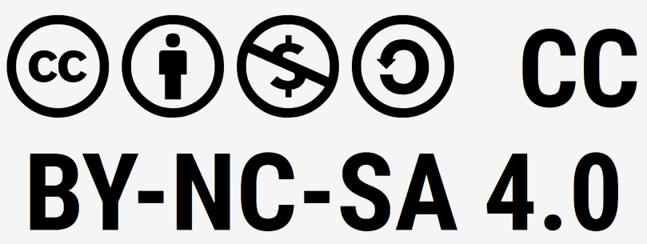

# Informática aplicada a sistemas informáticos (robótica)

Material para el módulo CMO-311 Informática aplicada a sistemas informáticos (robótica).

## 📜 Licencia

Este material está publicado bajo la licencia  
[Creative Commons Atribución-NoComercial-CompartirIgual 4.0 Internacional (CC BY-NC-SA 4.0)](https://creativecommons.org/licenses/by-nc-sa/4.0/deed.es).

Usted es libre de:

- Compartir — copiar y redistribuir el material en cualquier medio o formato.
- Adaptar — remezclar, transformar y crear a partir del material.

Bajo los siguientes términos:

- Atribución — Debe dar crédito de manera adecuada, brindar un enlace a la licencia e indicar si se han realizado cambios. Puede hacerlo de cualquier manera razonable, pero no de forma tal que sugiera que usted o su uso tienen el apoyo del licenciante.
- NoComercial — No puede utilizar el material con fines comerciales.
- CompartirIgual — Si remezcla, transforma o crea a partir del material, debe distribuir su contribución bajo la misma licencia que el original.

Avisos:

- No tiene que cumplir con la licencia para los elementos del material que sean de dominio público o cuando su uso esté permitido por una excepción o limitación aplicable.
- No se otorgan garantías. La licencia podría no darle todos los permisos que necesita para el uso que pretenda. Por ejemplo, otros derechos como los de publicidad, privacidad o derechos morales pueden limitar la forma en que utilice el material.

Texto legal completo disponible en:  

https://creativecommons.org/licenses/by-nc-sa/4.0/legalcode.es

