# **UT1 – Electricidad y circuitos electrónicos en corriente continua**

## Contenido

1. Conceptos básicos de electricidad.
2. Ley de Ohm y leyes de Kirchhoff.
3. Circuitos eléctricos. Circuitos en serie y paralelo.
4. Introducción a las fuentes de alimentación.
5. Mediciones con polímetro.

## 1 Conceptos básicos de electricidad

### 1.1 Naturaleza de la electricidad

La electricidad es un fenómeno físico fundamental presente en la naturaleza y en nuestra vida diaria. Para comprenderla, es necesario partir de la estructura de la materia. Toda la materia está formada por átomos, y cada átomo consta de un núcleo (compuesto por protones con carga positiva y neutrones sin carga) alrededor del cual se mueven electrones con carga negativa.

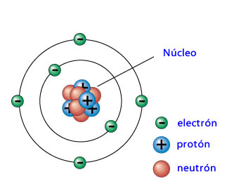    

El equilibrio entre protones y electrones hace que un átomo sea neutro. Sin embargo, cuando un átomo pierde o gana electrones, se convierte en una partícula cargada eléctricamente, llamada ion. Este desequilibrio de cargas es el origen de los fenómenos eléctricos.

La electricidad, por tanto, se manifiesta como el **movimiento o la interacción de cargas eléctricas**. Dichas cargas pueden ser de dos tipos:

- **Positivas** (protones).

- **Negativas** (electrones).

Dos partículas con la **misma carga se repelen**, mientras que dos partículas con **cargas opuestas se atraen**. Esta interacción es lo que explica gran parte de los comportamientos eléctricos y electromagnéticos.

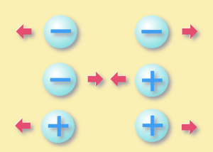

Podemos observar la electricidad en fenómenos naturales como los rayos en una tormenta, que no son más que descargas de grandes acumulaciones de cargas eléctricas en la atmósfera. En la vida cotidiana, la electricidad se convierte en una fuente de energía imprescindible que alimenta desde dispositivos electrónicos sencillos hasta complejas redes industriales.

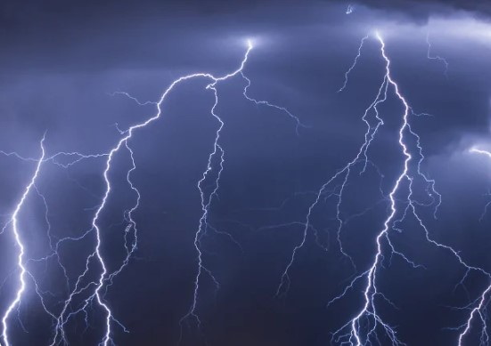

En resumen, la electricidad es la consecuencia directa del comportamiento de las partículas cargadas que forman la materia. Comprender este fenómeno es el primer paso para poder analizar, diseñar y trabajar con circuitos eléctricos y sistemas electrónicos.

### 1.2 Materiales aislantes y materiales conductores

Para que exista electricidad debe haber un **camino por el que los electrones puedan moverse**. Este camino depende del tipo de material.

#### 🔹 Materiales conductores

Son aquellos que permiten el **paso de la corriente eléctrica con facilidad**, ya que sus electrones de valencia (los de la última capa del átomo) están poco ligados al núcleo y pueden desplazarse libremente.

- Ejemplos: **cobre, aluminio, plata, oro**.

- Uso habitual: fabricación de **cables, conexiones y circuitos**.

📌 En la práctica, el cobre es el material más utilizado en instalaciones eléctricas por su buena conductividad y precio razonable.

---

#### 🔹 Materiales aislantes

Son aquellos que **ofrecen gran resistencia al paso de la corriente eléctrica**, porque sus electrones están fuertemente ligados al núcleo y no pueden moverse con facilidad.

- Ejemplos: **plásticos, madera seca, vidrio, goma, porcelana**.

- Uso habitual: **cubrir los cables** o **proteger a las personas** frente al contacto con la corriente.

📌 Cuando ves un cable eléctrico, el recubrimiento de plástico no conduce, mientras que el hilo de cobre interior sí lo hace.

---

#### 🔹 Materiales semiconductores

Existen también materiales intermedios, que no son buenos conductores ni buenos aislantes. Su capacidad de conducción depende de condiciones externas como la temperatura o la adición de impurezas (dopaje).

- Ejemplo: **silicio y germanio**.

- Uso habitual: fabricación de **chips, transistores y diodos**.

---

✅ En conclusión:

- **Conductores** → dejan pasar la corriente.

- **Aislantes** → bloquean la corriente.

- **Semiconductores** → permiten controlar el paso de la corriente y son la base de la electrónica moderna.

### 1.3 Magnitudes eléctricas fundamentales

En electricidad utilizamos una serie de magnitudes básicas que nos permiten **medir, calcular y comprender** los fenómenos eléctricos. Todas ellas forman la base para el análisis de circuitos.

---

#### 🔹 Carga eléctrica (Q)

La **carga eléctrica** es la propiedad que tienen algunas partículas de la materia, como electrones y protones. Un cuerpo tiene carga negativa si posee más electrones de lo normal, y carga positiva si le faltan electrones. Un cuerpo queda cargado si **gana o pierde electrones**.

- **Símbolo:** Q

- **Unidad:** Culombio (C)

- **Ejemplo:** un electrón tiene una carga de aproximadamente –1,6 × 10⁻¹⁹ C.

Dos cargas del mismo signo se repelen, y cargas de distinto signo se atraen.

En nuestro caso, de las partículas con carga que existe solo nos interesan el electrón y el protón. Existen otras partículas como el positrón, muón, etc. que no forman parte de este tema.

---

#### 🔹 Corriente eléctrica (I)

La **corriente eléctrica** es el flujo de carga eléctrica (electrones) que se desplaza a través de un material conductor en un intervalo de tiempo.

- **Símbolo:** I

- **Unidad:** Amperio (A) → 1 A equivale a 1 Culombio por segundo (1 C/s).

- **Medida con:** Amperímetro, conectado en **serie** en el circuito.

- **Analogía:** como el caudal de agua que circula por una tubería.

📌 **Nota importante:**  

En los circuitos se usa el **sentido de la corriente convencional**, que va del polo positivo al negativo de la fuente. Sin embargo, los electrones realmente se mueven en el **sentido contrario** (del negativo al positivo).

**Ejemplo:**  
Si por un conductor pasan 6,25 × 10¹⁸ electrones cada segundo, la intensidad de la corriente es de **1 A**.

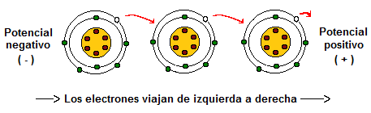

---

#### 🔹 Voltaje o diferencia de potencial (V)

El **voltaje** es el trabajo que hay que realizar para transportar una carga positiva entre dos puntos de un circuito. Indica el **desnivel eléctrico** entre esos dos puntos. 

También, se puede entender como la “presión” que empuja a los electrones a moverse.

- **Símbolo:** V

- **Unidad:** Voltio (V)

- **Medida con:** voltímetro, conectado en **paralelo** al componente del circuito.

- **Analogía:** como la altura del agua en un depósito que empuja el líquido hacia abajo.

---

#### 🔹 Resistencia eléctrica (R)

La **resistencia** es la oposición que un material ofrece al paso de la corriente eléctrica. Parte de la energía eléctrica se transforma en calor.

- **Símbolo:** R

- **Unidad:** Ohmio (Ω)

- **Medida con:** Óhmetro o multímetro en escala de ohmios, con el circuito desconectado.

- **Ejemplo práctico:** el filamento de una bombilla ofrece resistencia y se calienta hasta emitir luz.

- **Analogía:** como un estrechamiento en una tubería que dificulta el paso del agua.

---

#### 🔹 Potencia eléctrica (P)

La **potencia eléctrica** es la cantidad de energía eléctrica que un dispositivo consume o transforma por unidad de tiempo. Indica la rapidez con la que se realiza un trabajo eléctrico.

- **Símbolo:** P

- **Unidad:** Vatio (W) → $1 W = J / s$
- **Fórmula básica:**
  
  # 🔑 $P = V \times I$  
  (Potencia = Voltaje × Intensidad)

- **Medida con:** vatímetro o calculada a partir de la tensión y la corriente medidas con un multímetro.

- **Ejemplo práctico:** una bombilla de 60 W consume 60 julios de energía cada segundo para producir luz y calor.

- **Analogía:** como el “caudal de energía” que transporta el agua en movimiento: depende tanto de la presión (voltaje) como del caudal (intensidad).

---

#### 🔹 Energía eléctrica (E)

La **energía eléctrica** es la capacidad de un circuito o dispositivo para realizar un trabajo eléctrico durante un tiempo. Indica la cantidad total de electricidad consumida o transformada.

- **Símbolo:** E o W

- **Unidad:** Julio (J) → $1 J = 1 W \cdot s$
- **Relación con la potencia:**
  
  # 🔑 $E = P \times t$  
  (Energía = Potencia × Tiempo)

- **Unidades prácticas en consumo eléctrico:** kilovatio-hora (kWh)
  
  #### $1 kWh = 1000 W \times 3600 s = 3,6 \times 10^6 J$ 
  **Ejemplo práctico:**  
  
  Una bombilla de 100 W encendida durante 10 horas consume:
  
  #### $E = 100 W \times 10 h = 1000 Wh = 1 kWh$
- **Analogía:** como la **cantidad total de agua** que ha pasado por una tubería en un periodo de tiempo (no el caudal instantáneo, sino el volumen acumulado).

---

#### Tabla de magnitudes eléctricas fundamentales

| **Magnitud**                          | **Símbolo** | **Unidad**      | **Definición sencilla**                                                      | **Cómo se mide**                         | **Analogía**                                | **Ejemplo práctico**                                |
| ------------------------------------- | ----------- | --------------- | ---------------------------------------------------------------------------- | ---------------------------------------- | ------------------------------------------- | --------------------------------------------------- |
| **Carga eléctrica**                   | Q           | Culombio (C)    | Cantidad de electrones que un cuerpo posee en defecto o exceso.              | No se mide directamente, se calcula.     | Cuerpos con exceso o defecto de electrones. | Un electrón tiene –1,6 × 10⁻¹⁹ C.                   |
| **Corriente eléctrica**               | I           | Amperio (A)     | Flujo de carga eléctrica (electrones) a través de un conductor en un tiempo. | Amperímetro, en **serie**.               | Caudal de agua en una tubería.              | 1 A = 6,25 × 10¹⁸ electrones/seg.                   |
| **Voltaje (diferencia de potencial)** | V           | Voltio (V)      | “Presión eléctrica” que empuja a los electrones entre dos puntos.            | Voltímetro, en **paralelo**.             | Altura del agua en un depósito.             | Una pila de 1,5 V.                                  |
| **Resistencia eléctrica**             | R           | Ohmio (Ω)       | Oposición que ofrece un material al paso de la corriente.                    | Óhmetro o multímetro (circuito apagado). | Estrechamiento de una tubería.              | Filamento de una bombilla.                          |
| **Potencia eléctrica**                | P           | Vatio (W)       | Energía consumida o transformada por unidad de tiempo.                       | Vatímetro o cálculo P = V × I.           | Caudal de energía en el agua en movimiento. | Una bombilla de 60 W consume 60 J/s.                |
| **Energía eléctrica**                 | E o W       | Julio (J) / kWh | Cantidad total de electricidad consumida o transformada en un tiempo.        | Contadores eléctricos (kWh).             | Volumen total de agua acumulado.            | Una bombilla de 100 W encendida 10 h consume 1 kWh. |

## 2 Ley de Ohm y leyes de Kirchhoff

###### 2.1 Ley de Ohm

Antes de enunciar su famosa ley, conviene conocer brevemente a su autor.  

**Georg Simon Ohm (1789-1854)** fue un físico y matemático alemán que dedicó gran parte de su vida al estudio de la electricidad. En 1827 publicó su obra *Die galvanische Kette, mathematisch bearbeitet* (*El circuito galvánico tratado matemáticamente*), donde formuló la relación entre voltaje, corriente y resistencia.  

Su descubrimiento fue fundamental porque permitió establecer una base matemática para entender y calcular los circuitos eléctricos, algo que hasta entonces se hacía de forma experimental sin un modelo claro.  

#### Enunciado de la Ley de Ohm

La **Ley de Ohm** establece que la tensión eléctrica (V) entre los extremos de un conductor es directamente proporcional a la corriente (I) que circula por él. La constante de proporcionalidad es la **resistencia eléctrica (R)** del conductor.  

#### Fórmula:

#### $V = I \times R$
Donde:  

- **V** = Voltaje (voltios, V)  
- **I** = Intensidad de corriente (amperios, A)  
- **R** = Resistencia eléctrica (ohmios, Ω)  

#### Ejemplo sencillo

Un circuito tiene una resistencia de **10 Ω** conectada a una pila de **5 V**.  ¿Cuál es la corriente que circula?  

$V = I \times R$

Despejamos la intensidad de corriente:

$I = \frac{V}{R} $ ; $I = \frac{5}{10} = 0,5 A$

**Resultado:** La corriente que circula es de **0,5 amperios**

### 2.2 Leyes de Kirchhoff

#### Introducción

**Gustav Robert Kirchhoff (1824-1887)** fue un físico alemán que realizó aportaciones muy importantes a la teoría de circuitos eléctricos. Formuló dos leyes fundamentales que permiten analizar circuitos complejos con varias ramas, nodos y mallas. Estas leyes, junto con la Ley de Ohm, constituyen la base del análisis de circuitos eléctricos.  

#### ¿Para qué sirven las leyes de Kirchhoff?

Las leyes de Kirchhoff se utilizan para:  

- Analizar circuitos eléctricos con varias ramas y mallas.  
- Calcular tensiones e intensidades cuando la Ley de Ohm no es suficiente por sí sola.  
- Establecer ecuaciones que describen el comportamiento de todo el circuito.  

#### Conceptos básicos previos

- **Rama:** se le llama “Rama” en un circuito eléctrico a todo aquel elemento de dos terminales que se encuentre en el circuito. Dicho elemento puede ser, por ejemplo, un resistor, un condensador, una fuente de tensión, etc.  

- **Nodo:** punto de conexión común entre dos o más elementos del circuito. En un nodo se distribuye la corriente hacia diferentes trayectorias.  

- **Lazo:** cualquier recorrido cerrado dentro de un circuito, es decir, un camino que parte de un nodo y regresa al mismo nodo sin pasar dos veces por el mismo punto.  

- **Malla:** es un tipo especial de lazo que no encierra en su interior a ningún otro lazo. Dicho de otro modo, es el lazo más pequeño que puede trazarse en el circuito.  

👉 Toda malla es un lazo, pero no todo lazo es necesariamente una malla.

##### Ejemplo

**Rama**

El siguiente diagrama se compone de 4 ramas:

1 – Fuente de voltaje.  
2 – Resistencia.  
3 – Capacitor.  
4 – Fuente de corriente.

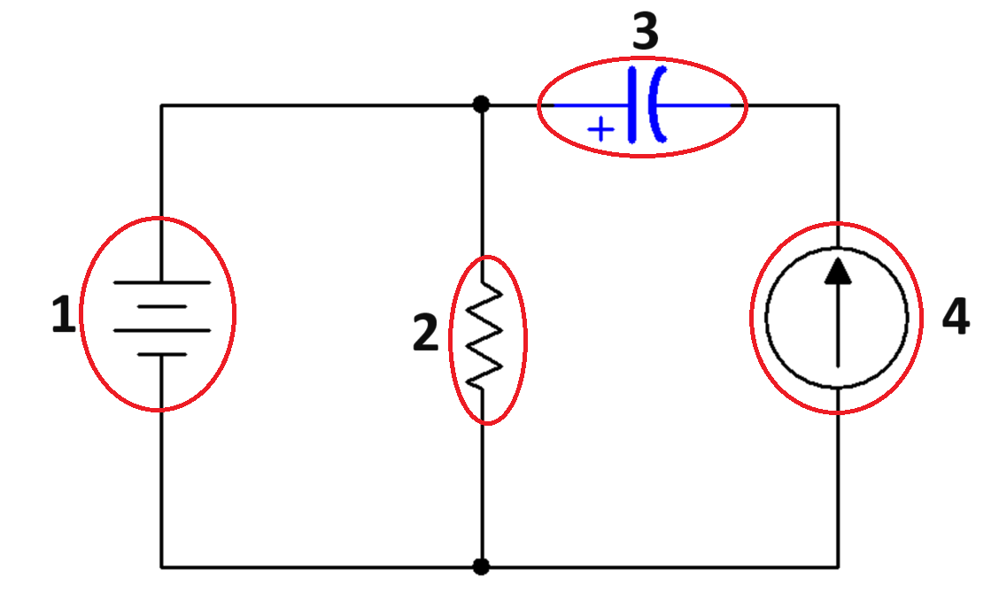

**Nodo**

El siguiente diagrama se compone de 3 nodos:

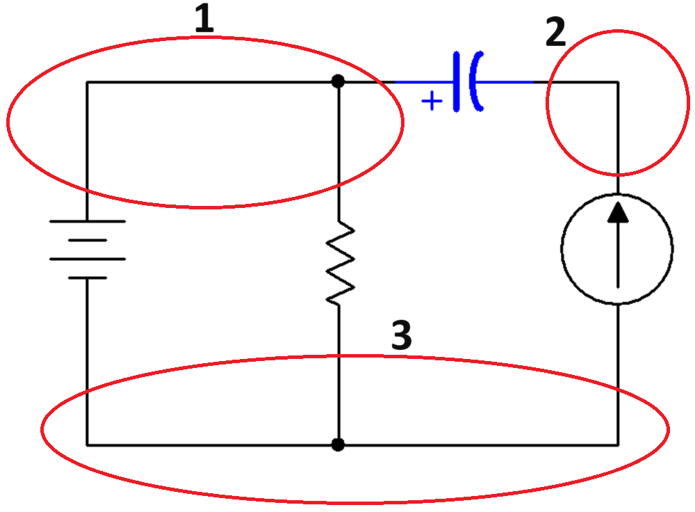

**Lazo**

El siguiente diagrama tiene 3 lazos:

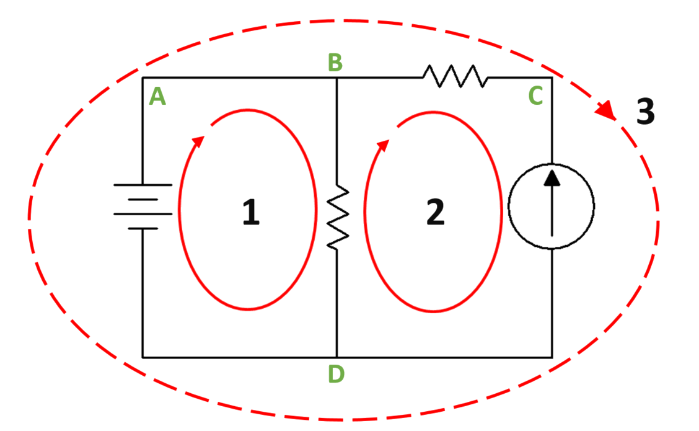

**Malla**

El siguiente diagrama tiene 2 mallas:

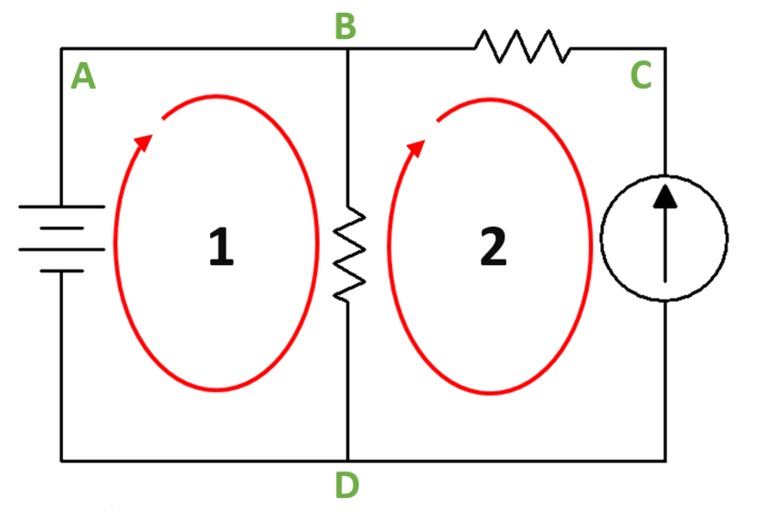

#### <u>Primera ley de Kirchhoff o ley de corrientes (nodos)</u>

En cualquier nodo de un circuito, la suma de las corrientes que entran es igual a la suma de las corrientes que salen.  
### $\sum I_{\text{entrantes}} = \sum I_{\text{salientes}}$
 

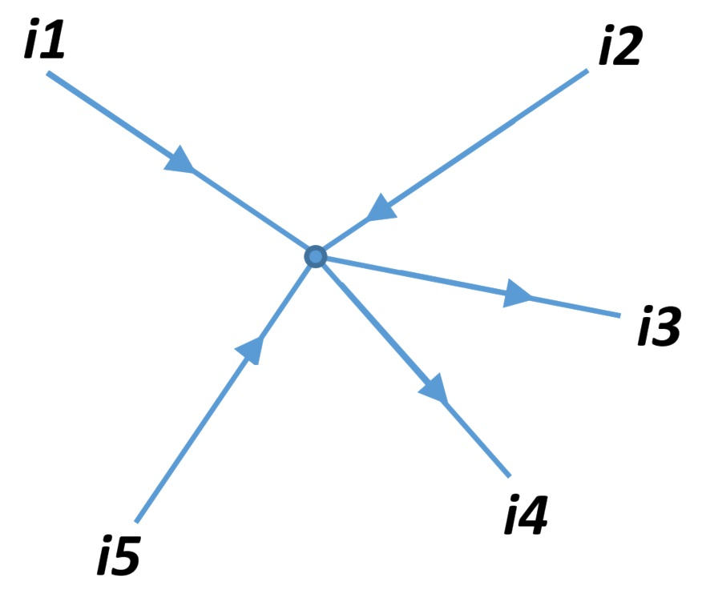

$i1 + i2 + i5 = i3 + i4$

##### ¿Qué significa esta ley en un circuito eléctrico?

La primera ley de Kirchhoff refleja el **principio de conservación de la carga eléctrica**: en un nodo no se acumula carga, sino que toda la corriente que llega debe salir.  

Esto implica que:  

- La cantidad de corriente que entra a un nodo es siempre igual a la que sale.  
- El nodo actúa como un “distribuidor” de corriente entre las distintas ramas conectadas.  
- Gracias a esta ley podemos relacionar corrientes en distintas ramas de un circuito sin necesidad de medirlas todas.  

📌 **Nota importante:**  
La primera ley de Kirchhoff se aplica a **todos los nodos**, independientemente del número de ramas.  

- En un nodo con **2 ramas**, la ley se cumple de forma trivial: la corriente que entra por una rama es exactamente la misma que sale por la otra ($i_1 = i_2$).  
- En un nodo con **3 o más ramas**, la ley resulta especialmente útil, ya que permite establecer relaciones entre varias corrientes diferentes.  

###### Ejemplo 1: Nodo con 4 ramas

Convención: corrientes **entrantes** positivas, **salientes** negativas.  
Datos:

- \($i_1 = +2,5\ \text{A}$\) (entra)
- \($i_2 = +1,0\ \text{A}$\) (entra)
- \($i_3 = -1,6\ \text{A}$\) (sale)
- \($i_4 = ?$\)

Aplicamos la primera ley de Kirchhoff en el nodo: 

$\sum i_k = 0$

$i_1 + i_2 + i_3 + i_4 = 0 \Rightarrow 2,5 + 1,0 - 1,6 + i_4 = 0 \Rightarrow i_4 = -1,9 \text{A}$

**Interpretación:** \($i_4$\) es –1,9 A, es decir, **1,9 A saliendo del nodo**.

Comprobación:

$\text{Entrantes} = 2,5 + 1,0 = 3,5 \text{A}$

$\text{Salientes} = 1,6 + 1,9 = 3,5 \text{A}$

✔️ **Se cumple la ley**.

###### Ejemplo 2: Nodo con resistencias y fuente de corriente

Esquema: un nodo \($V_n$) conectado a **tres resistencias a masa** y una **fuente de corriente** que entra al nodo.

Datos:

- $V_n = 5\ \text{V}$  
- $R_1 = 5\text{k}\Omega,\ R_2 = 10\text{k}\Omega,\ R_3 = 10\text{k}\Omega  $
- Fuente de corriente $I_S$ (entra al nodo).

Corrientes por las resistencias (salen del nodo hacia masa):

$i_{R1} = \frac{V_n}{R_1} = \frac{5}{5000} = 1,0 \text{mA}$

$i_{R2} = \frac{V_n}{R_2} = \frac{5}{10000} = 0,5 \text{mA}$

$i_{R3} = \frac{V_n}{R_3} = \frac{5}{10000} = 0,5 \text{mA}$

Suma de salientes:

$i_{R1} + i_{R2} + i_{R3} = 1,0 + 0,5 + 0,5 = 2,0 \text{mA}$

Para cumplir la primera ley de Kirchhoff:

$I_S = i_{R1} + i_{R2} + i_{R3} = 2,0 \text{mA}$

✔️ La corriente que entra es igual a la que sale ⇒ la ley se cumple.

#### <u>Segunda Ley de Kirchhoff (Ley de las mallas)</u>

La **Segunda Ley de Kirchhoff** establece que en una malla cerrada de un circuito eléctrico, la **suma algebraica de todas las tensiones es igual a cero**:
### $\sum V = 0$
Esto significa que, al recorrer una trayectoria cerrada en un circuito, las subidas y caídas de tensión se compensan.

En otras palabras:

- Toda la energía que entrega la fuente en una malla se reparte entre las caídas de tensión de las resistencias u otros elementos.
- No puede “sobrar” ni “perderse” energía dentro de la malla: lo que entra es exactamente lo que se consume.
- Esta ley nos permite **calcular corrientes y tensiones** en circuitos donde hay varias resistencias y mallas conectadas.

👉 En resumen:  

La Segunda Ley de Kirchhoff es una herramienta fundamental para **analizar circuitos complejos**, porque nos da las ecuaciones necesarias para encontrar los valores desconocidos de tensiones e intensidades.

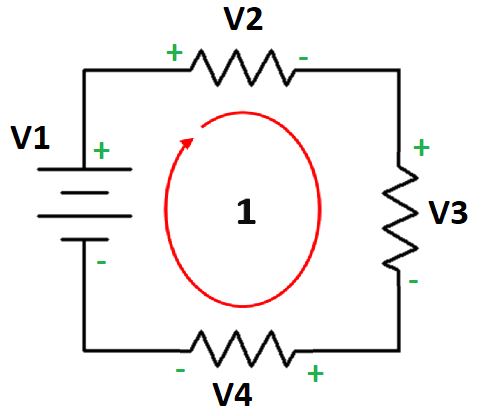

$-V1 + V2 + V3 + V4 = 0$

**Aclaración importante:**  
En los esquemas, a menudo se utilizan notaciones como $V2$, $V3$, $V4$ para las resistencias. **Esto no significa que sean fuentes de tensión**, sino que representan la **caída de tensión en cada resistencia**.  

Esa caída debe calcularse con la **Ley de Ohm**:  

$V = I \times R$

Por tanto, cuando escribimos $(V2, V3, V4)$, realmente queremos decir $((I_2 \times R_2, \ I_3 \times R_3, \ I_4 \times R_4)$  o, también, $(I \times R)_2, (I \times R)_3, (I \times R)_4)$.

---

##### **<u>Pasos para aplicar la ley</u>**

###### 1. Elegir un sentido de malla

- Se escoge un sentido de recorrido (horario o antihorario).  
- Ese sentido se mantiene en todo el análisis para evitar errores.  
- Si la corriente calculada resulta negativa, significa que circula en sentido contrario al supuesto.

---

###### 2. Asignar signos a los elementos

- A cada componente (fuente o resistencia) se le ponen sus polos **positivo (+)** y **negativo (–)**.  
- En las **fuentes de tensión**, el símbolo ya marca los polos.  
- En las **resistencias**, el polo positivo se coloca en el extremo por donde entra la corriente de malla y el negativo en el de salida.

En las **resistencias**, cuando hay una sola fuente en la malla, se puede usar este truco:  

  👉 **el lado conectado al positivo de la fuente se marca como (+)**  

  👉 **el lado conectado al negativo de la fuente se marca como (–)**

De esta forma no hay que pensar tanto en la corriente: basta con seguir la polaridad que arrastra la fuente.

**Resistencias compartidas entre dos o más mallas**

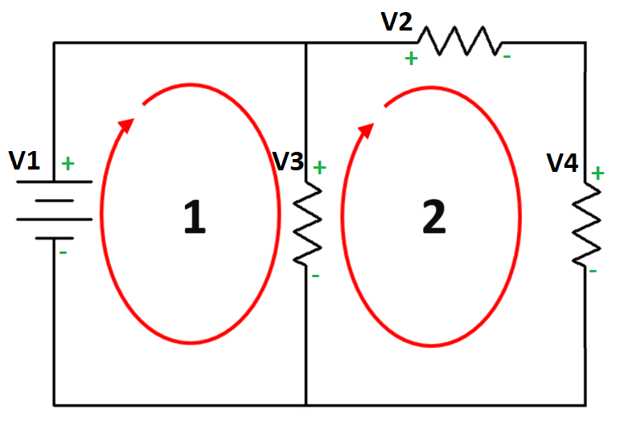

Cuando una resistencia pertenece a varias mallas (por ejemplo, una resistencia que une dos ramas), es necesario fijar **una única polaridad de referencia** para esa resistencia.

- Se asigna su polo positivo (+) y negativo (–) al calcular la **primera malla** en la que aparece.  
- Esa **polaridad ya no se cambia** al analizar las demás mallas, aunque el sentido de la corriente de cada una sea distinto.  
- En cada malla, al recorrer el circuito:  
  - **Si se entra por el polo positivo de la resistencia ⇒ se toma con signo positivo (+V).**  
  - **Si se entra por el polo negativo ⇒ se toma con signo negativo (–V).**  

De este modo, la resistencia compartida aparecerá con signo distinto en cada malla, pero siempre con la misma polaridad de referencia. Esto asegura que las ecuaciones de las mallas sean coherentes y formen un sistema correcto para resolver las corrientes.

---

###### 3. Regla de signos

Al recorrer la malla **según el sentido elegido en el paso 1**:

- **Si se entra por el polo positivo de un elemento → signo positivo (+).**  
- **Si se entra por el polo negativo de un elemento → signo negativo (–).**

Entrar por positivo o por negativo siempre se entiende **según el sentido de recorrido elegido en el paso 1**.

---

###### 4. Ecuación de la malla

La suma algebraica de todas las tensiones del recorrido debe ser **igual a 0**:

$(+V) + (-I \times R) + \dots = 0$

---

**Ejemplo 1**

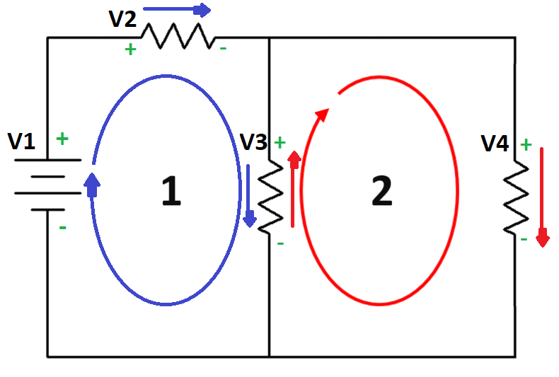

Malla 1

$-V1 +V2 + V3 = 0$

$-V1 + (I \times R)_2 + (I \times R)_3 = 0$

Malla 2

$-V3 + V4 = 0$

$-(I \times R)_3 + (I \times R)_4 = 0$

**Ejemplo 2**

Malla 1

$-V1 + V3 = 0$

$-V1 + (I \times R)_3 = 0$

Malla 2

$-V3 +V2 +V4 = 0$

$-(I \times R)_3 + (I \times R)_2 + (I \times R)_4 = 0$

###### Ejemplo práctico 1: Malla simple con fuente y dos resistencias

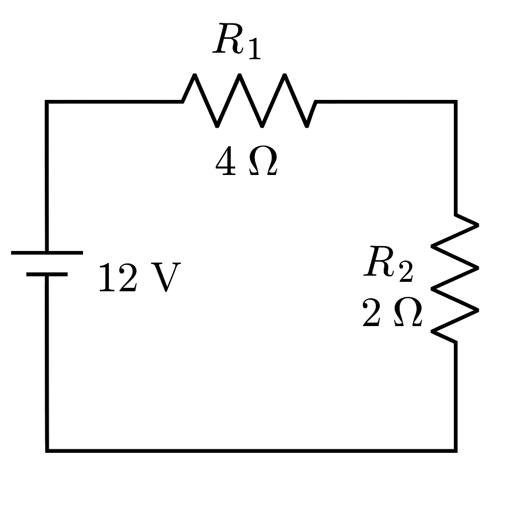

En la siguiente malla hay una fuente de tensión y dos resistencias en serie:

- $(V = 12\ \text{V})$ 
- $(R_1 = 4\ \Omega)$  
- $(R_2 = 2\ \Omega)$ 

**Resolución**

Aplicamos la Ley de Ohm para la corriente total:

$I = \frac{V}{R_1 + R_2} = \frac{12}{6} = 2\ \text{A}$

Caídas de tensión en cada resistencia:

$V_1 = I \times R_1 = 2 \times 4 = 8\ \text{V}$

$V_2 = I \times R_2 = 2 \times 2 = 4\ \text{V}$

Comprobación con la segunda ley de Kirchhoff:
$12 - 8 - 4 = 0$
###### ✔️ Se cumple la ley: la suma algebraica de tensiones en la malla es cero.

###### Ejemplo práctico 2 : Dos fuentes en una malla

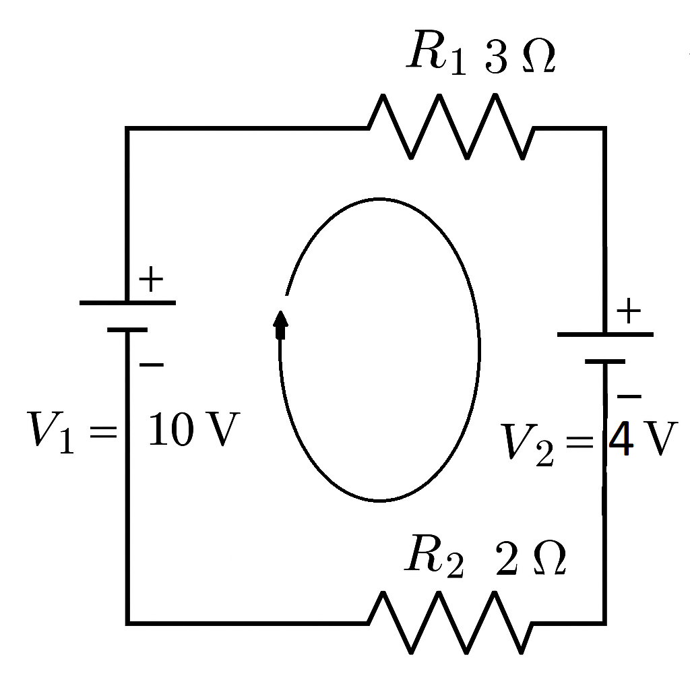

En la siguiente malla hay dos fuentes y dos resistencias:

- $(V_1 = 10\ \text{V})$ (positiva en el sentido de la malla)  
- $(V_2 = 4\ \text{V})$ (opuesta al sentido de la malla)  
- $(R_1 = 3\ \Omega)$ 
- $(R_2 = 2\ \Omega)$ 

**Resolución**

La tensión neta en la malla:

$V_{\text{neto}} = V_1 - V_2 = 10 - 4 = 6\ \text{V}$

Corriente total de la malla:

$I = \frac{V_{\text{neto}}}{R_1 + R_2} = \frac{6}{5} = 1,2\ \text{A}$

Caídas de tensión:

$V_{R1} = I \times R_1 = 1,2 \times 3 = 3,6\ \text{V}$

$V_{R2} = I \times R_2 = 1,2 \times 2 = 2,4\ \text{V}$

Comprobación:

$(-10) + (+4) + (+3,6) + (+2,4) = 0$

###### ✔️ Se cumple la segunda ley de Kirchhoff.

## 3. Circuitos eléctricos. Circuitos en serie y paralelo

### 3.1. ¿Qué es un circuito eléctrico?

Un **circuito eléctrico** es un conjunto de elementos conectados entre sí que forman un **camino cerrado** por el que puede circular la corriente eléctrica.  

Para que exista corriente, el circuito debe cumplir dos condiciones básicas:

1. **Fuente de energía:** proporciona la tensión necesaria (por ejemplo, una pila o una batería).  
2. **Camino cerrado:** los conductores y los componentes deben estar conectados formando un lazo completo, sin interrupciones.

Los elementos más comunes en un circuito eléctrico son:

- **Fuente de tensión** (pila, batería, fuente de laboratorio).  
- **Conductores** (cables que conectan los elementos).  
- **Resistencias u otros componentes** (lámparas, motores, condensadores, etc.).  
- **Interruptores** (para abrir o cerrar el paso de la corriente).

 

>📌**Importante** 
>- Si el circuito está abierto (por ejemplo, un interruptor en posición OFF), la corriente no circula.  
>- Si el circuito está cerrado, la corriente fluye desde el polo positivo de la fuente, atravesando los elementos conectados, hasta regresar al polo negativo.

---

## 3.2. Serie y paralelo

En un circuito eléctrico, los distintos componentes (resistencias, condensadores, fuentes, etc.) pueden estar conectados de formas diferentes.  

Las dos configuraciones <u>básicas</u> son:

- **Conexión en serie:** los elementos se conectan uno detrás de otro, de manera que la corriente que pasa por ellos es la misma.  
- **Conexión en paralelo:** los elementos se conectan compartiendo los mismos nodos, de forma que todos ellos tienen la misma tensión aplicada.

Estas configuraciones son fundamentales porque permiten simplificar circuitos complejos en una sola resistencia equivalente y comprender cómo se distribuyen las tensiones y las corrientes.

👉 Las propiedades de los circuitos en serie y en paralelo **no son reglas aisladas**, sino que se derivan directamente de las **leyes de Kirchhoff** y de la **Ley de Ohm**:

- En **serie**, la Ley de Corrientes de Kirchhoff asegura que la intensidad es la misma en todos los elementos, mientras que la Ley de Tensiones explica que la tensión total se reparte entre ellos.  
- En **paralelo**, la Ley de Tensiones indica que todos los elementos tienen la misma tensión, y la Ley de Corrientes explica cómo la intensidad total se reparte entre las ramas.

A partir de estas bases, podremos deducir las fórmulas de cálculo de resistencia equivalente, intensidades y tensiones, y aplicarlas a ejemplos prácticos.

📌 En estos apuntes utilizaremos indistintamente los términos **resistencia total** y **resistencia equivalente**, entendiendo ambos como la resistencia que representa al conjunto de resistencias conectadas en serie o en paralelo.

### 3.2.1. Circuito en serie

Un **circuito en serie** es aquel en el que los elementos se conectan uno a continuación de otro, formando un único camino para la corriente.

#### Características principales

- La **corriente (I)** es la misma en todos los elementos.  

- La **tensión total ($V_t$)** es la suma de las tensiones parciales:  
  
  $V_t = V_1 + V_2 + V_3 + \dots$
- La **resistencia equivalente (Req)** o total es la suma de todas las resistencias:  
  
  $R_{eq} = R_1 + R_2 + R_3 + \dots$
- La Ley de Ohm se aplica al circuito completo:  
  
  $I = \dfrac{V_t}{R_{eq}}$
#### Ejemplo resuelto

Tres resistencias en serie:  

- $R_1 = 10\ \Omega$  

- $R_2 = 20\ \Omega$  

- $R_3 = 30\ \Omega$  
  conectadas a una fuente de $V_t = 12\ \text{V}$.
1. **Resistencia equivalente:**  
   
   $   R_{eq} = 10 + 20 + 30 = 60\ \Omega$
2. **Corriente en el circuito:**  
   
   $   I = \dfrac{12}{60} = 0,2\ \text{A}$
3. **Tensiones en cada resistencia:**  
   
   - $V_1 = 0,2 \times 10 = 2\ \text{V}$  
   - $V_2 = 0,2 \times 20 = 4\ \text{V}$  
   - $V_3 = 0,2 \times 30 = 6\ \text{V}$  

4. **Comprobación con la Ley de Kirchhoff de tensiones:**  
   
   $   V_t = V_1 + V_2 + V_3 = 2 + 4 + 6 = 12\ \text{V}$   
   ✔️ Se cumple la igualdad.

---

📌 En un circuito en serie:

- La **intensidad es igual en todos los elementos**.  
- La **tensión se reparte proporcionalmente** al valor de cada resistencia.  
- La **resistencia equivalente siempre es mayor** que la mayor de las resistencias individuales.

### 3.2.2. Circuito en paralelo

Un **circuito en paralelo** es aquel en el que los elementos se conectan compartiendo los mismos dos nodos, de modo que cada elemento está conectado directamente a la fuente.

#### Características principales

- La **tensión (V)** es la misma en todos los elementos:  
  
  $V_t = V_1 = V_2 = V_3 = \dots$
- La **corriente total ($I_t$)** es la suma de las corrientes parciales:  
  
  $I_t = I_1 + I_2 + I_3 + \dots$
  
- La **resistencia equivalente (Req)** o total se obtiene con:  
  
  $\dfrac{1}{R_{eq}} = \dfrac{1}{R_1} + \dfrac{1}{R_2} + \dfrac{1}{R_3} + \dots$
  
- La Ley de Ohm se aplica en cada rama:  
  
  $I_n = \dfrac{V}{R_n}$
  
#### Ejemplo resuelto

Tres resistencias en paralelo:  

- $R_1 = 10\ \Omega$  

- $R_2 = 20\ \Omega$  

- $R_3 = 30\ \Omega$  
  conectadas a una fuente de $V_t = 12\ \text{V}$.
1. **Corrientes en cada rama:**  
   
   $I_1 = \dfrac{12}{10} = 1,2\ \text{A}$  
   
   $I_2 = \dfrac{12}{20} = 0,6\ \text{A}$  
   
   $I_3 = \dfrac{12}{30} = 0,4\ \text{A}$  

2. **Corriente total:**  
   
   $I_t = 1,2 + 0,6 + 0,4 = 2,2\ \text{A}$
3. **Resistencia equivalente:**  
   
   $\dfrac{1}{R_{eq}} = \dfrac{1}{10} + \dfrac{1}{20} + \dfrac{1}{30}$   
   $\dfrac{1}{R_{eq}} = \dfrac{11}{60}$   
   $R_{eq} = \dfrac{60}{11} \approx 5,45\ \Omega$
4. **Comprobación con la Ley de Ohm:**  
   
   $I_t = \dfrac{V_t}{R_{eq}} = \dfrac{12}{5,45} \approx 2,2\ \text{A}$   
   ✔️ Se cumple la igualdad.

---

📌 En un circuito en paralelo:

- La **tensión es igual en todos los elementos**.  
- La **intensidad se reparte** entre las ramas, en proporción a la resistencia de cada una.  
- La **resistencia equivalente siempre es menor** que la menor de las resistencias individuales.

### 3.2.3. Circuitos mixtos

En la práctica, la mayoría de los circuitos electrónicos son **mixtos**, es decir, combinan resistencias en serie y en paralelo dentro del mismo circuito.  
Este tipo de configuración es la más habitual en la realidad, ya que permite adaptar la corriente y la tensión a diferentes componentes (LEDs, bombillas, motores, etc.).

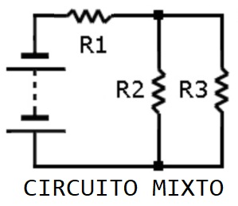

#### Características principales

- Se aplican los **principios de serie y paralelo**, simplificando el circuito paso a paso.  

- Para calcular la **resistencia total**:
  
  1. Identificar qué resistencias están en paralelo y calcular su resistencia equivalente.  
  2. Sustituirlas por una sola resistencia.  
  3. Repetir el proceso con resistencias en serie.  

- Una vez obtenida la **resistencia total ($R_t$)**, se puede aplicar la Ley de Ohm al circuito completo:  
  
  $I = \dfrac{V}{R_t}$
#### Ejemplo resuelto

Un circuito mixto con tres resistencias (tomar como esquema la imagen al principio de este apartado):

- $R_1 = 10\ \Omega$ en serie con

- un grupo formado por $R_2 = 20\ \Omega$ y $R_3 = 30\ \Omega$ en paralelo.  

- Fuente de tensión: $V = 12\ \text{V}$.
1. **Resistencia equivalente del paralelo ($R_2$ y $R_3$):**
   
   $\dfrac{1}{R_{23}} = \dfrac{1}{R_2} + \dfrac{1}{R_3}$   
   $\dfrac{1}{R_{23}} = \dfrac{1}{20} + \dfrac{1}{30} = \dfrac{5}{60}$   
   $R_{23} = \dfrac{60}{5} = 12\ \Omega$
2. **Resistencia total del circuito:**
   
   $R_t = R_1 + R_{23} = 10 + 12 = 22\ \Omega$
3. **Corriente total del circuito:**
   
   $I = \dfrac{V}{R_t} = \dfrac{12}{22} \approx 0,55\ \text{A}$
4. **Tensión en $R_1$:**
   
   $V_1 = I \times R_1 = 0,55 \times 10 = 5,5\ \text{V}$
5. **Tensión en el paralelo ($R_2$ y $R_3$):**
   
   $V_{23} = V - V_1 = 12 - 5,5 = 6,5\ \text{V}$
6. **Corriente en cada rama del paralelo:**
   
   $I_2 = \dfrac{V_{23}}{R_2} = \dfrac{6,5}{20} \approx 0,325\ \text{A}$  
   
   $I_3 = \dfrac{V_{23}}{R_3} = \dfrac{6,5}{30} \approx 0,217\ \text{A}$  
   
   ✔️ Comprobación: $I_2 + I_3 = 0,325 + 0,217 = 0,542\ \text{A} $  (se aproxima a la $I$ total $0,55 \text{A}$, diferencia debida al redondeo).

---

📌 En un circuito mixto:

- Se combinan conexiones en serie y en paralelo.  
- El análisis se hace **paso a paso**, simplificando grupos de resistencias.  
- La **resistencia total** es el resultado de esas simplificaciones sucesivas.  
- Este tipo de circuitos es el más común en aplicaciones reales (placas electrónicas, instalaciones eléctricas, etc.).

## 4. Introducción a las fuentes de alimentación

Una **fuente de alimentación** es un dispositivo que proporciona la energía eléctrica necesaria para que un circuito funcione.  
Convierte la energía que recibe de la red eléctrica (corriente alterna, AC) en la forma adecuada para alimentar circuitos electrónicos (normalmente corriente continua, DC).

### 4.1. Funciones principales de una fuente de alimentación

- **Transformar la tensión** de la red (230 V AC en España) a valores más bajos (por ejemplo, 12 V o 5 V).  
- **Rectificar** la corriente, es decir, convertir la corriente alterna en continua.  
- **Filtrar** las variaciones para obtener una señal continua estable.  
- **Regular** la tensión para que permanezca constante aunque cambie la carga conectada.

📌 En resumen: la fuente de alimentación adapta la electricidad de la red para que pueda usarse en dispositivos electrónicos de forma segura.

### 4.2. Tipos de fuentes de alimentación

- **Fuentes lineales:** sencillas, utilizan transformador, rectificador, condensador y regulador. Son estables pero poco eficientes y voluminosas.  
- **Fuentes conmutadas (SMPS):** más modernas y compactas, regulan mediante conmutación electrónica a alta frecuencia. Son más eficientes y ligeras.  
- **Fuentes de laboratorio:** permiten ajustar la tensión e intensidad de salida, e incluyen protecciones (sobrecorriente, cortocircuito).  
- **Fuentes integradas en equipos electrónicos:** cada dispositivo (ordenador, cargador de móvil, televisor) incorpora su propia fuente adaptada a sus necesidades.

### 4.3. Parámetros básicos de una fuente

- **Tensión de salida (V):** valor en voltios que suministra (ej. 5 V, 12 V, 24 V).  
- **Corriente máxima (A):** cantidad máxima de corriente que puede entregar sin dañarse.  
- **Potencia máxima (W):** $P = V \times I$ → indica la capacidad total de la fuente.  
- **Número de salidas:** algunas fuentes ofrecen varios valores (ejemplo: 5 V y 12 V simultáneamente).  
- **Protecciones:** contra sobrecarga, sobrecalentamiento o cortocircuitos.

### 4.4. Ejemplos prácticos

- **Cargador de móvil:** convierte 230 V AC en 5 V DC, con una corriente de hasta 2 A.  
- **Fuente de PC:** entrega varias tensiones (3,3 V, 5 V, 12 V) para alimentar los distintos componentes.  
- **Fuente de laboratorio:** usada en prácticas de electrónica, ajustable en tensión e intensidad.

---

📌 En los próximos apartados veremos cómo **usar un polímetro** para comprobar la tensión de salida de una fuente y cómo conectar correctamente una fuente de laboratorio para alimentar nuestros circuitos.

## 5. Mediciones con polímetro

El **multímetro** o **polímetro** es un instrumento que permite medir diferentes magnitudes eléctricas, principalmente:

- **Voltaje (tensión)**  
- **Intensidad de corriente**  
- **Resistencia eléctrica**

Según el modelo, también puede medir continuidad, frecuencia, capacidad de condensadores o incluso temperatura.

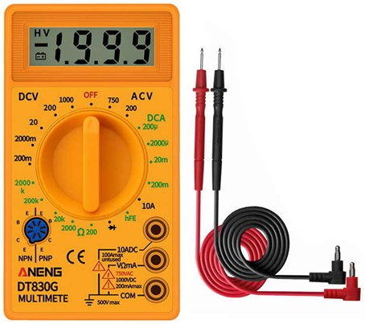

### 5.1. Tipos de multímetro

- **Analógico:** muestra el valor mediante una aguja que se desplaza sobre una escala graduada.  
- **Digital:** muestra el valor directamente en una pantalla numérica, lo que facilita la lectura y suele ser más preciso.

### 5.2. Partes principales de un multímetro

1. **Pantalla** (digital) o **escala con aguja** (analógico).  
2. **Selector de funciones y escalas**: permite elegir qué magnitud medir (V, A, Ω) y el rango adecuado.  
3. **Bornes de conexión** para las puntas de prueba:  
   - **COM (negro):** borne común.  
   - **VΩmA (rojo):** para medir voltajes, resistencias y corrientes **bajas**.  
   - **10A o 20A (rojo, independiente):** para medir corrientes **altas** (según modelo).  
4. **Cables de prueba** (rojo y negro).

### 5.3. Procedimiento general de uso

1. Conectar los cables en los bornes adecuados según lo que se quiera medir.  
2. Seleccionar en el disco la magnitud y el rango.  
3. Colocar las puntas en el componente o circuito:  
   - En **paralelo** si se mide tensión.  
   - En **serie** si se mide corriente.  
   - Directamente sobre el componente (circuito apagado) si se mide resistencia.  
4. Leer el valor en pantalla (digital) o en la escala (analógico).

📌 Importante: siempre empezar en la escala más alta y luego reducir para obtener una medida más precisa.

---

### 5.4. Medición de tensión continua (DCV)

- Colocar el cable **negro en COM** y el **rojo en VΩmA**.  
- En el selector, elegir la opción **DCV** o el símbolo `⎓`.  
- Seleccionar un rango superior al valor que esperamos medir (ej. 20 V si esperamos unos 12 V).  
- Conectar las puntas en paralelo con el componente o la fuente.  
- Recordar que la **polaridad importa**:  
  - Rojo → polo positivo.  
  - Negro → polo negativo.  
- Si se invierten las puntas:  
  - En digital → el valor aparece con signo negativo.  
  - En analógico → la aguja se mueve en sentido contrario o no se desplaza.

---

### 5.5. Medición de tensión alterna (ACV)

- Colocar el cable **negro en COM** y el **rojo en VΩmA**.  
- En el selector, elegir la opción **ACV** o el símbolo `~`.  
- Seleccionar un rango superior al esperado (ej. 750 V si se mide la red eléctrica de 230 V).  
- Colocar las puntas en paralelo con la fuente o el componente.  
- 📌 En corriente alterna **no hay polaridad**, por lo que no importa qué punta pongamos en cada borne.

---

### 5.6. Medición de corriente continua (DCA)

- Colocar el cable **negro en COM**.  
- Colocar el cable **rojo** en:  
  - VΩmA si la corriente es baja (mA).  
  - 10A o 20A si la corriente es alta.  
- En el selector, elegir la opción **DCA** o el símbolo `⎓`.  
- Para medir corriente es necesario **abrir el circuito** y conectar el multímetro **en serie** con la carga.  
- Atención a la polaridad:  
  - Rojo → dirección de entrada de la corriente.  
  - Negro → salida hacia el resto del circuito.

---

### 5.7. Medición de resistencia (Ω)

- Colocar el cable **negro en COM** y el **rojo en VΩmA**.  
- En el selector, elegir la escala de **Ω**.  
- El circuito debe estar **apagado y desconectado de la fuente**.  
- Colocar las puntas a ambos extremos del componente.  
- Leer el valor de resistencia.  
- 📌 Si el valor es mayor que el rango seleccionado, el multímetro mostrará “1” (sobresaturación) y habrá que elegir un rango más alto.

---

### 5.8. Medición de continuidad

Muchos multímetros tienen la función de **prueba de continuidad**, indicada por un símbolo de altavoz o diodo.  

- Se utiliza para comprobar si dos puntos del circuito están unidos eléctricamente.  
- Si hay continuidad, el multímetro emite un pitido.  
- Muy útil para comprobar cables o pistas de una placa.

---

📌 **Resumen:**  
El polímetro es la herramienta básica de cualquier técnico en electrónica e informática.  
Permite comprobar tensiones, corrientes y resistencias, diagnosticar averías y trabajar con seguridad en los circuitos que se montan en el taller.
