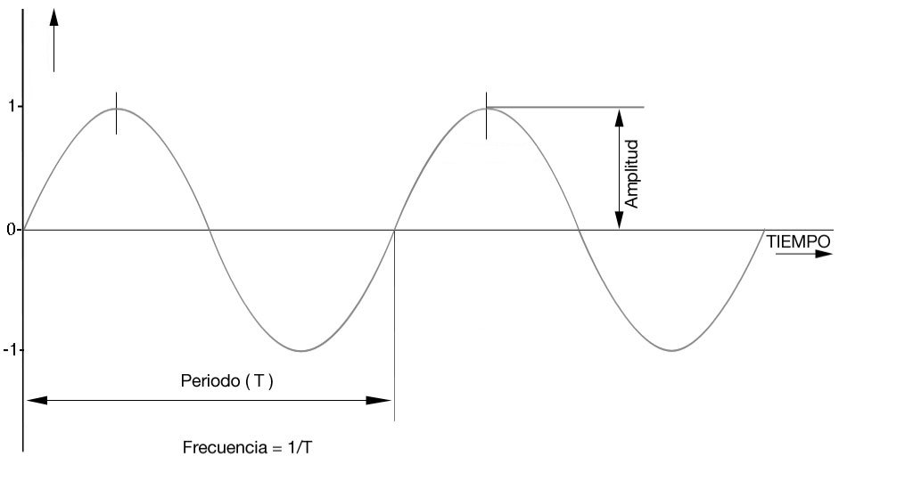
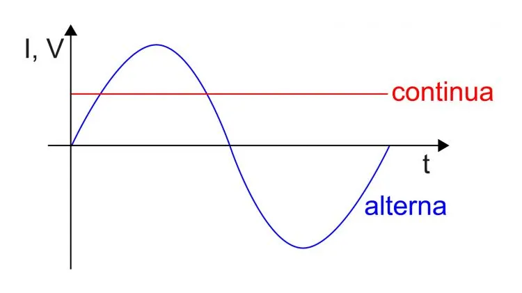
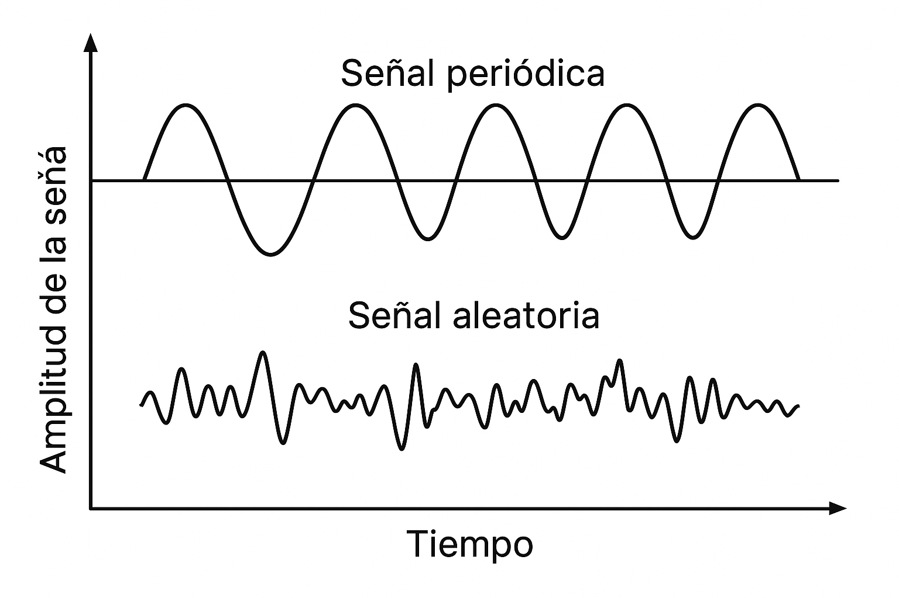
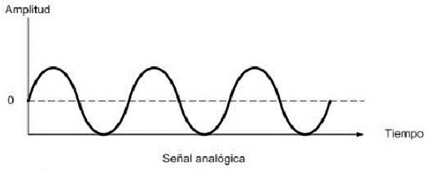
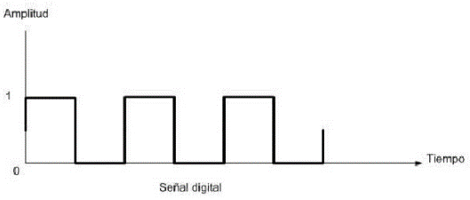

# UT2 – Sistemas electrónicos analógicos y digitales

## Contenido

1. Conceptos básicos de señales.
2. Tipos de señales.
3. Conversión analógico-digital (A/D).

---

## 1 Conceptos básicos de señales

### 1.1. ¿Qué es una señal?

Una **señal** es una magnitud física que **varía con el tiempo** (u otra variable) y que **transporta información**.  
Se representa como **s(t)** si es de **tiempo continuo** o **s[n]** si es de **tiempo discreto**.  
**Ejemplos:**

- Tensión de un micrófono (V) a lo largo del tiempo.
- Corriente en un circuito (A).
- Temperatura registrada cada minuto (°C) → señal discreta.
- Nivel lógico 0/1 en un pin digital → señal digital.

### 1.2 Magnitudes de una señal periódica

Las señales periódicas son fundamentales en electrónica y telecomunicaciones. Se caracterizan por repetirse en el tiempo con un cierto patrón, definido por tres magnitudes principales:

- Amplitud.

- Periodo.

- Frecuencia.

###### <u>Amplitud</u>

- Es el **valor máximo** que alcanza la señal respecto a su nivel de referencia (habitualmente 0).
- Se mide en voltios (V) si hablamos de tensión, o en amperios (A) si hablamos de corriente.
- En una señal senoidal, corresponde al valor pico (positivo o negativo).

📌**Ejemplo**: Una señal de audio con amplitud de 2 V oscila entre +2 V y −2 V.

###### Ciclo

Es **una repetición completa del patrón de la señal**.  
Si eliges un punto característico (p. ej., una cresta) y esperas hasta que **vuelva a aparecer el mismo punto con la misma fase**, eso es **un ciclo**.

###### <u>Periodo</u> (T)

- Es el **tiempo que tarda la señal en repetirse**.
- Se mide en segundos (s).
- Cada ciclo completo de la señal tiene un periodo constante. **En una señal periódica**, la duración de **cada repetición completa** del patrón (cada **ciclo**) es **la misma** y vale **T**.

📌**Ejemplo**: En la red eléctrica europea, la señal es senoidal y se repite cada 0,02 s (20 ms).

###### <u>Frecuencia</u> (f)

- Es el **número de ciclos completos que ocurren en un segundo**.
- Se mide en hercios (Hz).
- Está relacionada con el periodo mediante la fórmula:

$f = \frac{1}{T}$

📌**Ejemplo**: Una frecuencia de 50 Hz significa que la señal completa 50 ciclos cada segundo.

---

#### Relación entre periodo y frecuencia

- **Periodo corto ⇒ frecuencia alta**.  
- **Periodo largo ⇒ frecuencia baja**.  

📌**Ejemplo**:  

- Una señal con ( $T = 0,01 \, s$ ) tiene ( $f = 100 \, Hz$ ).  
- Una señal con ( $T = 0,001 \, s$ ) tiene ( $f = 1000 \, Hz$ ).  

#### Representación matemática de una señal senoidal

Una señal senoidal puede describirse como:

$v(t) = A \cdot \sin(\omega t + \varphi)$

Donde:

- ( $A$ ): Amplitud.
- ( $\omega = 2 \pi f$ ): Frecuencia angular (rad/s).
- ( $t$ ): Tiempo (s).
- ( $\varphi$ ): Fase inicial.

> **Fase ($\varphi$)**
> 
> Indica la **posición dentro del ciclo** de una señal periódica (en grados o radianes).

#### Ejemplo práctico

En la red eléctrica:

- Valor eficaz (RMS) ≈ 230 V.
- Amplitud pico ≈ 325 V.
- Frecuencia = 50 Hz.
- Periodo = 0,02 s.

**Resumen**:  
La **amplitud**, el **periodo** y la **frecuencia** son las tres magnitudes básicas que describen cualquier señal periódica. Su conocimiento es imprescindible para comprender el funcionamiento de los sistemas electrónicos y de comunicación.

---

## 2. Tipos de señales

Las señales se pueden clasificar de distintas formas según sus características.
Aunque estas clasificaciones son generales (eléctricas, acústicas, ópticas, etc.),
en este módulo las aplicaremos principalmente a **señales eléctricas** (tensión y corriente).

A continuación, se describen las principales clasificaciones que permiten diferenciar los tipos de señales en función de su comportamiento en el tiempo, su regularidad, su naturaleza y su representación.

**2.1. Señales continuas y alternas.**
**2.2. Señales periódicas y aleatorias.**
**2.3. Señales en tiempo continuo y discreto.**
**2.4. Señales analógicas y digitales.**

### 2.1. Señales continuas y alternas

Las señales eléctricas pueden clasificarse según la **forma en la que varían en el tiempo** en dos tipos principales: **continuas (DC)** y **alternas (AC)**.

#### 2.1.1. Señales continuas (DC)

- Es aquella que es **constante** en el tiempo: ( $v(t) = V_{\text{DC}}$ ).
- Como consecuencia, **mantiene el mismo signo** (no cambia de polaridad).
- Se representa como una **línea recta** paralela al eje del tiempo.
- También se denomina **DC pura**.

> **No confundir** con la **señal unipolar (CC pulsante)**: varía en el tiempo pero no cambia de signo.  
> Puede modelarse como ( $v(t) = V_{\text{DC}} + v_{\text{ac}}(t)$ ) con ( $\overline{v_{\text{ac}}}=0$ ). **No** es DC pura.

📌 **Ejemplos**

- Una pila de 1,5 V → **DC pura** (constante).
- Una señal que oscila entre 0 y +5 V (p. ej., salida de un sensor analógico) → **unipolar variable (CC pulsante)**; **no** es DC pura.

#### 2.1.2. Señales alternas (AC)

- **Varían periódicamente**. En **AC pura** el valor medio es 0 y **cambia de signo** respecto a 0 V.  
- La forma de onda más común es la **senoidal**, aunque también puede ser cuadrada, triangular u otras.
- Están presentes en la red eléctrica y en muchas señales de comunicación.
- En una señal alterna se definen magnitudes características:
  - **Valor pico (Vp)**: amplitud máxima.
  - **Valor pico a pico (Vpp)**: diferencia entre el valor máximo positivo y el máximo negativo.
  - **Valor eficaz (RMS)**: valor equivalente en corriente continua que produciría el mismo efecto de potencia.

📌 **Ejemplo**:  

- La red eléctrica doméstica en Europa: 230 V RMS, 50 Hz, onda senoidal.

#### 2.1.3. Comparativa entre señales continuas y alternas

| Característica | Señal continua (DC)                    | Señal alterna (AC)                       |
| -------------- | -------------------------------------- | ---------------------------------------- |
| Polaridad      | Siempre el mismo signo                 | Cambia periódicamente de signo           |
| Valor          | Constante                              | Oscila entre valores positivos/negativos |
| Fuente típica  | Pilas, baterías, fuentes DC            | Red eléctrica, generadores AC            |
| Aplicaciones   | Electrónica digital, carga de baterías | Transporte de energía, comunicaciones    |

✍️ **Resumen**:  

- **Señal continua (DC pura):** es **constante en el tiempo** ($v(t)=V_{\text{DC}}$). Como consecuencia, **no cambia de signo**. Está presente en pilas y fuentes reguladas.
- **Señal alterna (AC pura):** **varía periódicamente** con **valor medio 0**; **cambia de signo**. Presente en la **red eléctrica** y en muchas **señales de comunicación**.

---

### 2.2. Señales periódicas y aleatorias

Otra forma de clasificar las señales es según su **regularidad en el tiempo**. En este caso, distinguimos entre **señales periódicas** y **señales aleatorias**.

#### 2.2.1. Señales periódicas

- Son aquellas que **se repiten de forma idéntica cada cierto intervalo de tiempo** llamado **periodo (T)**.
- Pueden tener distintas formas de onda: **senoidal, cuadrada, triangular, diente de sierra**, etc.
- Se caracterizan por su **frecuencia fundamental** ( $f = \frac {1}{T} $).  
  Si la forma de onda no es senoidal pura, puede descomponerse en la frecuencia fundamental y sus **armónicos** (teorema de Fourier).
- Son muy utilizadas en comunicaciones, electrónica de potencia y sistemas digitales.

📌 **Ejemplos de señales periódicas**:

- Red eléctrica (50 Hz, senoidal).
- Señal de reloj en un microprocesador (onda cuadrada).
- Señal PWM (modulación por ancho de pulso) en control de motores.

#### 2.2.2. Señales aleatorias

- No presentan un patrón de repetición regular.
- Sus valores cambian de forma **impredecible** en el tiempo.
- No se pueden caracterizar con un único periodo o frecuencia, sino mediante **propiedades estadísticas** (media, varianza, densidad espectral de potencia).
- Son inevitables en la práctica, porque siempre existen fuentes de **ruido** en los sistemas electrónicos.
- Las señales aleatorias son un caso de las señales aperiódicas.

📌 **Ejemplos de señales aleatorias**:

- Ruido térmico en resistencias.
- Interferencias electromagnéticas.
- Variaciones impredecibles en una señal de sensores.

#### 2.2.3. Comparativa

| Característica | Señales periódicas                 | Señales aleatorias                      |
| -------------- | ---------------------------------- | --------------------------------------- |
| Repetición     | Se repiten cada periodo (T)        | No presentan repetición regular         |
| Frecuencia     | Definida (fundamental y armónicos) | Indefinida, caracterización estadística |
| Ejemplos       | Red eléctrica, reloj digital, PWM  | Ruido térmico, interferencias           |

✍️ **Resumen**:  

- Una **señal periódica** se repite con un patrón definido y puede analizarse en frecuencia.  
- Una **señal aleatoria** es impredecible y se analiza con herramientas estadísticas.

---

### 2.3. Señales en tiempo continuo y discreto

Otra clasificación de las señales se hace en función de cómo se representa la **variable temporal**. Así, distinguimos entre **señales en tiempo continuo** y **señales en tiempo discreto**.

#### 2.3.1. Señales en tiempo continuo

- Están definidas para **todos los valores del tiempo (t)**.
- La variable independiente es **continua** → el tiempo puede tomar infinitos valores.
- Son típicas de sistemas **analógicos**.
- Se representan mediante funciones matemáticas como ( $x(t)$ ).

📌 **Ejemplos**:

- La tensión en los bornes de una pila.
- Una señal senoidal de audio ( $x(t) = A \cdot \sin(2 \pi f t)$ ).
- La salida de un micrófono.

#### 2.3.2. Señales en tiempo discreto

- Están definidas solo en **instantes concretos de tiempo** (muestras).
- La variable independiente toma **valores discretos** → se numeran como enteros.
- Se representan como ( $x[n]$ ), donde ( $n$ ) es el número de muestra.
- Son la base del **procesamiento digital de señales (DSP)**.

📌 **Ejemplos**:

- Una señal de audio muestreada a 44,1 kHz (como en un CD).
- Las imágenes digitales (matrices de píxeles discretos).
- Datos de un sensor que se leen cada cierto intervalo de tiempo.

#### 2.3.3. Comparativa

| Característica | Señal en tiempo continuo (x(t))   | Señal en tiempo discreto (x[n]) |
| -------------- | --------------------------------- | ------------------------------- |
| Tiempo         | Continuo (todos los instantes)    | Discreto (muestras)             |
| Representación | Función matemática                | Secuencia de valores            |
| Dominio        | Analógico                         | Digital                         |
| Ejemplo        | Micrófono, termómetro de mercurio | Audio en CD, imágenes digitales |

✍️ **Resumen**:  

- Una **señal en tiempo continuo** se define en todo instante y corresponde al mundo físico (analógico).  
- Una **señal en tiempo discreto** se obtiene al **muestrear** la señal continua en instantes separados de tiempo.

---

### 2.4. Señales analógicas y digitales

#### 2.4.1. Señales analógicas

- Varían de manera **continua** en el tiempo.
- Pueden tomar **infinitos valores** dentro de un rango.
- Ejemplos:
  - La voz humana (ondas sonoras).
  - Temperatura medida con un termómetro de mercurio.
  - Intensidad de luz captada por un fotodiodo.

**Características de una señal analógica**

- Se representa mediante una onda **continua**.
- Puede variar suavemente con el tiempo y tomar infinitos valores.
- Es más **sensible al ruido**, ya que cualquier pequeña variación afecta a la señal.
- Ejemplo adicional: señal de audio en un tocadiscos.

#### 2.4.2. Señales digitales

- Varían de forma **discreta**, solo pueden tomar un número finito de valores.
- En electrónica digital se usan **dos niveles de tensión**:
  - **0 lógico (LOW)**: normalmente cercano a 0 V.
  - **1 lógico (HIGH)**: depende de la tecnología (ej. 5 V, 3,3 V).
- Ejemplos:
  - Transmisión de datos por un bus de ordenador.
  - Estados de encendido/apagado en un interruptor.

**Características de una señal digital**

- Se representa mediante una onda **discreta** (valores separados).
- Normalmente solo usa **dos estados**: 0 lógico y 1 lógico.
- Es más **robusta frente al ruido**, ya que pequeñas variaciones no cambian el estado lógico.
- Ejemplo adicional: datos en un CD o música en Spotify.

#### 2.4.3. Comparativa entre señal analógica y digital

| Característica   | Analógica                           | Digital                              |
| ---------------- | ----------------------------------- | ------------------------------------ |
| Valores posibles | Infinitos                           | Finitos (normalmente 0/1)            |
| Precisión        | Alta, pero sensible a ruido         | Menos sensible al ruido              |
| Procesamiento    | Complejo                            | Más sencillo y rápido                |
| Transmisión      | Pérdida de calidad con la distancia | Puede regenerarse sin perder calidad |
| Ejemplo          | Señal de audio                      | Señal binaria en un microcontrolador |

#### 2.4.4. Ejemplos de la vida cotidiana

- Música en **vinilo** (analógico) vs. música en **Spotify** (digital).
- **Reloj de manecillas** (analógico) vs. **reloj digital** (pantalla numérica).
- **Termómetro de mercurio** (analógico) vs. **sensor digital** (Arduino).

#### 2.4.5. Relación entre ambas

- Todas las señales físicas son **analógicas en origen** (voz, luz, temperatura).
- Para procesarlas en un ordenador deben convertirse en **digitales** mediante:
  - **Muestreo**: tomar muestras de la señal en intervalos de tiempo.
  - **Cuantificación**: asignar un valor discreto a cada muestra.
  - **Codificación**: transformar cada valor en formato binario.
- Después, si se quiere reproducir (por ejemplo, audio), la señal se convierte otra vez en **analógica** mediante un **DAC**.

---

## 3. Conversión analógico–digital (A/D).

Los sistemas informáticos y electrónicos digitales solo pueden trabajar con **valores discretos**. Por eso, para procesar una señal analógica (continua) es necesario **convertirla en digital**.  
Este proceso se realiza mediante un **convertidor analógico–digital (ADC)** y consta de tres fases principales: **muestreo, cuantificación y codificación**.

### 3.1. Muestreo

- Consiste en **tomar muestras** de la señal analógica en instantes de tiempo separados.  

- La frecuencia con la que se toman muestras se llama **frecuencia de muestreo** ( $f_s$ ).  

- Debe cumplir el **teorema de Nyquist**:  
  
  $f_s \geq 2 \cdot f_{max}$
  
  donde ( $f_{max}$ ) es la máxima frecuencia presente en la señal.  

- Si no se cumple, aparece el **aliasing**: distorsión por muestreo insuficiente.

📌 **Ejemplo**:  

- En un CD de audio, ( $f_s = 44.100 \, Hz$ ) para cubrir hasta 22 kHz de ancho de banda (rango auditivo humano).

### 3.2. Cuantificación

- Cada muestra obtenida en el muestreo debe aproximarse a un **valor discreto** entre un conjunto finito de niveles posibles.  

- Este proceso se llama **cuantificación**.  

- El número de niveles está determinado por el **número de bits (N)** de resolución:  
  
  Niveles = $2^N$

- El error introducido se llama **error de cuantificación**.

📌 **Ejemplo**:  

- Con un ADC de 8 bits → ( $2^8$ = 256 ) niveles posibles.  
- Con un ADC de 16 bits → ( $2^{16}$ = 65.536 ) niveles posibles (más precisión).

### 3.3. Codificación

- Una vez cuantificados los valores, se representan en **código binario** para que puedan ser procesados por el sistema digital.  
- Cada muestra se convierte en una **palabra binaria** de N bits.  
- Ejemplo: con un ADC de 3 bits, los posibles niveles se codifican como:  
  - 000, 001, 010, …, 111.

### 3.4. Ejemplo completo

En un sistema de audio digital:  

1. El micrófono genera una señal analógica (voz).  
2. El **ADC** muestrea la señal a( $f_s = 44.100 \, Hz$ ).  
3. Cada muestra se cuantifica con **16 bits** (65.536 niveles).  
4. Los valores cuantificados se codifican en binario y se almacenan en un archivo WAV o transmiten como flujo digital.

✍️ **Resumen**:  
El proceso A/D convierte una señal continua en una representación digital mediante:  

- **Muestreo** (en el tiempo).  
- **Cuantificación** (en amplitud).  
- **Codificación** (en binario).  

Esto permite que los sistemas informáticos procesen señales analógicas del mundo real.
