# UT 3 Dispositivos discretos: pasivos, activos, sensores y actuadores - PARTE 2

---

*En este documento se desarrolla la **Parte 2** de los apuntes, dedicada a los **sensores**.*

--- 

## Índice de contenidos

- [4 Sensores](#4-Sensores)
- [4.1 Sensores de temperatura](#41-sensores-de-temperatura)
- [4.2 Sensores de luz](#42-sensores-de-luz)
- [4.3 Sensores de sonido](#43-sensores-de-sonido)
- [4.4 Sensores de presencia y movimiento](#44-sensores-de-presencia-y-movimiento)

---

## Introducción a los dispositivos discretos

Un **dispositivo discreto** es un componente electrónico individual con una función específica dentro de un circuito.  
Se clasifican en cuatro grandes grupos:  

- Pasivos  
- Activos  
- **👉 Sensores**  
- Actuadores

---

## 4. Sensores

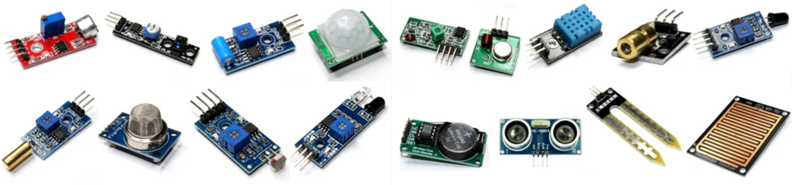

Los **sensores** son dispositivos capaces de **detectar una magnitud física** (como la temperatura, la luz, la distancia o el movimiento) y **convertirla en una señal eléctrica** que puede ser procesada por un circuito o un microcontrolador.

En los proyectos de **robótica y sistemas electrónicos programados**, los sensores permiten que los dispositivos **perciban su entorno** y **respondan de forma automática** a los cambios que se producen en él.  
Gracias a ellos, un sistema robótico puede **medir, comparar y actuar**: por ejemplo, encender una luz al detectar oscuridad, medir la distancia a un objeto o reaccionar ante el movimiento de una persona.

📌 **Idea clave:**

> Un sensor transforma una variable del mundo real en una **señal eléctrica útil** para el sistema electrónico o el microcontrolador.

Los sensores se pueden clasificar de muchas maneras, pero una de las más prácticas en este módulo es según **la magnitud que detectan**:

- **Temperatura:** termistores (NTC, PTC).

- **Iluminación:** LDR (resistencia variable según la luz).

- **Sonido:** detectan distancias mediante ondas de sonido.

- **Presencia o movimiento:** sensores PIR (detección por infrarrojos).

👉 En los próximos apartados se estudiarán sus **principios de funcionamiento**, **formas de conexión** y **aplicaciones prácticas** en montajes con microcontroladores.

### 4.1. Sensores de temperatura

[⬅️ Bloque anterior](#4-sensores) | [🔝 Índice](#indice-de-contenidos) | [➡️ Siguiente bloque](#42-sensores-de-luz)

#### 4.1.1. Concepto general de sensor de temperatura

Un **sensor de temperatura** es un componente que **detecta los cambios de temperatura del entorno** y los transforma en una **señal eléctrica**.  
En electrónica, los más comunes son los **termistores**, aunque también existen sensores integrados y sondas de precisión.

#### 4.1.2. Elementos sensibles a la temperatura

En electrónica, existen distintos tipos de sensores que utilizan **elementos electrónicos sensibles a la temperatura**, como:

- **Termistores (NTC y PTC):** varían su **resistencia eléctrica** según la temperatura.

- **Diodos y transistores:** su **caída de tensión** cambia aproximadamente **–2 mV/°C**, lo que permite construir sensores muy precisos como el **LM35** o el **TMP36**.

- **Resistencias metálicas (RTD):** usan materiales como **platino o níquel**, cuya resistencia aumenta de forma casi lineal con la temperatura (ejemplo: **Pt100**).

- **Termopares:** generan una **pequeña tensión eléctrica** al calentar la unión de **dos metales distintos** (efecto Seebeck).

- **Sensores infrarrojos:** detectan la **radiación térmica** emitida por los cuerpos, permitiendo medir la temperatura **sin contacto**.

De todos ellos, los **termistores** son los más habituales en **robótica educativa y proyectos electrónicos básicos**, por su **bajo coste, facilidad de uso y respuesta rápida**.

A continuación, se explican con más detalle los **termistores**, por ser los más utilizados, y después, de forma general, otros **elementos electrónicos sensibles a la temperatura**.

##### 4.1.2.1. Termistores

Los **termistores** son resistencias cuyo **valor varía con la temperatura**.  
Existen dos tipos principales:

- **NTC (Negative Temperature Coefficient):**  
  Su **resistencia disminuye** cuando **aumenta** la temperatura.  
  Se utilizan para **medir temperatura** o **compensar variaciones térmicas**.

- **PTC (Positive Temperature Coefficient):**  
  Su **resistencia aumenta** cuando **aumenta** la temperatura.  
  Se emplean como **limitadores de corriente** o **protección contra sobrecalentamientos**.

###### 🔹 Parámetros característicos

- **Resistencia nominal (R₀):** resistencia del termistor a una temperatura de referencia, normalmente **25 °C**.  
  Ejemplo: NTC 10 kΩ @ 25 °C.

- **Constante B (β):** indica cómo varía la resistencia con la temperatura.  
  Cuanto mayor es **B**, más pronunciada es la variación.

- **Rango de funcionamiento:** indica las temperaturas mínimas y máximas de trabajo.

- **Precisión y tolerancia:** determinan la fiabilidad de la medida.

###### 🔹 Funcionamiento básico

A temperatura baja, un NTC presenta una **alta resistencia**; al aumentar la temperatura, los electrones ganan energía y la **resistencia disminuye**.  
Este cambio puede transformarse en una **variación de tensión** si se conecta en un **divisor de tensión**.

###### 🔹 Conexión típica: divisor de tensión

El método más habitual para obtener una señal eléctrica proporcional a la temperatura es mediante un **divisor de tensión**:

```text
(VCC) ── [R fijo] ──●── [NTC] ── (GND)
                     │
                     └── Vout
```

##### 4.1.2.2. Otros elementos electrónicos sensibles a la temperatura

Además de los **termistores**, existen otros **componentes electrónicos** que también modifican alguna de sus propiedades eléctricas cuando cambia la temperatura.  
Estos elementos se utilizan como **base en la construcción de muchos sensores de temperatura** más avanzados.

###### 🔹 Diodos y transistores

La **caída de tensión** en la unión PN de un **diodo** o entre **base y emisor** de un **transistor** disminuye aproximadamente **2 mV por cada grado Celsius** que aumenta la temperatura.  
Este principio se emplea en sensores como el **LM35** o el **TMP36**, que ofrecen una **salida analógica lineal** proporcional a la temperatura.

###### 🔹 Resistencias metálicas (RTD)

Algunos metales como el **platino, níquel o cobre** aumentan su resistencia de forma casi **lineal con la temperatura**.  
Estos elementos, conocidos como **detectores de temperatura por resistencia (RTD)**, se usan en instrumentación de **alta precisión**.  
Ejemplo típico: **Pt100**, cuya resistencia es de 100 Ω a 0 °C.

###### 🔹 Termopares

Un **termopar** está formado por la unión de **dos metales distintos**.  
Cuando esa unión se calienta, aparece una **pequeña tensión eléctrica** (efecto **Seebeck**) proporcional a la temperatura.  
Se utilizan en **entornos industriales** y en la medición de **altas temperaturas**.

###### 🔹 Sensores infrarrojos

Estos sensores no necesitan contacto físico con el objeto, ya que **detectan la radiación térmica** que emite.  
Permiten medir temperatura a distancia y se utilizan en **termómetros digitales** o **sistemas de visión térmica**.  
Ejemplo: **MLX90614**.

📘 **En resumen:**

> Los **termistores** son los elementos más sencillos y comunes, pero también existen **diodos, transistores, metales y detectores ópticos** capaces de reaccionar ante la temperatura.  
> Estos componentes se emplean en la fabricación de **sensores analógicos y digitales** más sofisticados, como el **LM35**, el **TMP36**, el **DS18B20** o el **DHT11**, que se estudiarán a continuación.

#### 

#### 4.1.3. Sensores de temperatura analógicos y digitales

Los sensores de temperatura pueden clasificarse en **analógicos o digitales** según el **tipo de señal eléctrica** que entregan al microcontrolador:

- Los **sensores analógicos** producen una **tensión continua variable**, directamente proporcional a la temperatura.

- Los **sensores digitales** realizan internamente la **conversión analógica-digital** y entregan la información de temperatura mediante una **señal digital**, que puede ser un **nivel lógico (0 o 1)** o una **comunicación codificada** con bits (por ejemplo, los protocolos One-Wire o I²C).

En ambos casos, el microcontrolador interpreta la señal para obtener la temperatura medida, pero la forma de conexión y lectura es distinta.

En este contexto, el término **microcontrolador** se refiere al **chip principal que incorporan las placas programables** (como **Arduino**, **ESP32** o **Raspberry Pi Pico**), encargado de leer las señales de los sensores y ejecutar el programa cargado.

##### 4.1.3.1. Sensores analógicos

Los sensores analógicos entregan una **tensión continua variable** que varía **de forma proporcional a la temperatura**.  
El microcontrolador la interpreta mediante su **conversor analógico-digital (ADC)**, obteniendo un valor numérico proporcional a la temperatura medida.

**Ejemplos más comunes:**

- **LM35**
  
  - Salida **lineal** de 10 mV por cada grado Celsius.
  
  - A 25 °C entrega aproximadamente **250 mV**.
  
  - No necesita calibración externa.
  
  - Muy utilizado por su sencillez y buena precisión.
  
  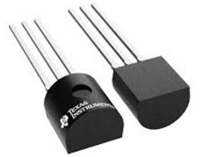

- **TMP36**
  
  - Similar al LM35, pero su salida incluye un **desplazamiento de 500 mV** para permitir medir **temperaturas bajo cero**.

- **Módulos con NTC**
  
  - Algunos sensores utilizan una **NTC** conectada con una **resistencia fija** formando un **divisor de tensión**, de modo que la salida analógica varía según la temperatura.
  
  - El microcontrolador interpreta esa variación mediante su conversor A/D.
  
  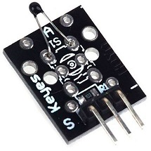

**Ventajas:**

- Fáciles de conectar y de entender.

- Económicos y disponibles en muchos kits educativos.

**Inconvenientes:**

- Menor precisión.

- Sensibles al ruido eléctrico.

- Requieren calibración en algunos casos.

##### 4.1.3.2. Sensores digitales

Los sensores digitales realizan internamente la **conversión analógica-digital** y entregan directamente un **valor numérico de temperatura** mediante un **protocolo de comunicación** (One-Wire, I²C, etc.).

**Ejemplos más habituales:**

- **DS18B20**
  
  - Comunicación **One-Wire** (solo necesita un pin de datos).
  
  - Alta precisión (± 0,5 °C).
  
  - Puede conectarse más de un sensor al mismo pin.
  
  - Rango de trabajo: –55 °C a +125 °C.
  
  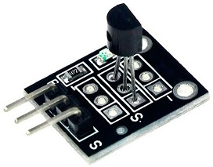

- **DHT11 / DHT22**
  
  - Miden **temperatura y humedad**.
  
  - **DHT22** ofrece mayor precisión y rango.
  
  - Transmiten los datos mediante una señal digital codificada.
  
  

- **BMP180 / BMP280**
  
  - Sensores digitales de **temperatura y presión atmosférica**.
  
  - Se comunican mediante **I²C** o **SPI**.
  
  - Muy usados en estaciones meteorológicas o robots que detectan altitud.

**Ventajas:**

- Lectura directa y precisa.

- Menor susceptibilidad al ruido.

- Permiten combinar varios sensores en un mismo bus de datos.

**Inconvenientes:**

- Comunicación más compleja.

- Precio ligeramente superior.

##### 🔸 Módulos híbridos con sensor analógico y salida digital

Algunos módulos combinan un **sensor analógico** (como un **termistor NTC**) con un pequeño circuito electrónico que permite obtener **dos tipos de salida**:  
una **analógica continua (A0)** y otra **digital (D0)**.

En este tipo de módulos:

- El **termistor NTC** detecta los cambios de temperatura y genera una **señal analógica variable** que puede leerse a través del pin **A0**.  
  Cuanto mayor es la temperatura, **menor es la tensión de salida**.  
  Esta salida permite **medir la temperatura** de forma continua, igual que con otros sensores analógicos.

- La salida **digital (D0)** procede de un **circuito comparador** (basado en un chip tipo LM393 o equivalente), que compara la tensión del NTC con un valor de referencia ajustado mediante el **potenciómetro**.  
  Cuando la temperatura **supera el umbral configurado**, el módulo **actúa como un interruptor electrónico**, activando el **LED indicador** y enviando una señal **HIGH (5 V)** al pin digital del microcontrolador.

| Pin    | Tipo de salida | Descripción                                             | Uso principal                                |
|:------:|:-------------- |:------------------------------------------------------- |:-------------------------------------------- |
| **A0** | Analógica      | Tensión variable proporcional a la temperatura.         | Medición continua de temperatura.            |
| **D0** | Digital        | Señal binaria (0 / 1) según el umbral térmico ajustado. | Activar ventiladores, alarmas o indicadores. |

Gracias a esta doble funcionalidad, estos módulos pueden emplearse tanto para **medir temperatura** como para **detectar cuándo se alcanza una temperatura límite**, combinando así las ventajas de los sensores analógicos y digitales.

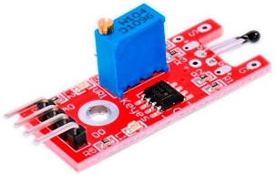

**Observación:** Los sensores **LM35**, **TMP36** y **DS18B20** tienen un aspecto físico muy similar (encapsulado TO-92).  
Para diferenciarlos es necesario **leer la referencia impresa** en el componente, ya que externamente parecen idénticos.

#### 4.1.4. Aplicaciones en robótica y sistemas automáticos

Los sensores de temperatura se emplean en múltiples tareas:

- **Control térmico** de motores, servos o placas electrónicas.

- **Monitoreo ambiental** en estaciones meteorológicas o invernaderos.

- **Protección contra sobrecalentamientos** en fuentes de alimentación o controladores.

- **Regulación de ventiladores o sistemas de refrigeración.**

--- 

### 4.2. Sensores de luz

[⬅️ Bloque anterior](#4-sensores) | [🔝 Índice](#indice-de-contenidos) | [➡️ Siguiente bloque](#42-sensores-de-temperatura)

#### 4.2.1. Introducción

Un **sensor de luz** es un dispositivo capaz de **detectar la cantidad de luz presente en el entorno** y transformarla en una **señal eléctrica** que puede ser interpretada por un circuito o un microcontrolador.

Estos sensores permiten que un sistema **reaccione ante cambios de iluminación**, por ejemplo, encendiendo una lámpara cuando oscurece o siguiendo una fuente luminosa en un robot.

La señal generada por el sensor puede variar **de forma continua (analógica)** o ser **todo o nada (digital)**, dependiendo del tipo de sensor empleado.

#### 📗 **Clasificación de los sensores de luz**

Los **sensores de luz** o **sensores ópticos** son dispositivos que detectan la cantidad o presencia de luz en el entorno y la transforman en una señal eléctrica.  
Se pueden clasificar en **dos grandes grupos**, según la forma en que responden a la luz:

---

##### 🔹 1. **Sensores resistivos**

- Su **resistencia eléctrica varía** con la cantidad de luz recibida.

- Cuanta más luz incide sobre ellos, **menor es su resistencia**.

- Generan una **señal analógica** (un voltaje que cambia progresivamente).

**Ejemplo principal:**

- **Fotoresistencia (LDR)**

📘 *Uso típico:* medir niveles de luz ambiental o activar luces automáticas.

---

##### 🔹 2. **Sensores electrónicos o semiconductores**

- Transforman directamente la luz en **corriente o voltaje eléctrico**.

- Son **más rápidos y precisos** que las LDR.

- Muy utilizados en sistemas digitales o de alta velocidad.

**Se dividen en:**

| Tipo               | Principio de funcionamiento         | Características                   | Ejemplos de uso                              |
| ------------------ | ----------------------------------- | --------------------------------- | -------------------------------------------- |
| **Fotodiodo**      | Genera corriente cuando recibe luz. | Rápido, preciso, poca señal.      | Contadores ópticos, mandos IR.               |
| **Fototransistor** | Amplifica la señal de luz recibida. | Muy sensible, salida más intensa. | Barreras de luz, robots seguidores de línea. |

---

📘 **Relación entre sensores de temperatura y de luz**

Muchos sensores analógicos, como los **termistores NTC** (que detectan temperatura) o las **fotoresistencias (LDR)** (que detectan luz), funcionan con un **principio similar**:  
su **resistencia eléctrica varía** según la magnitud física que detectan.

Estos componentes no generan voltaje directamente, pero al conectarse junto con una **resistencia fija** en un **divisor de tensión**, provocan que la **tensión de salida cambie** cuando varía la temperatura o la iluminación.

De este modo, el microcontrolador puede medir esa variación de voltaje y traducirla en un valor de temperatura o nivel de luz.

#### **4.2.2. Fotoresistencias (LDR)**

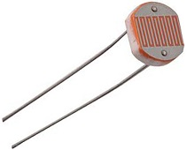

Las **LDR (Light Dependent Resistor)** o **fotoresistencias** son sensores analógicos que **varían su resistencia eléctrica según la cantidad de luz que reciben**.

Cuando la **iluminación aumenta**, los electrones del material semiconductor interno (normalmente sulfuro de cadmio, CdS) ganan energía y **disminuye la resistencia** del componente.  
En la oscuridad ocurre lo contrario: los electrones quedan menos excitados y la **resistencia aumenta**.

| Iluminación (lux)        | Resistencia típica (Ω) |
| ------------------------ | ---------------------- |
| 1000 (luz intensa)       | ~1 kΩ                  |
| 100 (interior iluminado) | ~10 kΩ                 |
| 10 (penumbra)            | ~100 kΩ                |
| 1 (oscuridad)            | >1 MΩ                  |

🔹 **Curva característica:**

> La relación entre luz y resistencia no es lineal.  
> A medida que la luz aumenta, la resistencia disminuye de forma **logarítmica**.
> 
> 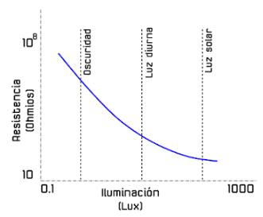

##### Formas de conectar un fotoresistor

Existen dos formas básicas para la conexión de nuestra LDR, pueden ser utilizadas dependiendo del fin deseado. Si disponemos de un controlador es posible modificar los resultados mediante programación.

1. ***Pull-up* o  Mayor oscuridad, mayor voltaje**: En este caso, la resistencia fija se conecta al nodo positivo de la fuente de voltaje y la fotoresistencia al nodo de masa (GND). Cuando disminuye la iluminación, la resistencia de la LDR aumenta, haciendo que el voltaje en el punto de referencia (Vout) se aproxime al de la fuente de alimentación.
   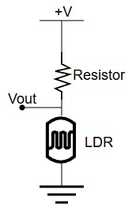

2. ***Pull-down* o Mayor luz, mayor voltaje**: Al conectar la fotoresistencia al nodo positivo de la fuente de voltaje y la resistencia fija al nodo de masa (GND), al incidir una mayor cantidad de luz sobre la LDR su resistencia disminuye. Esto provoca una menor caída de voltaje en la fotoresistencia y, por tanto, un mayor voltaje en el pin de referencia (Vout), obteniéndose una lectura mayor.<br>
   
   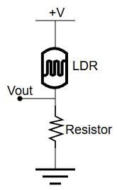

Se puede sustituir el resistor por un potenciómetro si vamos a cambiar de un estado a otro, por lo tanto la iluminación va a variar, con esto evitamos modificar el código de programación.

##### 📘 Módulo sensor de luz (LDR con potenciómetro)


Además de las **fotoresistencias sueltas**, existen **sensores de luz montados sobre una pequeña placa**.  
Estos módulos incluyen la **LDR**, un **potenciómetro** y algunos componentes electrónicos que facilitan su uso con placas como **Arduino**.

El **potenciómetro** permite **ajustar la sensibilidad del sensor**, es decir, decidir a partir de qué nivel de luz el módulo considera que hay claridad o que hay oscuridad.

Suelen tener **tres pines**:

| Pin     | Función                                     |
| ------- | ------------------------------------------- |
| **VCC** | Alimentación (3,3 V o 5 V)                  |
| **GND** | Tierra                                      |
| **OUT** | Señal de salida (0 o 1 según haya luz o no) |

👉 Cuando la luz es intensa, el módulo puede enviar una señal diferente a cuando hay oscuridad.  
Así, por ejemplo, se puede usar para **encender luces automáticamente por la noche** o **detectar la dirección de una fuente de luz en un robot**.

📙 **Nota medioambiental**

Muchas **fotoresistencias (LDR)** tradicionales están fabricadas con **sulfuro de cadmio (CdS)**, un material que contiene **cadmio**, elemento tóxico y restringido por la **Directiva RoHS** de la Unión Europea.  
Por eso, cada vez se utilizan más **sensores de luz alternativos**, como los **TEMT6000**, **TSL2561** o **TSL2591**, que ofrecen **mayor precisión** y son **respetuosos con el medio ambiente**.

#### **4.2.3. Fotodiodos**

Los **fotodiodos** son sensores que **detectan la presencia o la cantidad de luz** mediante el **efecto fotoeléctrico interno**.  
Cuando la luz incide sobre su superficie, los fotones liberan electrones dentro del material semiconductor y se genera una **pequeña corriente eléctrica**.

Esa corriente es muy débil y **no se utiliza como fuente de energía**, sino simplemente como **señal eléctrica** que indica que el fotodiodo está recibiendo luz.  
Por eso, se emplea como un **indicador o detector luminoso**, no como un generador eléctrico (como sería una célula solar).

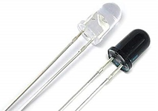

> 🔹 **Externamente, un LED y un fotodiodo tienen un aspecto muy similar.**  
> Ambos suelen tener el mismo tipo de encapsulado con dos patillas, por lo que **no pueden distinguirse a simple vista**.  
> La diferencia está en su **funcionamiento interno**:
> 
> - el **LED** emite luz cuando pasa corriente,
> 
> - el **fotodiodo** genera una pequeña corriente al recibir luz.

📗 **Características principales**

- Está formado por un **diodo semiconductor** sensible a la luz.

- Los fotodiodos se utilizan **polarizados en inverso** cuando se emplean como sensores de luz,  ya que esta configuración **aumenta su sensibilidad y velocidad de respuesta**.

- La **corriente inversa aumenta** (es la señal que el circuito aprovecha para saber que el fotodiodo está recibiendo luz) cuando el fotodiodo recibe más luz.
  En oscuridad, la corriente inversa es despreciable; con luz, aumenta hasta niveles detectables, generando la señal utilizada por el microcontrolador.

- Su **respuesta es muy rápida**, mucho más que la de una fotoresistencia (LDR).

📙 **Aplicaciones más comunes**

- **Mandos a distancia** (receptores infrarrojos).

- **Barreras de luz** o **contadores ópticos**.

- **Robots o sistemas automáticos** que necesitan detectar cambios de iluminación.

- **Dispositivos de comunicación por fibra óptica.**

📒 **Ventajas**

- Detecta la luz con gran **rapidez y precisión**.

- Funciona tanto con **luz visible** como **infrarroja**.

- Consume muy poca energía.

📕 **Desventajas**

- La corriente que genera es **muy pequeña**, por lo que suele necesitar un **amplificador o comparador** para poder interpretarla.

- No sirve para **medir niveles de luz** como una LDR, sino solo para **detectar presencia o ausencia de luz**.

##### 📗 **Conexión básica de un fotodiodo**

Un **fotodiodo suelto** puede conectarse fácilmente a un circuito si se utiliza junto a una **resistencia** formando un **divisor de tensión**, del mismo modo que ocurre con una **fotoresistencia (LDR)**.  
Sin embargo, la **forma de conexión es diferente**, porque el **fotodiodo debe polarizarse en inverso** para funcionar correctamente.

📘 **Conexión típica:**

- **Ánodo** del fotodiodo → a **GND (negativo)**

- **Cátodo** del fotodiodo → a **VCC** a través de una **resistencia**

- El **punto medio** (entre el cátodo y la resistencia) → a una **entrada analógica (A0)** del microcontrolador

```text
+5V ──[R]──┬──►|── GND
           │
           └──→ A0 (señal)
```

*(El símbolo ►| representa el fotodiodo polarizado en inverso.)*

📙 **Funcionamiento**

- En **oscuridad**, el fotodiodo prácticamente **no conduce** y la tensión en A0 es **muy baja**.

- Cuando **recibe luz**, la corriente inversa **aumenta**, y la **tensión en A0 sube**.

- El microcontrolador interpreta esa variación como un **aumento de luz**.

📒 **Nota**

> En la práctica, los valores de la resistencia pueden variar (por ejemplo, 10 kΩ o 100 kΩ) según la sensibilidad del fotodiodo y la cantidad de luz.  
> Por eso, los **módulos comerciales** incluyen el circuito ya calibrado y con **potenciómetro ajustable**.

##### 📘 **Módulos con fotodiodo**

Además del **fotodiodo suelto**, existen **módulos sensores** que ya incorporan el fotodiodo junto con todos los **componentes electrónicos necesarios** para su funcionamiento.  
Estos módulos están pensados para **conectarse directamente a una placa Arduino** o a otro microcontrolador sin necesidad de montar el circuito desde cero.

📗 **Elementos que suele incluir un módulo con fotodiodo**

- **Fotodiodo receptor**, que detecta la luz.

- **Resistencias y comparadores**, para adaptar la señal y hacerla utilizable.

- **Potenciómetro**, que permite **ajustar la sensibilidad** del sensor.

- **LED indicador**, que se enciende cuando el módulo detecta luz.

- **Pines de conexión** (VCC, GND y OUT) listos para conectar con cables Dupont.

📙 **Funcionamiento**

- El **fotodiodo** genera una corriente al recibir luz.

- El circuito interno la convierte en una **señal eléctrica limpia** (analógica o digital).

- El **potenciómetro** permite ajustar el umbral de detección sin modificar el código del programa.

- El **LED** muestra de forma visual cuándo se ha detectado luz.

📒 **Tipos de salida**

| Tipo de salida     | Descripción                                              | Uso                                                         |
| ------------------ | -------------------------------------------------------- | ----------------------------------------------------------- |
| **Analógica (A0)** | Entrega un valor proporcional a la intensidad de la luz. | Permite medir variaciones de iluminación.                   |
| **Digital (D0)**   | Indica si la luz supera o no el umbral ajustado.         | Ideal para detección “sí/no” (presencia o ausencia de luz). |

📕 **Ventajas**

- Listo para usar: no requiere montaje adicional.

- Ajuste de sensibilidad mediante potenciómetro.

- Puede conectarse directamente al Arduino.

- Incluye LED indicador de detección.

📗 **En resumen**

> El **módulo con fotodiodo** es una **versión práctica y completa** del sensor,  
> que integra el propio fotodiodo con la electrónica de control necesaria para **ofrecer una salida estable y fácilmente interpretable** por un microcontrolador.

##### 📘 **Tipos de módulos con fotodiodo**

Además de los fotodiodos individuales, existen numerosos **módulos electrónicos** que los incorporan junto con los **componentes necesarios para su funcionamiento**.  
Estos módulos facilitan su conexión a una placa **Arduino** o a otros sistemas programables y permiten aprovechar las propiedades del fotodiodo para diferentes aplicaciones.

Según su finalidad, podemos distinguir tres tipos principales:

---

##### 🔹 **1. Sensores de luz ambiental**

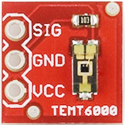

Estos módulos detectan la **cantidad de luz visible** presente en el entorno.  
El fotodiodo actúa como detector y el circuito convierte su señal en una tensión proporcional a la iluminación.

Algunos modelos entregan una **salida analógica (A0)**, que varía de forma continua según la luz, y otros una **salida digital (D0)**, que cambia de estado cuando la luz supera un umbral ajustable mediante potenciómetro.

📗 **Aplicaciones**

- Encendido automático de luces.

- Medición de luminosidad ambiental.

- Control de brillo en pantallas o robots seguidores de luz.

📒 **Ejemplo**

- Módulo TSL2561 o TEMT6000.

- Alimentación de **3,3 V o 5 V**.

- Pines: **VCC, GND, A0/D0**.

---

##### 🔹 **2. Sensores de infrarrojos (IR)**

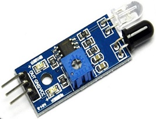

Estos módulos no miden la luz visible, sino la **radiación infrarroja (IR)**, que es **invisible al ojo humano**.  
Utilizan un **LED emisor infrarrojo** y un **fotodiodo receptor**, o en algunos casos un **fototransistor IR**, colocados frente a frente o en ángulo.

📘 **Funcionamiento**

- El LED emite un haz de luz infrarroja.

- El fotodiodo detecta si ese haz llega directamente o reflejado por un objeto.

- Si el haz se interrumpe o se refleja, el módulo genera una señal digital.

📗 **Aplicaciones**

- **Sensores de obstáculo** (robots seguidores de línea, alarmas).

- **Sensores de barrera** (control de paso de objetos).

- **Receptores de mandos a distancia.**

📙 **Ejemplo**

- Módulo **KY-032** (sensor de obstáculo IR).

- Módulo **KY-010** (sensor de ranura o light blocking).

- Módulo **KY-022** (receptor IR para mando).

📒 **Nota**

> Algunos de estos módulos utilizan **fototransistores IR** en lugar de fotodiodos.  
> En la práctica, ambos funcionan de forma similar: detectan la presencia o ausencia de luz infrarroja.  
> El fototransistor ofrece una señal más intensa, por eso se usa con mayor frecuencia en detección de objetos o barreras.

📙 **Rechazo de luz ambiente en sensores IR**

Los **sensores infrarrojos (IR)** están diseñados para funcionar incluso en entornos con luz solar o artificial intensa.  
Para evitar detecciones falsas, muchos módulos IR **modulan la señal del LED emisor**, encendiéndolo y apagándolo unas **38 000 veces por segundo (38 kHz)**.  
El **receptor solo responde a esa frecuencia específica**, por lo que **ignora la luz constante del entorno** y únicamente detecta la señal procedente del emisor del propio sensor o del mando a distancia.

---

##### 🔹 **3. Sensores biomédicos**

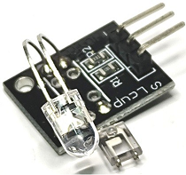

Estos sensores utilizan el fotodiodo para **detectar variaciones en la luz reflejada por el cuerpo humano**.  
Suelen incluir **un LED emisor (rojo o infrarrojo)** y un **fotodiodo receptor**, montados muy próximos entre sí.

📘 **Funcionamiento**

- El LED emite luz hacia la piel (por ejemplo, el dedo).

- La sangre absorbe parte de esa luz.

- Con cada latido, varía la cantidad de luz reflejada, y el **fotodiodo capta esos cambios**.

- El circuito amplifica la señal para calcular el **ritmo cardíaco** o el **nivel de oxígeno (SpO₂)**.

📗 **Aplicaciones**

- Módulos de **frecuencia cardíaca (Heartbeat Sensor)**.

- Módulos de **oximetría (SpO₂)**.

- Relojes inteligentes y pulseras deportivas.

📒 **Ejemplo**

- Módulo **KY-039** (Heart Rate Sensor).

- Módulo **MAX30100 / MAX30102** (sensor combinado de pulso y oxígeno).

--- 

#### **4.2.4. Fototransistores**

Los **fototransistores** son sensores electrónicos que **detectan la luz** al igual que los fotodiodos, pero con una **sensibilidad mucho mayor**.  
Funcionan como un **transistor normal**, pero su **base está controlada por la luz** en lugar de por una corriente eléctrica.

Cuando la **luz incide sobre el fototransistor**, los fotones liberan electrones dentro del material semiconductor, lo que **aumenta la corriente** que circula entre el **colector y el emisor**.  
Cuanta más luz recibe, **mayor es la corriente** de salida.

📙 **Diferencia respecto al fotodiodo**

> El fotodiodo produce una pequeña corriente al recibir luz,  
> mientras que el fototransistor **amplifica internamente** esa corriente,  
> generando una señal **más fuerte y fácil de detectar** por el circuito.

---

##### 📗 **Características principales**

- Está formado por un **transistor semiconductor** cuya **base es sensible a la luz**.

- Al recibir luz, **la corriente entre colector y emisor aumenta**.

- Cuanta más luz incide sobre él, **más corriente conduce**.

- Suele tener **dos patillas** (colector y emisor); la base interna está controlada por la luz.

- Algunos modelos incluyen una **tercera patilla (base)**, aunque normalmente no se usa.

- La **respuesta es rápida** y la **señal de salida más intensa** que en un fotodiodo.

- Puede detectar **luz visible o infrarroja**, según el tipo de encapsulado.

📘 **Color del encapsulado**

- **Transparente:** sensible a luz visible.

- **Negro u oscuro:** sensible solo a **luz infrarroja (IR)**.

---

##### 📙 **Conexión básica de un fototransistor**

Un **fototransistor suelto** se conecta de forma similar a un transistor NPN, aunque la base no se conecta a nada, ya que la **luz actúa como señal de control**.

📘 **Conexión típica (modo colector común):**

- **Colector** → a **VCC (5 V)** mediante una **resistencia**.

- **Emisor** → a **GND (negativo)**.

- **Punto intermedio (entre el colector y la resistencia)** → a una **entrada analógica (A0)** o **digital (D0)** del microcontrolador.

```text
+5V ──[R]──┬──┤>── GND
           │
           └──→ A0 (señal)
```

*(El símbolo ┤> representa el fototransistor.)*

📗 **Funcionamiento**

- En **oscuridad**, el fototransistor **no conduce**, y la tensión en A0 es alta (cercana a 5 V).

- Al recibir luz, **comienza a conducir corriente**, lo que **disminuye la tensión en A0**.

- El microcontrolador detecta esta variación y puede interpretar la presencia o ausencia de luz.

📙 **Nota**

> En algunos circuitos, el fototransistor se conecta al revés (emisor al positivo y colector al negativo),  
> dependiendo del tipo de lectura que se desee (mayor luz → mayor voltaje o al contrario).

---

##### 📘 **Aplicaciones más comunes**

- **Sensores de obstáculo infrarrojos.**  
  Detectan si un objeto refleja la luz IR emitida por un LED.

- **Sensores de barrera o de ranura.**  
  Detectan si un objeto interrumpe un haz de luz.

- **Receptores de mandos a distancia (IR).**  
  Captan la señal modulada de un control remoto.

- **Sensores de llama.**  
  Detectan radiación infrarroja emitida por el fuego.

- **Contadores ópticos o lectores de velocidad.**  
  Detectan pasos o rotaciones mediante interrupciones de luz.

---

##### 📒 **Ventajas**

- **Alta sensibilidad** a la luz.

- **Señal de salida intensa**, fácil de procesar.

- **Respuesta rápida** y estable.

- Puede funcionar con **luz visible o infrarroja**.

##### 📕 **Desventajas**

- **Menor linealidad** que un fotodiodo (no mide luz, solo detecta presencia).

- Puede **saturarse** con luz muy intensa.

- Su respuesta puede variar entre modelos.

---

##### 📗 **Módulos con fototransistor**

Los **fototransistores** están integrados en numerosos módulos ópticos.  
Aunque externamente se parezcan a los módulos con fotodiodo, su **salida es más intensa** y su uso más común es la **detección de presencia u obstáculos**.

📘 **Ejemplos de módulos**

- **Sensor de obstáculo IR (KY-032, KY-033)** → Detección por reflexión infrarroja.

- **Sensor de barrera (KY-010)** → Detección de interrupciones de un haz de luz.

- **Receptor IR (KY-022)** → Recepción de señales de mandos a distancia.

- **Sensor de línea (TCRT5000 o similar)** → Detecta contraste entre superficie blanca y negra.

📙 **Nota**

> Muchos módulos IR y ópticos combinan un **LED emisor** y un **fototransistor receptor**.  
> En otros casos, se sustituye por un **fotodiodo** según el fabricante,  
> pero el principio de funcionamiento es siempre el mismo:  
> **detectar la luz reflejada o interrumpida**.

---

##### 📕 **En resumen**

> El **fototransistor** es un sensor **más sensible que el fotodiodo**,  
> capaz de amplificar internamente la señal producida por la luz.
> 
> Se utiliza en **módulos de detección de obstáculos, barreras, receptores IR y sensores de línea**,  
> donde la finalidad no es medir la intensidad de la luz, sino **detectar su presencia o variación**.

--- 

📘 **Parámetros característicos de los sensores de luz**

Cuando se consulta la **hoja de datos** (*datasheet*) de un sensor óptico, se pueden encontrar algunos **parámetros técnicos** que ayudan a comprender su comportamiento y a elegir el más adecuado según la aplicación:

- **Respuesta espectral:** indica a qué tipo de luz responde mejor el sensor (luz visible, infrarroja o ultravioleta).

- **Ángulo de visión (FOV – Field of View):** determina el área desde la que el sensor puede captar la luz. Un ángulo estrecho concentra la detección en una zona pequeña; uno amplio permite captar más entorno.

- **Sensibilidad:** mide la cantidad de señal que genera el sensor para una determinada cantidad de luz. Cuanta mayor sensibilidad, más capaz es de detectar pequeñas variaciones de iluminación.

- **Corriente oscura:** es la pequeña corriente que produce el sensor incluso en completa oscuridad. Representa un valor de error o “ruido” del dispositivo.

- **Rango dinámico:** indica el intervalo de iluminación que el sensor puede medir correctamente sin saturarse ni perder precisión.

📙 **En resumen:**

> Estos parámetros permiten comparar distintos sensores de luz y comprender mejor su comportamiento en condiciones reales, ayudando a seleccionar el más adecuado para cada tipo de proyecto o entorno.

--- 

⏱️ **Tiempo de respuesta y usos**

Las **LDR** responden **lentas** (≈ decenas – centenas de milisegundos), por eso se emplean para **medir luz ambiental** o ajustar el **brillo** en sistemas donde los cambios son progresivos.  
En cambio, los **fotodiodos** y **fototransistores** reaccionan **mucho más rápido** (microsegundos – milisegundos), lo que los hace ideales para **detección de objetos**, **contadores ópticos**, **barreras IR** o **seguimiento de líneas** en robótica.

| Sensor                    | Tipo de señal       | Tiempo de respuesta típico | Aplicaciones más adecuadas                                     |
| ------------------------- | ------------------- | -------------------------- | -------------------------------------------------------------- |
| **LDR (fotoresistencia)** | Analógica           | 10 – 500 ms (lento)        | Luz ambiental, encendido automático, brillo de pantallas.      |
| **Fotodiodo**             | Analógica o digital | < 1 µs (muy rápido)        | Contadores ópticos, recepción IR, comunicaciones ópticas.      |
| **Fototransistor**        | Analógica o digital | 1 – 50 µs (rápido)         | Barreras de luz, detección de obstáculos, seguidores de línea. |

📘 **Conclusión:**

> El **tiempo de respuesta** determina la rapidez con la que el sensor puede reaccionar a los cambios de luz.  
> Cuanto menor sea este tiempo, **mayor velocidad de detección**, aunque también aumenta la **complejidad del circuito**.

---

### 4.3. Sensores de sonido

[⬅️ Bloque anterior](#43-sensores-de-luz) | [🔝 Índice](#indice-de-contenidos) | [➡️ Siguiente bloque](#44-sensores-de-presencia-o-movimiento)

#### 4.3.1 Introducción

El **sonido** es una **vibración mecánica** que se propaga a través de un **medio material** (como el aire, el agua o un sólido) en forma de **ondas longitudinales**.  
Estas ondas producen variaciones de presión que el oído humano puede percibir cuando su **frecuencia** se encuentra dentro del rango audible.

📘 **Características básicas de una onda sonora:**

- **Frecuencia (Hz):** número de vibraciones por segundo. Determina el **tono** del sonido (grave o agudo).

- **Amplitud:** representa la **intensidad** o volumen del sonido.

- **Longitud de onda (λ):** distancia entre dos puntos equivalentes de la onda.

- **Velocidad de propagación:** depende del medio; por ejemplo, en el aire a temperatura ambiente es aproximadamente **343 m/s**.

> 🔹 **Ejemplo:** al hablar o aplaudir, las cuerdas vocales o las palmas generan vibraciones que viajan por el aire en forma de ondas sonoras, y un micrófono puede transformarlas en una señal eléctrica.

📗 **Tipos de ondas sonoras según su frecuencia**

| Tipo de sonido     | Frecuencia aproximada | Perceptible por el oído humano | Ejemplos de aplicación                                     |
| ------------------ | --------------------- | ------------------------------ | ---------------------------------------------------------- |
| **Infrasonido**    | < 20 Hz               | ❌ No audible                   | Medición sísmica, detección industrial.                    |
| **Sonido audible** | 20 Hz – 20 kHz        | ✅ Sí audible                   | Voz, música, ruido ambiental.                              |
| **Ultrasonido**    | > 20 kHz              | ❌ No audible                   | Ecografía, medición de distancia, detección de obstáculos. |

📙 **Diferencia entre sonido audible y ultrasonido**

- El **sonido audible** se utiliza en sensores que **captan vibraciones o ruidos** (micrófonos, módulos KY-037 o KY-038).

- El **ultrasonido**, en cambio, se emplea en sensores que **emiten y reciben ondas de alta frecuencia** para **medir distancias o detectar objetos** (como el módulo **HC-SR04**).

📘 **En resumen:**

> Todos los sensores acústicos trabajan con ondas sonoras,  
> pero los sensores de **sonido** detectan **ruido o voz**,  
> mientras que los de **ultrasonido** utilizan frecuencias más altas para **medir o localizar** objetos.

#### 4.3.2 Sensores de sonido


Los **sensores de sonido** son dispositivos capaces de **detectar las vibraciones del aire producidas por un ruido, una voz o un aplauso** y transformarlas en una **señal eléctrica** que puede ser interpretada por un microcontrolador.

El elemento principal de estos sensores es un **micrófono**, que actúa como **transductor acústico**: convierte las ondas sonoras en pequeñas variaciones de voltaje.

##### 📘 **Principio de funcionamiento**

El **micrófono electret**, presente en la mayoría de módulos de sonido educativos (como los **KY-037** y **KY-038**), está formado por una **membrana metálica flexible** y una **capa cargada eléctricamente** (electret).  
Cuando una onda sonora incide sobre la membrana, esta **vibra**, produciendo **variaciones de presión** que se transforman en una **señal eléctrica proporcional** a la intensidad del sonido.

Sin embargo, la señal generada por el micrófono es **muy débil**, por lo que el módulo incluye un **amplificador operacional** (normalmente un **LM393** o un **LM358**) que incrementa la amplitud de la señal antes de enviarla al microcontrolador.

##### 📗 **Tipos de salida**

Los módulos de sonido suelen ofrecer **dos salidas**: una **analógica (A0)** y otra **digital (D0)**.

| Tipo de salida     | Descripción                                                                                     | Uso principal                                             |
| ------------------ | ----------------------------------------------------------------------------------------------- | --------------------------------------------------------- |
| **A0 (analógica)** | Entrega un voltaje proporcional a la intensidad del sonido detectado.                           | Medir el nivel de ruido o analizar la forma de la onda.   |
| **D0 (digital)**   | Genera un valor 1 o 0 según si el sonido supera un **umbral ajustable** mediante potenciómetro. | Detectar eventos sonoros como aplausos, golpes o alarmas. |

📙 **Nota:**  
El **potenciómetro** del módulo permite **ajustar la sensibilidad**, es decir, el nivel de sonido a partir del cual se activa la salida digital.

##### 📘 **Conexión típica**

Los módulos **KY-037** y **KY-038** se conectan de forma muy sencilla a una placa Arduino o similar:

| Pin     | Función          | Descripción                               |
| ------- | ---------------- | ----------------------------------------- |
| **VCC** | Alimentación     | 3,3 V o 5 V según el módulo.              |
| **GND** | Tierra           | Referencia común del circuito.            |
| **A0**  | Salida analógica | Voltaje proporcional al nivel sonoro.     |
| **D0**  | Salida digital   | Estado 1 o 0 según el umbral configurado. |

---

##### 📗 **Funcionamiento básico**

1. El micrófono capta las vibraciones del aire (voz, aplauso, ruido).

2. El amplificador interno convierte esas variaciones en una señal de mayor amplitud.

3. Si el nivel de sonido supera el valor configurado, el comparador activa la **salida digital (D0)**.

4. El microcontrolador puede reaccionar encendiendo un LED, registrando el evento o ejecutando una acción.

---

##### 📙 **Ejemplo de aplicación**

- **Encendido de luces o sistemas por aplauso.**

- **Medición del nivel de ruido ambiental.**

- **Activación de alarmas o grabadoras de voz.**

- **Detección de sonido en robots o sistemas interactivos.**

---

##### 📒 **Ventajas**

- Muy fácil de utilizar con placas Arduino.

- Permite ajustar la sensibilidad mediante potenciómetro.

- Disponible en la mayoría de kits educativos.

- Detecta una amplia gama de sonidos audibles.

##### 📕 **Limitaciones**

- No distingue tipos de sonido (solo mide nivel o presencia).

- Sensible al ruido ambiental y a vibraciones.

- La salida analógica puede variar con la temperatura o la fuente de alimentación.

---

📘 **En resumen:**

> Los **sensores de sonido** convierten las **vibraciones del aire** en señales eléctricas.  
> Son útiles para **detectar ruidos, golpes o aplausos**, y permiten crear sistemas que **reaccionan ante el sonido**, aunque no puedan identificarlo.

#### 4.3.3 Sensores de ultrasonido

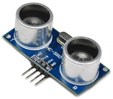

#### 📘 Qué son los ultrasonidos

Los **ultrasonidos** son **ondas sonoras de frecuencia superior a 20 kHz**, es decir, **más allá del límite audible por el ser humano**.  
Aunque no podamos oírlas, se comportan igual que cualquier otra onda sonora: se **propagan por el aire u otros medios** y pueden **reflejarse al chocar contra un objeto**.

Estas propiedades los hacen muy útiles para medir distancias, detectar obstáculos o analizar materiales sin necesidad de contacto físico.

📗 **Características principales de las ondas ultrasónicas:**

- **Frecuencia:** mayor de 20 000 Hz.

- **Velocidad de propagación:** depende del medio (en el aire ≈ 343 m/s a 20 °C).

- **Reflexión:** al encontrarse con un objeto, parte de la onda rebota (eco).

- **Direccionalidad:** el haz ultrasónico es estrecho, lo que permite medir con precisión una zona concreta.

---

#### ⚙️ Principio de funcionamiento

El **sensor de ultrasonido** trabaja según el **principio del eco** o del **tiempo de vuelo (Time of Flight)**.

1. El sensor **emite un pulso ultrasónico** a través de un **transductor emisor**.

2. Este pulso **viaja por el aire** hasta que **rebota en un objeto**.

3. El **transductor receptor** detecta el eco reflejado.

4. El sistema mide el **tiempo transcurrido** entre la emisión y la recepción.

5. Como se conoce la **velocidad del sonido**, es posible calcular la **distancia** al objeto.

📘 **Concepto clave:**  
Cuanto **más tiempo tarda** en volver el eco, **más lejos** está el objeto.  
Si el tiempo es corto, el objeto está **más cerca**.

##### 🔹 Estructura del sensor de ultrasonido

El módulo más utilizado en proyectos de robótica educativa es el **HC-SR04**, formado por **dos transductores** muy parecidos a pequeños micrófonos:

- **Emisor (Trigger):** genera el pulso ultrasónico de alta frecuencia.

- **Receptor (Echo):** capta la onda reflejada por los objetos.

Ambos están sincronizados por un circuito electrónico que controla la emisión, mide el tiempo y genera una señal eléctrica proporcional a la distancia detectada.

📗 **Pines del módulo HC-SR04:**

| Pin      | Nombre              | Función                                                 |
| -------- | ------------------- | ------------------------------------------------------- |
| **VCC**  | Alimentación (5 V)  | Proporciona energía al sensor.                          |
| **TRIG** | Disparo (*Trigger*) | Entrada que inicia la emisión del pulso ultrasónico.    |
| **ECHO** | Eco (*Echo*)        | Salida que indica el tiempo que tarda el eco en volver. |
| **GND**  | Tierra              | Referencia común del circuito.                          |

#### 📙 Medición de la distancia

Durante el funcionamiento:

- El circuito del sensor emite un **breve tren de ondas** (normalmente 8 pulsos de 40 kHz).

- La onda se **propaga por el aire** y rebota en los objetos cercanos.

- El sensor mide el **tiempo total de viaje (ida y vuelta)** del pulso.

- Dividiendo ese tiempo entre dos (porque la onda va y vuelve) y multiplicando por la **velocidad del sonido**, se obtiene la **distancia real**.

<br>

> #### $Distancia=\frac{velocidad del sonido \times tiempo}{2}$

<br>
📘 *Ejemplo conceptual:*  
Si el eco tarda 10 ms en volver, la distancia será:

2343m/s×0,010s​≈1,7m

##### 🔸 Factores que afectan a la medición

- **Temperatura y humedad:** modifican la velocidad del sonido y, por tanto, la precisión.

- **Superficies blandas o irregulares:** absorben o dispersan las ondas, reduciendo la intensidad del eco.

- **Ángulo de incidencia:** si el objeto no está perpendicular al haz, la señal reflejada puede no regresar al receptor.

- **Interferencias:** varios sensores cercanos pueden confundirse si emiten al mismo tiempo.

#### 📗 Características típicas del HC-SR04

| Parámetro               | Valor aproximado |
| ----------------------- | ---------------- |
| Frecuencia de trabajo   | 40 kHz           |
| Rango de medida         | 2 cm – 400 cm    |
| Precisión               | ± 3 mm           |
| Ángulo de detección     | ~15°             |
| Tensión de alimentación | 5 V              |
| Corriente típica        | 15 mA            |

#### 🤖 Aplicaciones

Los sensores ultrasónicos son muy usados en **robótica y automatización**, ya que permiten **detectar objetos sin contacto físico**:

- Detección de **obstáculos** en robots móviles o vehículos autónomos.

- **Sistemas de aparcamiento asistido**.

- **Medición de nivel** de líquidos o sólidos en depósitos.

- **Control de proximidad** o activación automática.

- Detección de **personas u objetos** en zonas delimitadas.

#### 📒 Ventajas

- **Medición sin contacto físico**, ideal para entornos húmedos o sucios.

- **Buena precisión** para rangos de hasta varios metros.

- **Económico y fácil de integrar** en proyectos educativos.

- **Inmune a la iluminación ambiental**, a diferencia de los sensores ópticos.

- **Alta fiabilidad** en objetos de tamaño medio o grande.

#### 📕 Limitaciones

- **No detecta bien materiales blandos o absorbentes** (espuma, tela, corcho, etc.).

- **Sensibilidad a la temperatura y humedad**, que alteran la velocidad del sonido.

- **Ángulo de detección reducido** (≈ 15°).

- **Dificultad para detectar objetos muy pequeños o inclinados**.

- **Posibles interferencias** si varios sensores emiten al mismo tiempo.

#### 📘 En resumen

> Los **sensores de ultrasonido** utilizan **ondas sonoras de alta frecuencia** para medir distancias basándose en el **tiempo que tarda el eco en regresar**.  
> Son precisos, económicos y muy utilizados en proyectos de **robótica educativa**, donde permiten que los sistemas **“vean” sin necesidad de contacto físico**.

### 4.4. Sensores de presencia y movimiento

[⬅️ Bloque anterior](#43-sensores-de-sonido) | [🔝 Índice](#indice-de-contenidos) | [➡️ Sensores](#4-sensores)

#### 4.4.1 Introducción

Los **sensores de presencia o movimiento** detectan la **presencia de personas, animales u objetos en movimiento** dentro de un área determinada.  
Transforman ese cambio en una **señal eléctrica** que puede utilizarse para **activar luces, alarmas, robots o sistemas automáticos**.

Estos sensores no se limitan a detectar contacto físico, sino que **analizan variaciones en el entorno**, como radiación infrarroja, ondas ultrasónicas o microondas.

📘 **Tipos principales de sensores de presencia o movimiento:**

| Tipo de sensor           | Principio de detección                      | Ejemplo de módulo  | Aplicaciones típicas                       |
| ------------------------ | ------------------------------------------- | ------------------ | ------------------------------------------ |
| **PIR**                  | Cambios en radiación infrarroja térmica     | KY- PIR / HC-SR501 | Iluminación automática, alarmas, domótica  |
| **Ultrasonido**          | Reflexión de ondas sonoras                  | HC-SR04            | Robótica, detección de obstáculos          |
| **Microondas (Doppler)** | Variación de frecuencia de ondas reflejadas | RCWL-0516          | Sistemas de seguridad, apertura automática |

#### 4.4.2 Sensores PIR (Infrarrojos Pasivos)

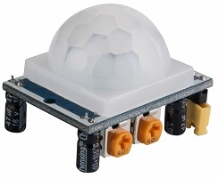

Los **sensores PIR (Passive InfraRed)** detectan **cambios en la radiación infrarroja** emitida naturalmente por los cuerpos calientes, como personas o animales.  
No emiten ninguna señal; simplemente **perciben variaciones térmicas** en su campo de visión.

📗 **Principio de funcionamiento**

- Todos los objetos con temperatura superior al cero absoluto emiten **radiación infrarroja (IR)**.

- El **sensor PIR** contiene un **cristal piroeléctrico** que genera una pequeña carga eléctrica cuando cambia la cantidad de radiación IR que recibe.

- Cuando una persona entra o sale del área de detección, el sensor percibe ese cambio y **activa su salida**.

📘 **Elementos del módulo PIR (HC-SR501 o similar)**

| Componente               | Función                                                         |
| ------------------------ | --------------------------------------------------------------- |
| **Sensor piroeléctrico** | Detecta la radiación IR emitida por cuerpos calientes.          |
| **Lente Fresnel**        | Divide el campo de visión en zonas, aumentando la sensibilidad. |
| **Potenciómetros**       | Permiten ajustar **sensibilidad** y **tiempo de activación**.   |
| **Circuito comparador**  | Analiza la señal y genera una salida digital (HIGH / LOW).      |
| **LED indicador**        | Señala detección de movimiento.                                 |

📙 **Pines de conexión**

| Pin     | Descripción                    |
| ------- | ------------------------------ |
| **VCC** | Alimentación (5 V típico).     |
| **OUT** | Salida digital (1 si detecta). |
| **GND** | Tierra o negativo.             |

📒 **Rango de detección típico**

- **Distancia:** 3 – 7 m (ajustable).

- **Ángulo:** ≈ 120°.

- **Tiempo de retardo:** 2 – 300 s (ajustable).

📘 **Funcionamiento básico**

1. El módulo se calibra al encenderse (unos 30 s).

2. Si detecta un cambio en la radiación IR (una persona moviéndose), la salida pasa a **HIGH (5 V)**.

3. Pasado el tiempo configurado, vuelve a **LOW (0 V)**.

4. Puede conectarse directamente a un pin digital del microcontrolador o a un relé.

📗 **Aplicaciones**

- Encendido automático de luces o ventiladores.

- Sistemas de alarma o vigilancia.

- Robots detectores de presencia humana.

- Control de energía (apagado cuando no hay movimiento).

📕 **Ventajas y limitaciones**

| Ventajas                                  | Limitaciones                                   |
| ----------------------------------------- | ---------------------------------------------- |
| Bajo consumo y fácil de usar.             | No detecta objetos inmóviles.                  |
| Económico y de gran alcance.              | Sensible a fuentes de calor intensas.          |
| No emite radiación, completamente pasivo. | Necesita unos segundos de calibración inicial. |

#### 4.4.3 Sensores ultrasónicos aplicados a detección de movimiento


Aunque los **sensores de ultrasonido** ya se estudiaron en el bloque anterior (ver 4.3.3), también pueden emplearse como **sensores de presencia o movimiento**, ya que permiten **detectar objetos que se acercan, se alejan o entran en una zona de control**.

📘 **Principio de funcionamiento**

- El sensor **emite ondas ultrasónicas** (≈40 kHz) y mide el tiempo que tardan en **reflejarse y volver** al receptor.

- Si **no hay ningún objeto**, el eco tarda más en regresar o no se detecta.

- Si **un objeto o persona entra en el área**, el tiempo de retorno **disminuye** o aparece un **nuevo eco**.

- El microcontrolador compara esas variaciones y **detecta la presencia o el movimiento**.

📗 **Ventajas frente a los sensores PIR**

- Detecta **cualquier tipo de objeto**, no solo cuerpos calientes.

- Funciona en **oscuridad total**.

- Permite **medir la distancia exacta** al objeto.

- Ideal para sistemas de **proximidad o control de nivel**.

📕 **Limitaciones**

- No atraviesa materiales (la onda se refleja).

- Puede verse afectado por la temperatura, humedad o ángulo de incidencia.

- El ángulo de detección es **estrecho (~15°)**.

- Si hay varios sensores cercanos, pueden **interferirse**.

📙 **Ejemplo de aplicación como sensor de movimiento**

Con un **HC-SR04** o similar:

- Si la distancia medida **varía bruscamente**, se interpreta como **presencia o movimiento**.

- Si la distancia permanece constante durante un tiempo, se considera **sin movimiento**.

#### 4.4.4 Sensores de microondas (Radar Doppler)

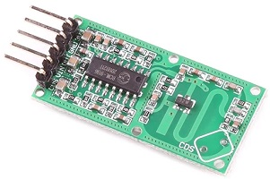

Los **sensores de microondas** funcionan mediante el **efecto Doppler**, detectando el **movimiento de objetos** a través de la **reflexión de ondas electromagnéticas**.

El módulo más común en robótica y domótica es el **RCWL-0516**.

📘 **Principio de funcionamiento**

- El sensor **emite ondas electromagnéticas** de unos **3,2 GHz** (banda microondas).

- Si un objeto se mueve dentro del área de detección, **refleja las ondas con una ligera variación de frecuencia** (efecto Doppler).

- El circuito detecta esa variación y **activa la salida digital**.

📙 **Características típicas**

| Parámetro               | Valor aproximado                    |
| ----------------------- | ----------------------------------- |
| Tensión de alimentación | 4 – 28 V DC                         |
| Distancia de detección  | 5 – 9 m                             |
| Ángulo de detección     | 360° (a través de objetos delgados) |
| Tiempo de retardo       | ≈ 2 s (fijo)                        |
| Salida                  | Digital (HIGH = detección)          |

📗 **Ventajas**

- Detecta movimiento **a través de paredes, plástico o cristal fino**.

- No depende de la luz ni de la temperatura.

- Cobertura **omnidireccional**.

- Ideal para sistemas ocultos o integrados en carcasas.

📕 **Desventajas**

- No distingue entre personas y objetos.

- Puede activarse por movimientos detrás de paredes delgadas.

- Consumo algo mayor que un sensor PIR.

📙 **Aplicaciones**

- Alarmas y sistemas de seguridad.

- Iluminación automática en interiores.

- Robots que siguen movimiento incluso tras obstáculos.

- Dispensadores automáticos o puertas con apertura por proximidad.

#### 4.4.5 Comparativa entre sensores PIR, ultrasónicos y de microondas

| Característica                   | **PIR (Infrarrojos pasivos)**   | **Ultrasonido (HC-SR04)**  | **Microondas (RCWL-0516)** |
| -------------------------------- | ------------------------------- | -------------------------- | -------------------------- |
| **Tipo de detección**            | Radiación infrarroja térmica    | Reflexión de ondas sonoras | Efecto Doppler (ondas EM)  |
| **Rango típico**                 | 3 – 7 m                         | 2 – 4 m                    | 5 – 9 m                    |
| **Ángulo de detección**          | ~120°                           | ~15°                       | 360°                       |
| **Detecta a través de objetos**  | ❌ No                            | ❌ No                       | ✅ Sí                       |
| **Afectado por temperatura/luz** | ✅ Sí                            | ❌ No                       | ❌ No                       |
| **Consumo**                      | Muy bajo                        | Bajo                       | Medio                      |
| **Salida**                       | Digital                         | Analógica/Digital          | Digital                    |
| **Aplicaciones comunes**         | Alarmas, iluminación automática | Medición, robótica, sonar  | Seguridad, domótica, radar |

---

# CONTINUA EN LA PARTE 3

UT3 Dispositivos discretos pasivos activos sensores y actuadores - Parte 3.md

---

© Apuntes de **Informática aplicada a sistemas electrónicos (Robótica)** – UT3  
