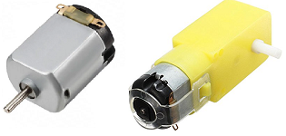
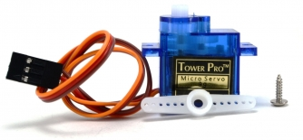
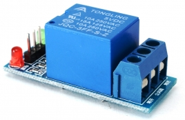
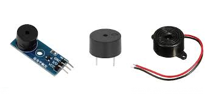

# UT 3 Dispositivos discretos: pasivos, activos, sensores y actuadores - PARTE 3

---

*En este documento se desarrolla la **Parte 3** de los apuntes, dedicada a los **actuadores**.*

---

## Introducción a los dispositivos discretos

Un **dispositivo discreto** es un componente electrónico individual con una función específica dentro de un circuito.  
Se clasifican en cuatro grandes grupos:

- Pasivos
- Activos
- Sensores
- **👉 Actuadores**

---

## Índice de contenidos

5 Actuadores.

5.1 Motores DC.

5.2 Servomotores.

5.3 Relés.

5.4 Zumbadores

--- 

## 5. Actuadores

En un sistema electrónico o robótico, los **actuadores** son los dispositivos encargados de **convertir una señal eléctrica en una acción física**.  
Mientras que los sensores permiten *percibir* el entorno, los actuadores permiten **interactuar** con él realizando movimientos, generando sonido, activando mecanismos o controlando cargas eléctricas.

Un actuador recibe una **señal de control** (digital o analógica) procedente de un microcontrolador, un circuito analógico o una electrónica de potencia, y la transforma en alguno de los siguientes efectos:

- **Movimiento rotatorio** → motores DC, servomotores.

- **Movimiento lineal** → solenoides (pestillo eléctrico).

- **Conmutación eléctrica** → relés.

- **Vibración o sonido** → zumbadores.

En robótica y automatización, los actuadores constituyen la **parte final del sistema**, porque son los que ejecutan la acción física tras el procesamiento de las señales que provienen de sensores u otros módulos del circuito.

#### **Clasificación de los actuadores**

Los actuadores pueden clasificarse de distintas maneras según su **principio de funcionamiento**, **tipo de movimiento** o **forma de control**.  
A nivel didáctico (y útil para robótica educativa), la clasificación más clara es la siguiente:

##### 1 Según el tipo de energía que transforman

- **Electromecánicos:** Transforman energía eléctrica en movimiento mecánico.  
  *Ejemplos:* motores DC, servomotores, solenoides.

- **Electroacústicos:** Transforman energía eléctrica en vibración o sonido.  
  *Ejemplos:* zumbadores activos y pasivos, piezoeléctricos.

- **Electromagnéticos:** Transforman energía eléctrica en acción magnética o conmutación.  
  *Ejemplos:* relés electromecánicos, relés de estado sólido.

##### 2 Según el tipo de movimiento

- **Rotatorio:** Producen giro o rotación.  
  *Ejemplos:* motores DC, motores con reductora, servomotores.

- **Lineal:** Producen desplazamiento en línea recta.  
  *Ejemplos:* solenoides, actuadores lineales.

##### 3 Según el tipo de control

- **Control ON/OFF:** Solo permiten dos estados: encendido o apagado.  
  *Ejemplos:* relés, solenoides, zumbadores activos, motores DC sin controlador.*

- **Control proporcional (modulación):** Permiten regular velocidad, intensidad o posición mediante PWM u otras señales.  
  *Ejemplos:* motores DC con PWM, servomotores, zumbadores pasivos.*

### 5.1 Motores DC

Los **motores de corriente continua (DC)** son actuadores que transforman energía eléctrica en **movimiento rotatorio**.  
Son muy utilizados en robótica educativa por su simplicidad, bajo coste y facilidad de control cuando se usan con una electrónica adecuada.

#### 5.1.1 Funcionamiento básico

Un motor DC gira cuando se aplica una **diferencia de tensión** entre sus bornes.  
La velocidad y el sentido de giro dependen de:

- **La tensión aplicada** → más tensión = más velocidad.

- **La polaridad** → invertir los cables invierte el sentido de giro.

Dentro del motor hay un **inductor** y un **conmutador**, que permiten generar un campo magnético alternante para producir el giro continuo.

#### 5.1.2 Características principales

- **Movimiento:** rotatorio continuo.

- **Control directo:** encendido/apagado cambiando la polaridad.

- **Control avanzado:** regulando la velocidad mediante señal **PWM**.

- **Necesitan una fuente externa** (no se deben alimentar desde un pin de Arduino).

- Suelen incluir reductoras (engranajes) para aumentar el par y disminuir la velocidad.

#### 5.1.3 Comportamiento eléctrico

Los motores DC consumen **corriente elevada** incluso a bajo voltaje.  
Además generan **ruido eléctrico** y **picos inductivos** al arrancar o detenerse.

Por este motivo:

- **No se pueden conectar directamente al Arduino.**

- Se controlan mediante **transistores**, **puentes H** o **módulos driver** (L298N, L293D, TB6612FNG).

- Se utiliza un **diodo de protección** (flyback) para evitar daños por picos de tensión.

#### 5.1.4 Usos típicos en robótica

- Ruedas de robots móviles.

- Ventiladores.

- Sistemas de giro simples.

- Mecanismos con alta velocidad pero poca precisión.

Cuando se necesita un giro preciso o un ángulo concreto, se usan **servomotores** en lugar de motores DC.

#### 5.1.5 Ventajas y desventajas

**Ventajas:**

- Simples y económicos.

- Alta velocidad.

- Fáciles de instalar con un driver.

**Desventajas:**

- Poco precisos sin sensores adicionales.

- Alto consumo.

- Generan interferencias.

### 5.2 Servomotores

Los **servomotores** son actuadores que generan **movimiento rotatorio controlado**.  
A diferencia de los motores DC, un servomotor permite fijar su **posición angular** con gran precisión, por lo que se usan ampliamente en robótica y mecatrónica.

#### 5.2.1 Funcionamiento básico

Un servomotor está formado por:

- Un **motor DC interno**

- Una **caja de engranajes** (reductora)

- Un **sensor de posición** (potenciómetro)

- Un **controlador interno**

El controlador compara la posición actual con la posición deseada y ajusta el motor automáticamente para mantener ese ángulo.

#### 5.2.2 Rango de movimiento

Existen dos tipos comunes:

- **Servomotor estándar (0º a 180º):**  
  Muy usado en proyectos educativos (ej.: SG90).

- **Servomotor de rotación continua:**  
  Gira como un motor DC, pero con control de velocidad mediante PWM.

En la UT3 nos centramos principalmente en los **servos de 0–180º**, que son los más didácticos.

#### 5.2.3 Señal de control (PWM)

Los servomotores utilizan una señal **PWM especial** de 50 Hz:

- **Pulso de ≈ 1 ms** → ~0º

- **Pulso de ≈ 1.5 ms** → ~90º

- **Pulso de ≈ 2 ms** → ~180º

La electrónica interna interpreta estos pulsos y ajusta la posición.

> *Nota:* Aunque usan PWM, **no es el mismo PWM** que se usa para controlar la velocidad de un motor DC.

#### 5.2.4 Alimentación

Los servos consumen más corriente que un pin de Arduino puede suministrar.

- **La señal PWM sí se conecta al Arduino.**

- **La alimentación (5V) es recomendable sacarla de una placa de alimentación externa**, sobre todo si hay varios servos en el mismo proyecto.

Siempre se debe compartir el **GND común** entre Arduino y la fuente externa.

#### 5.2.5 Usos típicos en robótica

- Movimiento de brazos robóticos.

- Control de dirección en robots móviles.

- Apertura y cierre de mecanismos.

- Movimiento de sensores (ultrasonido, cámaras, etc.).

Su capacidad para mantener una posición estable los hace ideales para sistemas donde se requiere **precisión angular**.

#### 5.2.6 Ventajas y desventajas

**Ventajas:**

- Precisión angular.

- Fácil de controlar desde Arduino.

- Bajo coste (microservos).

- Fuerza (par) elevada gracias a la reductora.

**Desventajas:**

- Limitados en velocidad.

- Rango de movimiento restringido (si no son de rotación continua).

- Consumen mucha corriente bajo carga.

### 5.3 Relés

Los **relés** son actuadores que permiten **controlar cargas eléctricas** mediante una señal de baja potencia. Funcionan como **interruptores controlados eléctricamente**, permitiendo activar o desactivar un circuito externo sin contacto directo entre el microcontrolador y la carga.

#### 5.3.1 Funcionamiento básico

Un relé está formado por:

- Una **bobina** que se activa con corriente.

- Un **conjunto de contactos** mecánicos que se abren o cierran.

- Un **sistema de aislamiento** entre la parte de control (bobina) y la parte de potencia (contactos).

Cuando la bobina se energiza:

1. Se genera un **campo magnético**.

2. Este campo atrae una lámina metálica.

3. La lámina abre o cierra los contactos, igual que un interruptor.

Esto permite controlar dispositivos que funcionan a tensiones o corrientes mayores de las que puede manejar Arduino.

#### 5.3.2 Tipos de contactos

Los relés más habituales tienen:

- **NO (Normally Open o Normalmente Abierto):**  
  El circuito está abierto y **solo se cierra cuando se activa** el relé.

- **NC (Normally Closed o Normalmente Cerrado):**  
  El circuito está cerrado y **se abre al activar** el relé.

#### 5.3.3 Aislamiento eléctrico

Una característica clave del relé es que **proporciona aislamiento**:

- La parte de control trabaja a 5V (Arduino).

- La parte de potencia puede trabajar a **12V, 24V o incluso 230V**.

Esto evita que tensiones elevadas dañen la electrónica.

#### 5.3.4 Por qué no se conectan directamente al Arduino

Los relés **no pueden conectarse directamente a un pin del Arduino**, porque:

- La bobina necesita más **corriente** de la que un pin puede dar.

- Al desactivarse, la bobina genera un **pico inductivo (flyback)** que puede dañar la placa.

Por eso siempre se usa:

- Un **transistor NPN** o

- Un **módulo de relé con protección**, que ya incorpora:
  
  - Transistor
  
  - Diodo flyback
  
  - Aislador (optoacoplador, en algunos modelos)

#### 5.3.5 Usos típicos en robótica

Los relés permiten controlar:

- Lámparas, tiras LED de alta potencia

- Motores DC grandes o bombas

- Sistemas de apertura/cierre

- Cargas alimentadas por otra fuente (12V o 230V)

En robótica educativa, se utilizan para:

- Encender dispositivos externos

- Controlar cargas que no se pueden alimentar desde la placa

#### 5.3.6 Ventajas y desventajas

**Ventajas:**

- Aislamiento eléctrico seguro

- Control de cargas altas

- Fáciles de usar mediante módulos

**Desventajas:**

- Son lentos (mecanismo mecánico)

- Hacen ruido al activar

- Vida útil limitada por desgaste de contactos

- No aptos para control rápido como PWM

### 5.4 Zumbadores (Buzzers)

Los **zumbadores** son actuadores que convierten una señal eléctrica en **vibración** o **sonido**. Se utilizan para generar avisos acústicos, señales de estado y efectos sonoros simples en proyectos de electrónica y robótica.

#### 5.4.1 Tipos de zumbadores

##### Zumbador activo

Incorpora un oscilador interno.  
Produce un tono fijo al aplicarle tensión.

- Necesita solo **5V** o el voltaje indicado.

- No requiere señal PWM (Modulación por Ancho de Pulso).

- Es el más sencillo de usar.

Control:

- `HIGH` → suena

- `LOW` → silencio

##### Zumbador pasivo

No incluye oscilador.  
Produce sonido únicamente si se le envían **pulsos (PWM)** desde Arduino.

Permite generar tonos distintos usando funciones como `tone()`.

Control:

- PWM → sonido

- Sin PWM → no suena

#### 5.4.2 Funcionamiento básico

Los zumbadores funcionan mediante un elemento piezoeléctrico que vibra al aplicarle una señal eléctrica.  
La vibración genera un sonido cuya frecuencia depende del tipo de zumbador:

- **Activo:** frecuencia fija interna

- **Pasivo:** frecuencia controlada por Arduino

#### 5.4.3 Características eléctricas

Los buzzers consumen muy poca corriente, por lo que:

- Se pueden conectar **directamente a un pin de Arduino**

- No requieren transistor ni fuente externa

- No generan picos inductivos

Esto los hace ideales como actuadores simples para pruebas y ejemplos.

#### 5.4.4 Usos típicos en robótica

- Alarmas y avisos acústicos

- Indicación de estado (arranque, error, finalización)

- Señalización en proyectos con sensores

- Reproducción de melodías sencillas (zumbador pasivo)

#### 5.4.5 Ventajas y desventajas

**Ventajas:**

- Muy fáciles de usar

- Bajo consumo

- Ideales para señalización

- El zumbador pasivo permite variedad de tonos

**Desventajas:**

- Sonido limitado (especialmente el activo)

- No sirven para audio de calidad

- El volumen suele ser moderado

--- 

## Tabla comparativa de actuadores

| Actuador            | Tipo de movimiento / acción              | Señal de control                | Alimentación                     | Ventajas                              | Desventajas                      |
| ------------------- | ---------------------------------------- | ------------------------------- | -------------------------------- | ------------------------------------- | -------------------------------- |
| **Motor DC**        | Movimiento rotatorio continuo            | Encendido/apagado o PWM         | Requiere fuente externa + driver | Simple, rápido, económico             | Poco preciso, alto consumo       |
| **Servomotor**      | Movimiento rotatorio controlado (0–180º) | PWM especial                    | Preferible fuente externa        | Preciso, fácil de controlar, buen par | Limitado en ángulo, consumo alto |
| **Relé**            | Conmutación eléctrica (ON/OFF)           | Señal digital (mediante módulo) | Requiere fuente externa          | Aísla y controla cargas altas         | Lento, ruido, desgaste mecánico  |
| **Zumbador activo** | Sonido fijo                              | Señal digital                   | Puede alimentarse desde Arduino  | Muy fácil de usar, bajo consumo       | Sonido limitado                  |
| **Zumbador pasivo** | Sonido controlado (PWM)                  | PWM                             | Puede alimentarse desde Arduino  | Permite tonos variados                | Requiere programación            |
