# UT 3 Dispositivos discretos: pasivos, activos, sensores y actuadores -  PARTE 1

## 1. Introducción a los dispositivos discretos

Un **dispositivo discreto** es un componente electrónico individual con una función específica dentro de un circuito.  
Se clasifican en cuatro grandes grupos:  

- **Pasivos**  
- **Activos**  
- **Sensores**  
- **Actuadores**  

---

## 2. Dispositivos pasivos

Los dispositivos pasivos **no generan energía**, solo la consumen, almacenan o disipan.

1. Resistores (resistencias).
2. Condensadores.
3. Bobinas.

### 2.1. Resistores (resistencias)

**Definición**  
Los resistores o resistencias se oponen al paso de la corriente eléctrica.

- **Tipos:**
  - Fijos: tienen un valor constante (ejemplo: 100 Ω).
  - Variables: se ajustan manualmente para modificar su valor. Se les suele denominar **potenciómetros**.
- **Aplicaciones:** divisores de tensión, limitación de corriente en LEDs, ajustes de volumen.

#### Potencia nominal de las resistencias

Además del valor en ohmios (Ω), las resistencias tienen una **potencia nominal (W)** que indica la **energía máxima que pueden disipar sin dañarse**.  
Cuando una resistencia disipa más potencia de la que soporta, se calienta en exceso y puede quemarse.

La potencia disipada se calcula con las siguientes fórmulas:

$$
P = V \cdot I = \frac{V^2}{R} = I^2 \cdot R
$$

donde:

- \(P\): potencia (W)  
- \(V\): voltaje aplicado (V)  
- \(I\): corriente que circula (A)  
- \(R\): resistencia (Ω)  

**Valores típicos en resistencias comerciales:**

- **1/4 W (0,25 W):** las más habituales en kits y protoboard.  
- **1/2 W, 1 W, 2 W o más:** se usan en circuitos que manejan mayor potencia.  

📌 **Ejemplo práctico:**  
Una resistencia de 220 Ω en un circuito de 12 V:  

$P = \frac{V^2}{R} = \frac{12^2}{220} \approx 0,65\ \text{W}$

- Si usamos una resistencia de 1/4 W → se quema.  
- Hay que usar mínimo una de 1 W.  

👉 En los kits de electrónica educativa, casi todas las resistencias son de **1/4 W**, suficientes para trabajar con LEDs, sensores y microcontroladores.

### 2.1.1. Resistencias fijas

El valor es fijo, no varía.

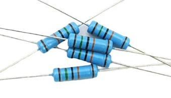

#### Cómo leer el valor de una resistencia fija

Las resistencias fijas suelen indicar su valor mediante un **código de colores** en forma de **bandas pintadas** sobre el cuerpo del componente.

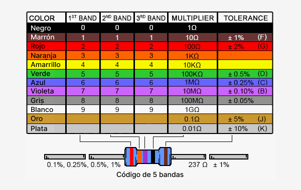

Las resistencias comerciales pueden tener **3, 4, 5 o 6 bandas**, dependiendo de la precisión y del estándar de fabricación:

##### Número de bandas en resistencias fijas

| Banda                | 3 Bandas             | 4 Bandas         | 5 Bandas         | 6 Bandas         |
| --------------------:| -------------------- | ---------------- | ---------------- | ---------------- |
| 1ª                   | $1.^{er}$ dígito     | $1.^{er}$ dígito | $1.^{er}$ dígito | $1.^{er}$ dígito |
| 2ª                   | 2.º dígito           | 2.º dígito       | 2.º dígito       | 2.º dígito       |
| 3ª                   | Multiplicador        | Multiplicador    | $3.^{er}$ dígito | $3.^{er}$ dígito |
| 4ª                   | — (tolerancia ±20 %) | Tolerancia       | Multiplicador    | Multiplicador    |
| 5ª                   | —                    | —                | Tolerancia       | Tolerancia       |
| 6ª                   | —                    | —                | —                | Coeficiente de   |
| temperatura (ppm/°C) |                      |                  |                  |                  |

###### 🔹 Tolerancia en las resistencias

La **tolerancia** indica el **margen de error** que puede tener una resistencia respecto a su valor nominal (el que se lee en el cuerpo o en las bandas de colores).

Por ejemplo:

- Una resistencia de **100 Ω ±5 %** puede tener un valor real entre **95 Ω y 105 Ω**.  
- Una resistencia de **4,7 kΩ ±1 %** puede tener un valor real entre **4,653 kΩ y 4,747 kΩ**.

Cuanto **menor es el porcentaje**, **más precisa** es la resistencia.

En los **kits de electrónica educativos o de iniciación** (como los que se usan con **Arduino** o en prácticas de laboratorio escolar), las resistencias suelen tener una **tolerancia del ±5 %**.

📌 **En resumen:**  
La tolerancia representa el **margen de error del valor real** respecto al valor teórico.  
Cuanto **menor** sea la tolerancia, **más exacta** será la resistencia.

##### Cómo saber cuál es la primera banda

1. **La banda de tolerancia (oro, plata o sin banda) siempre va al final**, a la derecha.  
   
   - Si ves una franja dorada o plateada, esa es la **última banda**.  
   - Si no hay oro/plata → se asume ±20 % y la última banda suele quedar algo más separada.

2. **Las bandas iniciales (dígitos) están más juntas entre sí.**  
   La **última** suele estar un poco más separada.

3. **En resistencias de 5 o 6 bandas** la primera casi nunca es oro o plata → esos colores suelen ser **multiplicador o tolerancia**, no un dígito.

##### Ejemplo práctico

- **[Rojo] [Violeta] [Marrón] [Oro]**  
  Oro = tolerancia (±5 %) → se lee por la **izquierda**: Rojo (2), Violeta (7), Marrón (×10).  
  Valor = 27 × 10 = **270 Ω ±5 %**.

📌 **Consejo práctico:**  

> Si hay **oro o plata**, siempre es la **última** banda; si no, empieza por el lado donde las bandas estén **más juntas**.

### 2.1.3. Resistencias variables

También conocidas como **potenciómetros**, el valor de la resistencia es **variable** y se ajusta manualmente (girando un eje, deslizando un cursor, etc.).

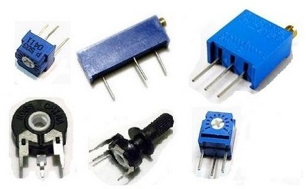

Como se aprecia en la imagen superior, los potenciómetros tienen **tres terminales:**

- **Extremos (A y B):** patillas exteriores conectadas a los dos extremos de la **pista resistiva**.  
- **Central (W o cursor):** es el terminal variable que se **desliza** sobre la pista y divide la resistencia total en dos: \($R_{AW}$) y \($R_{WB}$\).

Se cumple:

$R_{AW} + R_{WB} = R_{\text{total}}$

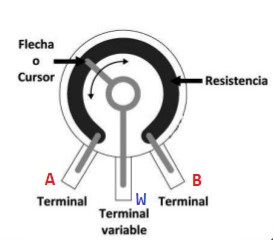

#### Funcionamiento

Según conectemos el potenciómetro, este realizará una función determinada.

- Función como **resistencia fija** → conectar **A–B** (solo los extremos).  
- Función como **resistencia variable** → conectar **A–W** o **W–B** (un extremo y el cursor).  
  - Recomendación: **une W con el extremo que no uses** para evitar corte si el cursor pierde contacto.  
- Función como **Divisor de tensión** → conectar los **tres terminales**:
  - **A = \($V_{\text{in}}$\)**, **B = GND**, **salida en W**.

#### ¿Qué es un divisor de tensión?

Un **divisor de tensión** es un circuito con **dos resistencias en serie** entre \($V_{\text{in}}$) y masa (GND).  
La **salida** \($V_{\text{out}}$) en el **punto intermedio** es una **fracción** de \($V_{\text{in}}$):

$V_{\text{out}} = V_{\text{in}} \cdot \frac{R_2}{R_1 + R_2}$

*(válido si la carga consume muy poca corriente)*

Un **potenciómetro** hace lo mismo pero **ajustable**. Conecta:

- **A = \(+\) (\($V_{\text{in}}$))**
- **B = GND**
- **\($V_{\text{out}}$) en W (cursor)**

Al girar, la salida cambia **suavemente** entre **0 V** y **\($V_{\text{in}}$)**.  
Ejemplo con potenciómetro lineal de 10 kΩ y \($V_{\text{in}}=5\ \text{V}$): 

inicio ≈ 0 V, mitad ≈ 2,5 V, final ≈ 5 V.

**Detalles importantes:**

1. **Sentido de giro:** si va “al revés” de lo esperado, **intercambia A y B**.  
2. **Efecto de la carga:** funciona bien si lo que conectas a la salida **consume muy poca corriente** (alta impedancia).  
   Si necesitas entregar corriente, usa un **amplificador/buffer**.

<u>Diferencia entre **resistencia variable** y **divisor de tensión**</u>

La resistencia variable se emplea para **regular corriente** (ejemplo: limitar la intensidad que pasa por un LED), sin embargo, en el divisor de tensión, no solo se varía resistencia, sino que **obtiene una salida de tensión ajustable** y se usa para **generar una señal de control** (por ejemplo, ajustar el volumen de un amplificador o dar una referencia analógica a un microcontrolador).

**La diferencia clave**:

- Conectar como **resistencia variable** = solo cambias el valor de resistencia en un circuito.

- Conectar como **divisor de tensión** = generas una **tensión de salida proporcional** a la entrada y a la posición del cursor.

#### Usos sencillos de las resistencias

**1) Resistencias fijas (valor constante)**  

- **Encender un LED sin quemarlo (limitar corriente)**: R en serie con el LED (p. ej., 220–330 Ω a 5 V).  
- **Evitar lecturas raras en un pulsador** (pull-down o pull-up): mantener la entrada en 0 o 1 cuando el botón no se pulsa (p. ej., 10 kΩ).

**2) Resistencias variables usadas como resistencia ajustable (2 patillas)**  

- **Ajustar el brillo de un LED (baja potencia):** potenciómetro en serie **junto con** una **resistencia fija** (p. ej., 220 Ω) para proteger el LED.
- **Atenuar un zumbador pequeño**: pot en serie para bajar un poco el volumen.  
  - Conexión: **W + un extremo**; opcional recomendable: **unir W con el extremo libre**.

**3) Resistencias variables usadas como divisor de tensión (3 patillas)**  

- **“Mando” que un microcontrolador puede leer**: A = 5 V, B = GND, W → entrada analógica (pot lineal 10 kΩ).  
- **Control sencillo de nivel** (por ejemplo, volumen de una señal de audio activa).

#### Recomendaciones rápidas

- **Valores típicos útiles:** 220 Ω, 330 Ω, 1 kΩ, 4,7 kΩ, 10 kΩ.
- **Resistencia recomendada en potenciómetros:** **10 kΩ lineal (B)**, adecuada para usos generales.
- Si al girar el mando **va al revés**, **intercambia A y B**.
- No uses un potenciómetro para controlar directamente **motores** o **lámparas**: es mejor hacerlo con técnicas de **modulación (PWM)** y un **transistor**, que veremos más adelante.

---

### 2.2. Condensadores

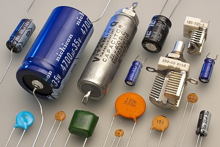

**Definición**

Un **condensador** (también llamado, aunque con menor frecuencia, capacitador) es un componente electrónico capaz de **almacenar energía eléctrica** en forma de **campo eléctrico** entre dos placas conductoras separadas por un material aislante (dieléctrico).

Su principal característica es la **capacitancia (C)**, medida en **faradios (F)**, que indica cuánta carga puede almacenar por cada voltio aplicado:

$C = \frac{Q}{V}$

donde:

- C: capacitancia (F).

- Q: carga almacenada (Coulombios).

- V: voltaje aplicado (Voltios).

Además de la **capacitancia (C)**, un condensador tiene otros parámetros relevantes:

- **Tensión nominal o de trabajo ($V_{\text{max}}$)**  
  Es el **máximo voltaje** que puede aplicarse sin que el condensador se dañe.  
  
  - Si se supera, el dieléctrico interno puede romperse → cortocircuito o explosión (en el caso de los electrolíticos).  
  - Siempre conviene elegir un condensador con una tensión de trabajo **mayor que la tensión real del circuito** (ejemplo: para 12 V, usar uno de al menos 16 V o 25 V).  

- **Polaridad**  
  
  - Los condensadores **electrolíticos** y de **tántalo** tienen polaridad (marcada con un + o un –).  
  - Conectarlos al revés puede dañarlos.  
  - Los condensadores **cerámicos** y de **película** no tienen polaridad.  

- **Tolerancia**  
  Indica cuánto puede variar su valor real respecto al nominal (ejemplo: ±10 %, ±20 %).  

📌 **Nota práctica:**  

- Nunca uses un condensador electrolítico de 16 V en un circuito de 24 V → explotará o se dañará.  

- En la práctica, se recomienda un **margen de seguridad del 20–50 %** por encima de la tensión de uso.

- Con un margen del **20–50 %** sobre **24 V**, el condensador debería ser de **≥ 29–36 V**.  
  En la práctica, usa un valor comercial:
  
  - **35 V** (opción habitual y suficiente en 24 V DC estables).
  
  - **50 V** si quieres más margen (entornos con picos o más temperatura).
  
  👉 Resumen: para 24 V, **35 V** mínimo recomendado; **50 V** si hay posibles picos.

#### Principales tipos de condensadores

Existen numerosos tipos de condensadores. A continuación se describen algunos de los más comunes:

1. **Electrolíticos**
   
   - Polarizados (tienen polo positivo y negativo).
   
   - Capacitancias grandes (µF a miles de µF).
   
   - Uso: filtrado y estabilización en fuentes de alimentación.
   
   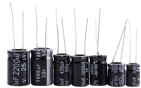

2. **Cerámicos**
   
   - Pequeños, no polarizados (no distinguen polo positivo y negativo).
   
   - Capacitancias bajas (pF a nF).
   
   - Uso: alta frecuencia, filtros, desacoplo de ruido.
   
   ###### 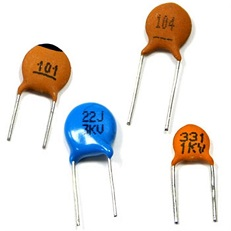

3. **De tántalo**
   
   - Polarizados.
   
   - Más estables y de mayor calidad que los electrolíticos.
   
   - Uso: equipos electrónicos donde importa la fiabilidad y el tamaño reducido.
   
   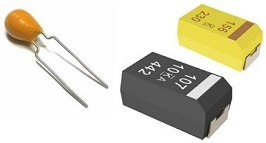

4. **Variables (trimmers o condensadores variables)**
   
   - Su capacitancia puede ajustarse manualmente.
   
   - Uso: radios, osciladores, ajustes finos de frecuencia.

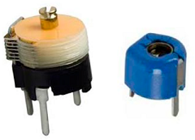

#### Aplicaciones de los condensadores en circuitos electrónicos programados

En los proyectos de **robótica con microcontroladores y sensores**, los condensadores se emplean sobre todo para **dar estabilidad a las señales y a la alimentación**.

1. **Desacoplo de alimentación**
   
   - Los condensadores se colocan cerca de <u>sensores</u> y módulos para absorber pequeñas variaciones de tensión. “**Colocar cerca**” significa conectarlos directamente junto al componente que queremos estabilizar, normalmente entre sus pines de alimentación.
   
   - **Ejemplo:** un condensador de 100 nF junto a un sensor ultrasónico evita que las lecturas fluctúen por ruido eléctrico.

2. **Eliminación de ruido en señales analógicas**
   
   - Algunos sensores (luz, temperatura…) generan valores inestables debido al ruido eléctrico. Un condensador ayuda a suavizar la señal antes de que el microcontrolador la procese.

3. **Antirrebote en pulsadores**
   
   - Al pulsar un botón, el contacto rebota y genera varios pulsos. Un condensador en paralelo con el pulsador filtra esos rebotes, entregando al microcontrolador una señal limpia.

4. **Retardos de tiempo (circuitos RC)**
   
   - Un condensador junto con una resistencia puede formar un **temporizador sencillo**.  
   - El tiempo de carga o descarga depende del producto \($R \cdot C$\), conocido como **constante de tiempo $(\tau)$**.  
   - **Ejemplo:** un condensador de 10 µF con una resistencia de 100 kΩ produce un retardo de aproximadamente 1 segundo $(\tau = R \cdot C)$.  
   - Se utiliza para:  
     - Generar un **retardo inicial** al encender un circuito o microcontrolador (reset automático).  
     - Crear **temporizadores básicos** en proyectos electrónicos sencillos.

👉 En resumen: **en este módulo usaremos los condensadores principalmente para** **estabilizar la alimentación** de sensores y módulos, **limpiar señales** en entradas analógicas, **filtrar rebotes** en pulsadores, y **generar retardos simples** en circuitos electrónicos.

📌 **Nota**  
La forma práctica de conectar estos condensadores (desacoplo en sensores y módulos) se explicará más adelante, en el apartado dedicado a **sensores**.

#### 🔹 Alcance práctico en este módulo

En las prácticas de **circuitos electrónicos con sensores y microcontroladores**, la mayoría de los componentes que emplearemos estarán **ya integrados en módulos** (por ejemplo, sensores de luz, temperatura o ultrasonidos).  
Estos módulos incluyen **resistencias, condensadores** y otros elementos electrónicos que garantizan su correcto funcionamiento y estabilidad.

Sin embargo, en algunos montajes **podemos utilizar condensadores** de forma puntual para:

- **Filtrar pequeñas variaciones de tensión** (ruido eléctrico) en las líneas de alimentación.  
- **Suavizar señales analógicas** procedentes de sensores.  
- **Evitar rebotes** en pulsadores o contactos.  
- **Crear retardos simples** junto con resistencias (circuitos RC).

👉 En cambio, **no construiremos transformadores ni fuentes de alimentación**, ya que trabajaremos siempre con **tensiones seguras de corriente continua (5 V o 3,3 V)** suministradas por los microcontroladores o fuentes externas reguladas.

--- 

### 2.3. Bobinas (inductores)

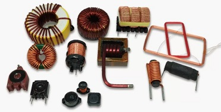

###### Definición

Una bobina (o inductor) es un componente pasivo formado por un hilo conductor enrollado en espiral. Al paso de la corriente, almacena **energía en un campo magnético**.

#### Tipos de bobinas

- **De núcleo de aire:** solo llevan el hilo enrollado, suelen usarse en radiofrecuencia.

- **De núcleo de ferrita:** concentran mejor el campo magnético y permiten mayor inductancia en menor tamaño.

- **Bobinas variables:** permiten ajustar la inductancia (similares a los potenciómetros, pero en inductancia).

#### Unidades

- Se miden en **Henrios (H)**.
- Valores habituales en electrónica: **microhenrios (µH)** y **milihenrios (mH)**.

#### Identificación práctica

- Pueden parecer pequeñas resistencias recubiertas de color, o toroidales (anillos con hilo de cobre enrollado).

- En placas de Arduino o fuentes de alimentación se ven como cilindros con cobre enrollado o bloques negros marcados con un número (ejemplo: “330” significa 33 µH).

#### Aplicaciones

- **Filtros sencillos**: en combinación con condensadores ayudan a suavizar señales eléctricas.  

- **Motores y relés**: sus bobinados internos generan el campo magnético necesario para mover piezas mecánicas o accionar interruptores.  

- **Módulos electrónicos**: en algunos reguladores de tensión aparecen como pequeños componentes enrollados de cobre que ayudan a estabilizar la alimentación.

#### Ejemplo en proyectos de robótica

- En algunos **módulos de alimentación** que se utilizan para dar tensión estable a un Arduino, la bobina aparece junto al condensador para mantener la salida estable.  
- En **motores de corriente continua y relés**, los devanados internos son bobinas que generan el campo magnético necesario para su funcionamiento.  

👉 En resumen: **en este módulo veremos las bobinas sobre todo como parte interna de motores y relés, y también en algunos módulos electrónicos que se usan para alimentar microcontroladores y sensores.**

---

#### Comparativa de dispositivos pasivos

| Componente      | Magnitud que controla/almacena        | Símbolo esquemático | Unidad de medida | Aplicación principal                    |
| --------------- | ------------------------------------- | ------------------- | ---------------- | --------------------------------------- |
| **Resistencia** | Oposición al paso de la corriente     | ─/\/\/─             | Ohmios (Ω)       | Limitar corriente, divisores de tensión |
| **Condensador** | Carga eléctrica en un campo eléctrico | ─‖─                 | Faradios (F)     | Filtrar ruido, estabilizar señales      |
| **Bobina**      | Energía en un campo magnético         | ─⏝⏝⏝─               | Henrios (H)      | Motores, relés, filtros sencillos       |

--- 

## 3. Dispositivos activos

Los dispositivos activos **pueden controlar el paso de la corriente** y requieren una fuente de energía externa para funcionar.

### 3.1. Diodos rectificadores

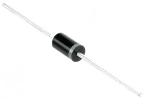

**Definición**  
Un diodo rectificador es un componente electrónico **semiconductor** que permite el paso de la corriente eléctrica en un solo sentido (**polarización directa**) y bloquea el paso en el sentido contrario (**polarización inversa**).

👉 En circuitos de **corriente alterna (CA)**, la polaridad de la tensión cambia constantemente. Esto significa que el diodo **solo conducirá corriente en los semiciclos donde se encuentre en polarización directa**, bloqueando el paso en el semiciclo contrario. Según cómo se coloque en el circuito, permitirá el paso de las **semiondas positivas** o de las **semiondas negativas**.

👉 En **corriente continua (CC)** la polaridad no cambia, por lo que el diodo rectificador no se utiliza para rectificar. Sin embargo, puede emplearse como **elemento de protección** frente a una conexión inversa de la alimentación.

#### Unidades en los diodos rectificadores

Los diodos rectificadores se caracterizan principalmente por dos parámetros eléctricos:

- **Tensión máxima inversa ($V_{RRM}$)**: es la máxima tensión que el diodo puede soportar en **polarización inversa** sin dañarse.  
  👉 Se mide en **voltios (V)**.

- **Corriente máxima directa ($I_F$)**: es la máxima corriente que puede circular a través del diodo cuando está en **polarización directa**.  
  👉 Se mide en **amperios (A)**.

Otros valores importantes en algunos casos son la **caída de tensión directa** (normalmente ~0,7 V en diodos de silicio) y el **tiempo de recuperación** (importante en diodos rápidos).

#### Tipos de diodos rectificadores

Existen diferentes tipos de diodos rectificadores, adaptados a las necesidades del circuito:

- **Diodos de propósito general**: soportan corrientes y tensiones moderadas. Usados en fuentes de alimentación básicas.  
- **Diodos de potencia**: diseñados para manejar corrientes elevadas, usados en cargadores, inversores y sistemas de energía.  
- **Diodos rápidos o ultrarrápidos**: tienen un tiempo de conmutación muy bajo, adecuados para fuentes conmutadas y alta frecuencia.  
- **Diodos Schottky**: presentan una caída de tensión directa más baja (~0,2 – 0,4 V), lo que los hace más eficientes en aplicaciones de baja tensión y alta velocidad.  
- **Puente rectificador**: conjunto de **4 diodos** conectados en forma de puente, que permite la **rectificación de onda completa** (aprovecha tanto las semiondas positivas como las negativas de la señal de CA).

#### Funcionamiento de los diodos rectificadores

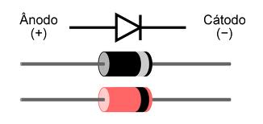

El funcionamiento de un diodo rectificador depende del tipo de corriente que circule por el circuito.

##### En corriente continua (CC)

En un circuito de corriente continua, el diodo no tiene un papel útil en condiciones normales, ya que la corriente siempre circula en la misma dirección.  
Su uso principal es como **protección**, evitando daños en el circuito si se invierte la polaridad de la fuente.

- Si la polaridad es correcta, el diodo se encuentra en **polarización directa** (**ánodo → polo positivo** y **cátodo → polo negativo**) y permite el paso de la corriente.
- Si la polaridad está invertida, el diodo entra en **polarización inversa** (**ánodo → polo negativo** y **cátodo → polo positivo**) y bloquea la corriente, protegiendo así los componentes.

##### En corriente alterna (CA)

En corriente alterna, la tensión cambia de polaridad de manera periódica.  
Eso significa que, durante medio ciclo, un extremo de la fuente está a mayor potencial (lo llamamos **semionda positiva**) y en el medio ciclo siguiente ocurre lo contrario (**semionda negativa**).

Un diodo rectificador en serie con la carga funciona así:

- Durante la **semionda positiva**, el ánodo del diodo está a mayor potencial que el cátodo → el diodo está en **polarización directa** y **conduce**.  
- Durante la **semionda negativa**, la polaridad se invierte y el cátodo queda a mayor potencial que el ánodo → el diodo está en **polarización inversa** y **no conduce**.

De esta manera, el diodo solo deja pasar **una mitad de la señal alterna**.  
Este proceso se denomina **rectificación de media onda**.

Si el diodo se coloca en sentido contrario, el efecto será el mismo pero invertido:

- Bloqueará las **semiondas positivas**.  
- Dejará pasar únicamente las **semiondas negativas**.

👉 **En este módulo emplearemos los diodos rectificadores principalmente como elementos de protección**.  
Su función será evitar daños en los circuitos cuando exista el riesgo de **conectar la alimentación con la polaridad invertida**.  
De este modo, el diodo bloqueará la corriente en caso de error, protegiendo los componentes del montaje.

--- 

### 3.2. LEDs (Light Emitting Diode)

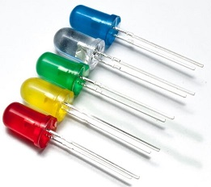

**Definición**
Un **LED** (del inglés *Light Emitting Diode*) es un **diodo** que, además de permitir el paso de corriente en un solo sentido, **emite luz cuando está polarizado directamente** (**ánodo → polo positivo** y **cátodo → polo negativo**).

Su funcionamiento se basa en el mismo principio que el de cualquier diodo:  solo **conduce corriente** si se conecta en el sentido correcto (del ánodo al cátodo).  La diferencia es que el LED está fabricado con materiales que, al conducir la corriente, **liberan energía en forma de luz visible**.

##### 🔹 ¿Se puede usar un LED como diodo rectificador?

Aunque un **LED es un diodo**, **no puede utilizarse como diodo rectificador**.

El LED está diseñado para **emitir luz** cuando se polariza directamente, pero **no soporta las corrientes ni tensiones** que manejan los diodos rectificadores.  
Además, su **caída de tensión directa es mayor** (entre 1,8 V y 3,6 V), lo que lo hace **inadecuado para rectificar señales eléctricas**.

👉 En resumen: **un LED y un diodo rectificador funcionan de forma parecida, pero tienen finalidades distintas**.

#### 🔹 Cómo utilizar un LED

Para usar un LED correctamente en un circuito, hay que tener en cuenta su **polaridad**, su **caída de tensión** y la necesidad de **limitar la corriente** con una resistencia.

##### 🔸 Identificación de las patillas

Un LED tiene dos terminales:

- **Ánodo (+):** patilla **más larga**.  
- **Cátodo (–):** patilla **más corta**.  
- Además, el **cátodo** suele tener un **bisel plano** o una **zona interna más grande** en el encapsulado transparente.

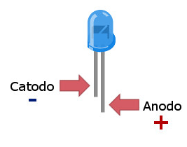

##### 🔸 Polarización

- **Polarización directa:**  
  El ánodo se conecta al positivo y el cátodo al negativo.  
  → El LED **conduce corriente** y **emite luz**.

- **Polarización inversa:**  
  Si se invierte la conexión, el LED **no conduce** ni emite luz.  
  Si la tensión inversa es alta, puede **dañarse**.

#### 🔸 Caída de tensión según el color

Cada color de LED presenta una **caída de tensión directa (Vf)** distinta, que depende del material semiconductor con el que está fabricado.

| Color del LED | Caída de tensión (Vf aprox.) |
| ------------- | ---------------------------- |
| Rojo          | 1,8 – 2,2 V                  |
| Amarillo      | 2,0 – 2,4 V                  |
| Verde         | 2,0 – 3,0 V                  |
| Azul          | 3,0 – 3,3 V                  |
| Blanco        | 3,0 – 3,6 V                  |

#### 🔸 Resistencia limitadora

Para evitar que circule una corriente excesiva que pueda <u>dañar el LED</u>, se coloca una **resistencia en serie**.

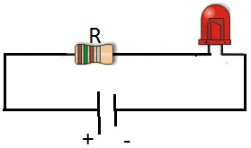

Su valor se calcula con la **Ley de Ohm**:

$R = \frac{V_{fuente} - V_f}{I}$

Donde:

- ($V_{fuente}$): tensión de la fuente de alimentación.  
- ($V_f$): caída de tensión del LED.  
- ($I$): corriente deseada (normalmente entre 10 mA y 20 mA).

**Ejemplo:**
Si alimentamos un LED rojo ($V_f$ = 2 V) con una fuente de 5 V y queremos una corriente de 15 mA:

$R = \frac{5 V - 2 V}{0.015 A} = 200 Ω$

El valor estándar más próximo sería **220 Ω**.

Emiten luz al ser polarizados directamente.  

- Colores: rojo, verde, azul, blanco, RGB.  
- Aplicaciones: indicadores luminosos, pantallas.  

### 🔹 Uso de LEDs en corriente alterna (CA)

Todo lo explicado en el apartado anterior corresponde a circuitos de **corriente continua (CC)**, donde la polaridad es fija.  
Sin embargo, los **LEDs también pueden emplearse en corriente alterna (CA)**, aunque con algunas precauciones.

- En corriente alterna, la **polaridad cambia constantemente**, por lo que el LED **solo conducirá durante los semiciclos en los que esté polarizado directamente**.  
  👉 Esto hace que el LED **parpadee a la frecuencia de la red eléctrica** (por ejemplo, 50 Hz), aunque este parpadeo **no siempre es perceptible al ojo humano**.

- Durante los semiciclos inversos, el LED **no conduce** y podría **dañarse** si la tensión inversa supera su límite (normalmente unos 5 V).  
  
  Para evitar que se dañe un LED en un circuito de corriente alterna se emplean **diodos y resistencias**.  No se va a profundizar más en este tema porque en este módulo nos centramos en los **circuitos de corriente continua**.

### 🔹 Aplicaciones de los LEDs en este módulo

En el módulo **Informática aplicada a sistemas electrónicos (Robótica)**, los LEDs se utilizan principalmente como **indicadores visuales** y **elementos de salida** en proyectos con **microcontroladores** (por ejemplo, Arduino o ESP32).  

Algunos usos típicos incluyen:

- **Indicadores de estado:**  
  Mostrar si un circuito, sensor o sistema está activo.  
  *Ejemplo:* encender un LED verde cuando un sensor detecta un valor correcto.

- **Pruebas de salida digital:**  
  Verificar que una señal de control funciona correctamente antes de conectar un actuador real.

- **Señalización y depuración:**  
  Usar diferentes colores o parpadeos para representar estados del programa (inicio, error, conexión, etc.).

- **Iluminación básica o decorativa:**  
  En maquetas o prototipos, mediante tiras de LEDs o matrices RGB controladas por microcontrolador.

👉 En todos los casos, es fundamental **proteger el LED con una resistencia limitadora adecuada** y **respetar la polaridad** para garantizar su durabilidad y correcto funcionamiento.

---

### 3.3. Fotodetectores

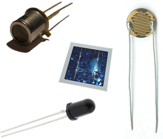

**Definición** 
Un **fotodetector** es un **componente electrónico sensible a la luz** que **modifica su comportamiento eléctrico cuando recibe iluminación**.  
En términos sencillos, **deja pasar la corriente eléctrica (cierra el circuito)** al recibir luz, y **la bloquea (abre el circuito)** cuando está en oscuridad.

Su principio de funcionamiento es **inverso al del LED**:  

- El **LED** emite luz cuando circula corriente.  
- El **fotodetector** deja pasar la corriente cuando recibe luz.

Estos dispositivos son muy utilizados en **sensores de presencia**, **sistemas de iluminación automática**, **robots seguidores de línea** o **contadores ópticos**.

#### 🔸 Principales tipos de fotodetectores

1. **Fotorresistencia (LDR – Light Dependent Resistor)**  
   
   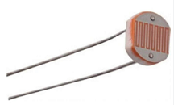
   
   - Su **resistencia eléctrica disminuye cuando recibe luz**.  
   - Cuanta más luz incide, **menor resistencia** presenta.  
   - Muy utilizada en **sensores de iluminación**, lámparas automáticas o sistemas de seguimiento solar.

2. **Fotodiodo**  
   
   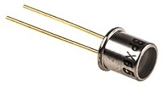
   
   - Es un **diodo semiconductor** diseñado para **dejar pasar la corriente eléctrica cuando recibe luz**.  
     - En oscuridad, apenas conduce (circuito abierto).  
     - Al iluminarse, **permite el paso de corriente** (circuito cerrado).  
   - Responde **rápidamente** a los cambios de iluminación, por lo que se utiliza en **detectores de llama**, **barreras ópticas**, **contadores de velocidad** o **receptores de señales infrarrojas**.

3. **Fototransistor**  
   
   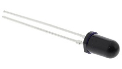
   
   - Es un **fotodetector que deja pasar corriente cuando recibe luz**, igual que el fotodiodo, pero con **mayor sensibilidad**.  
   - Detecta incluso **niveles de luz muy bajos**.  
   - Se utiliza en **barreras de luz**, **sensores de proximidad**, **lectores ópticos** y **robots detectores de objetos**.

4. **Fotocélula o célula fotovoltaica**  
   
   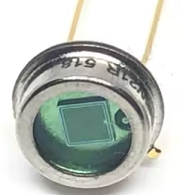
   
   - Es un **fotodetector que transforma directamente la luz en electricidad** mediante el **efecto fotovoltaico**.  
   - A diferencia de los demás fotodetectores, **no necesita una fuente de alimentación externa**, ya que **genera su propia corriente** cuando recibe luz.  
   - Puede considerarse una **pequeña célula solar**, similar a las que forman los **paneles solares**.  
   - Se utiliza en **sistemas de energía solar**, **sensores autónomos** y **dispositivos portátiles que aprovechan la luz para funcionar o recargarse**.

💡 **En resumen:**  
Los fotodetectores son elementos esenciales en la robótica y la automatización, ya que permiten **“ver” o detectar la luz y el entorno** para que los sistemas electrónicos puedan reaccionar a los cambios de iluminación o presencia.

- Funcionan de manera inversa al LED: **no emiten luz, sino que responden a ella**.  
- Al recibir luz, **permiten el paso de corriente** o **modifican su resistencia** (según el tipo de fotodetector).  
- Tipos principales: **fotorresistencias (LDR)**, **fotodiodos**, **fototransistores** y **fotocélulas fotovoltaicas**.  
- Aplicaciones: **control de iluminación**, **sensores de presencia**, **barreras de luz**, **robots seguidores de línea** y **sistemas de detección óptica**.

| Tipo de fotodetector          | Comportamiento al recibir luz                                       | ¿Genera corriente? | Aplicaciones principales                                               |
| ----------------------------- | ------------------------------------------------------------------- | ------------------ | ---------------------------------------------------------------------- |
| **Fotorresistencia (LDR)**    | Disminuye su resistencia y deja pasar más corriente                 | ❌ No               | Encendido automático de luces, sensores de iluminación ambiental       |
| **Fotodiodo**                 | Permite el paso de corriente en presencia de luz                    | ❌ No               | Barreras ópticas, detectores de llama, receptores infrarrojos          |
| **Fototransistor**            | Deja pasar corriente con mayor sensibilidad que el fotodiodo        | ❌ No               | Sensores de proximidad, robots detectores de objetos, lectores ópticos |
| **Fotocélula (fotovoltaica)** | Convierte la luz directamente en electricidad (efecto fotovoltaico) | ✅ Sí               | Paneles solares, sensores autónomos, cargadores solares                |

🔸 **Diferencia práctica entre LDR, fotodiodo y fototransistor**

La principal diferencia entre estos tres tipos de fotodetectores está en **cómo están construidos** y en su **nivel de sensibilidad** frente a la luz.

Cada uno utiliza **materiales y estructuras semiconductoras diferentes**, lo que determina su **respuesta a la iluminación**:

- La **fotorresistencia (LDR)** varía su resistencia de forma lenta y es adecuada para cambios de luz **graduales** (por ejemplo, iluminación ambiental).  
- El **fotodiodo** responde de manera **más rápida y precisa**, por lo que se usa en detección de señales o haces de luz.  
- El **fototransistor** es el **más sensible**, capaz de detectar incluso niveles de luz muy bajos, por lo que se emplea en sensores de precisión o detección de objetos.

👉 En resumen, **todos reaccionan ante la luz**, pero **cada uno tiene distinta sensibilidad y velocidad de respuesta** según su construcción interna.

###### 🔹 Diferencia entre la fotocélula y el resto de fotodetectores

La **fotocélula** o **célula fotovoltaica** también reacciona a la luz, pero **no funciona igual** que los demás fotodetectores.  
Mientras que los **LDR, fotodiodos y fototransistores** necesitan una **alimentación externa** y **solo modifican el paso de corriente** cuando reciben luz,  
la **fotocélula** **genera su propia corriente eléctrica** al ser iluminada, gracias al **efecto fotovoltaico**.  

En otras palabras, los **LDR, fotodiodos y fototransistores** se utilizan como **sensores de luz**, mientras que la **fotocélula** actúa como una **fuente de energía** (un pequeño panel solar).  

#### 🔹 Uso práctico de los fotodetectores en circuitos

Los **fotodetectores pueden utilizarse como componentes individuales** (por ejemplo, una **LDR suelta**) o **formando parte de módulos o sensores** que ya incluyen otros elementos electrónicos.

En los módulos más comunes —como los sensores de luz para Arduino— la **fotoresistencia** u otro fotodetector se monta sobre **una pequeña placa de circuito** junto con **resistencias, condensadores** e incluso **amplificadores o comparadores**.  
Estos componentes adicionales sirven para **ajustar la sensibilidad**, **proteger el sensor** o **convertir la señal** en un valor que pueda leer fácilmente el microcontrolador.

💡 **Ejemplo:**  
Una LDR conectada directamente necesita una **resistencia en serie** para formar un **divisor de tensión**.  
Sin embargo, un **módulo de sensor de luz** ya trae esa resistencia incluida y ofrece **salidas analógica y/o digital** mediante pines listos para conectar a la **protoboard** o al **Arduino**.

👉 En resumen:  

- Un **fotodetector individual** requiere componentes externos (como resistencias).  
- Un **módulo sensor** incluye esos elementos integrados, facilitando su uso en proyectos de robótica.

##### 🔹 ¿Qué utilizaremos en este módulo?

En este módulo no trabajaremos con **fotodetectores individuales** (como una LDR o un fotodiodo sueltos), sino con **sensores de iluminación montados en placa**, que ya incorporan los componentes necesarios para su funcionamiento.

Estos sensores están formados por un **fotodetector** (normalmente una LDR) junto con **resistencias, condensadores o comparadores**, que permiten que el circuito funcione de forma estable y que la señal pueda conectarse directamente al **microcontrolador (Arduino)** o a la **protoboard** sin cálculos ni ajustes adicionales.

💡 **Ventajas de usar sensores de iluminación en placa:**

- Son **más fáciles de conectar** y no requieren montaje con resistencias externas.  
- Ofrecen **salida analógica o digital lista para usar**.  
- Evitan errores de conexión y permiten centrarse en **el diseño y programación del sistema electrónico**.

👉 En resumen, **en este módulo utilizaremos sensores de iluminación**, que internamente emplean fotodetectores como la **LDR**, pero ya listos para integrarse en los circuitos de robótica.

---

### 3.4 Transistores

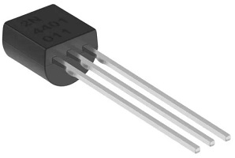

#### 🔹 ¿Qué es un transistor?

Un **transistor** es un **componente electrónico activo** que permite **controlar el paso de la corriente eléctrica**.

Se utiliza principalmente como:

- **Interruptor electrónico** 

- **Controlador de corriente / regulador**

- **Amplificador de señales** (no lo veremos en detalle en este módulo).

Es uno de los componentes fundamentales de la electrónica moderna y está presente en prácticamente todos los circuitos actuales.

#### 🔹 Tipos más comunes

En electrónica básica y en Arduino se utilizan sobre todo dos tipos de transistores bipolares:

##### 1 NPN

- Deja pasar corriente **del colector al emisor** cuando se aplica una pequeña corriente en la base.

- Es el más utilizado para controlar cargas con Arduino.

##### 2. PNP

- Funciona al revés: conduce cuando la base está a un nivel más bajo que el emisor.

- Mucho menos habitual en Arduino.

Para trabajar en clase usaremos principalmente **transistores NPN**.

#### 🔹 Partes del transistor

Un transistor bipolar (BJT) tiene **tres patillas**:

- **Base (B)** → Señal de control

- **Colector (C)** → Entrada de corriente hacia la carga

- **Emisor (E)** → Salida hacia GND

> La **base** es la patilla que controla el encendido o apagado del transistor.

#### 🔹 1) El transistor como interruptor (uso en Arduino)

En robótica lo usamos casi siempre como **interruptor controlado por Arduino**.

##### Funcionamiento básico:

1. Arduino envía una señal a la **base** a través de una resistencia.

2. El transistor “se abre” y permite que la corriente pase del **colector** al **emisor**.

3. La carga (motor, relé, filamento COB, zumbador…) recibe energía desde una fuente externa de forma segura.

4. Cuando Arduino pone la base a 0V, el transistor “se cierra” y la carga se apaga.

##### 🔹 ¿Por qué lo necesitamos?

Porque un pin de Arduino **no puede alimentar cargas grandes**:

- Motores

- Relés

- Tiradores eléctricos

- Luces potentes

- Filamentos COB LED

El transistor **protege el pin** y permite manejar cargas que consumen más corriente.

##### 🔹 Esquema típico de uso con Arduino (transistor NPN)

##### Ejemplos de transistores NPN que se pueden usar

Los mismos que tienes en clase:

- **S8050**

- **S9013**

- **S9014**

- **C945**

- **2N3904**

- **2N5551**

Todos ellos funcionan igual como interruptores.

##### 🔹 Aplicaciones en robótica

El transistor se utiliza para:

- Encender motores y ventiladores

- Activar relés

- Controlar filamentos COB LED

- Aumentar la corriente para una tira LED

- Activar zumbadores potentes

- Controlar módulos que necesitan más corriente de la que da el Arduino

#### 🔹 2) El transistor como **controlador de corriente / regulador**

Además de funcionar como interruptor, un transistor también puede trabajar en un modo intermedio en el que **no está totalmente saturado ni totalmente en corte**.  
En este modo la corriente que pasa por el transistor **depende de la señal que recibe en la base**.

Esto permite **regular**:

- La **velocidad** de un motor de corriente continua

- El **brillo** de un LED

- La **intensidad** en un zumbador

- La **potencia** de una carga pequeña

Este uso es muy común cuando trabajamos con **PWM en Arduino**.

#### 🔹¿Qué es el PWM?

El **PWM (Pulse Width Modulation)** es una técnica que usa Arduino para **simular niveles intermedios de potencia**.

Arduino **no puede generar voltaje analógico real**, solo puede poner un pin a:

- **5V** (salida digital HIGH)

- **0V** (salida digital LOW)

Pero si envía pulsos muy rápidos, alternando entre 5V y 0V, y cambiando **el tiempo que está encendido respecto al tiempo que está apagado**, se puede imitar un voltaje intermedio.

Ese porcentaje se llama **ciclo de trabajo (duty cycle)**.

Ejemplos:

- 20% encendido → carga recibe poca energía → motor lento / LED tenue

- 80% encendido → carga recibe mucha energía → motor rápido / LED brillante

El PWM no cambia el voltaje: cambia **cuánta energía promedio** recibe la carga.

Gracias al PWM, Arduino puede controlar cuánta energía llega a la base del transistor y, por tanto, **regula la corriente que pasa por la carga**.

##### 🔹 ¿Cómo funciona en modo controlador de corriente / regulador?

En lugar de usarlo como interruptor (corte/saturación), el transistor opera en su **región activa**:

- Una pequeña variación de corriente en la **base**

- Produce una variación proporcional de corriente entre **colector → emisor**

> El transistor no genera energía: solo **deja pasar más o menos** según la señal de control.

Este comportamiento lo convierte en un **regulador**.

##### 🔹 Ejemplo: regular la velocidad de un motor con PWM

Arduino genera una señal PWM (muy rápida) que **simula voltajes intermedios**.  
El transistor actúa como “válvula” y ajusta cuánta corriente llega al motor.

###### Funcionamiento:

1. Arduino envía pulsos PWM a la base.

2. El transistor permite más o menos corriente según el ciclo de trabajo.

3. El motor recibe más o menos potencia (energía media).

4. La velocidad varía de forma suave.

**⚠ Importante:**  
Si la carga es un motor, relé o cualquier bobina, debe colocarse un **diodo en paralelo** a la carga para proteger el transistor.

##### 🔹 Ejemplo: regular el brillo de un LED

- PWM del 20% → poca corriente → LED tenue

- PWM del 80% → más corriente → LED brillante

##### 🔹 Esquema típico de regulación con PWM (transistor NPN)

> Arduino (PWM) → Resistencia → Base del transistor
> Colector → Motor / LED / carga
> Emisor → GND
> Fuente externa → carga → transistor

La conexión es la misma que cuando funciona como interruptor; cambia la **señal PWM**, que hace que trabaje como regulador.

#### 🔹 ¿Por qué es útil este modo?

Porque permite:

- Controlar actuadores de forma **proporcional**

- Evitar golpes de corriente bruscos

- Ahorrar energía

- Dar un control suave (velocidad, brillo…)

> Aunque un transistor puede regular corriente de forma “analógica pura”, en Arduino se utiliza **casi siempre con PWM**, porque es mucho más eficiente y el transistor no se calienta tanto.

#### 🔹 Resumen

- El transistor es un **componente activo** imprescindible en electrónica y robótica.

- En Arduino se usa principalmente como **interruptor electrónico** para controlar cargas que consumen más corriente de la que puede dar un pin.

- También puede funcionar como **regulador de corriente** mediante **PWM**, permitiendo controlar **velocidad**, **brillo** o **potencia** de forma proporcional.

- Es fundamental para el trabajo con **actuadores**: motores, relés, luces, zumbadores y tiras LED.

---

# CONTINUA EN LA PARTE 2

UT3 Dispositivos discretos pasivos activos sensores y actuadores - Parte 2.md

---

© Apuntes de **Informática aplicada a sistemas electrónicos (Robótica)** – UT3
