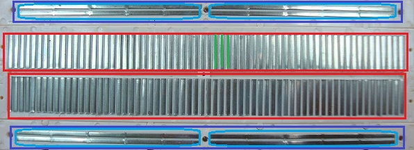

# UT4 Diseño, montaje y medida de circuitos electrónicos en un proyecto tecnológico

---

*En este documento se desarrolla la **Parte 2** de los apuntes, dedicada a los **sensores**.*

---

## Índice de contenidos

- [3 Herramientas de diseño y simulación](#3-herramientas-de-diseño-y-simulación)
- [4 Montaje de circuitos en protoboard](#4-montaje-de-circuitos-en-protoboard)
- [5 Medición de parámetros eléctricos en montajes](#5-medición-de-parámetros-eléctricos-en-montajes)
- [6 Identificación de errores y fallos en circuitos](#6-identificación-de-errores-y-fallos-en-circuitos)

---

## 3 Herramientas de diseño y simulación

Antes de montar un circuito real es fundamental comprobar que el diseño es correcto y que el comportamiento previsto coincide con los cálculos y el funcionamiento teórico. Las herramientas de diseño y simulación permiten **probar circuitos sin riesgo**, detectar errores antes del montaje y visualizar el flujo de corriente, tensiones y conexiones internas.

El uso de simuladores es una parte esencial en proyectos tecnológicos porque reduce tiempos de montaje, evita daños en los componentes y mejora la comprensión de los circuitos.

En este apartado se revisan distintas herramientas de simulación y diseño electrónico que pueden utilizarse durante el desarrollo del proyecto tecnológico, explicando qué funciones ofrecen y qué tipo de circuitos permiten representar o analizar.

### 3.1 Objetivos del uso de herramientas de simulación

Las herramientas de diseño y simulación permiten:

- Verificar que las conexiones del circuito son correctas

- Probar el funcionamiento antes del montaje real

- Detectar cortocircuitos, polaridades invertidas o componentes mal elegidos

- Visualizar tensiones y corrientes en cualquier punto del circuito

- Simular sensores y actuadores sin necesidad de disponer del hardware físico

- Realizar cambios rápidos sin tener que reconstruir el circuito en protoboard

- Documentar el diseño para integrarlo en el proyecto tecnológico final

Para proyectos educativos y de iniciación a la electrónica, los simuladores ayudan a los alumnos a entender el comportamiento real de los componentes y a desarrollar confianza antes de enfrentarse al montaje físico.

### 3.2 Tinkercad Circuits

Tinkercad es un simulador en línea muy utilizado en educación porque es sencillo, visual y gratuito. Permite construir circuitos en protoboard, añadir Arduino, sensores y actuadores, y simular tanto la electrónica como el código.

#### Características principales

- Simulación de circuitos con protoboard

- Componentes básicos: resistencias, LEDs, potenciómetros, pulsadores, sensores

- Componentes avanzados: motores, servos, ultrasonidos, relés

- Simulación completa de Arduino (incluye programación con bloques o texto)

- Visualización de tensiones y corrientes

- Detección de errores de conexión

- Ejecución paso a paso del programa cargado en Arduino

#### Ventajas para el aprendizaje

- No requiere instalación

- Permite experimentar sin miedo a dañar componentes

- Es ideal para practicar conexiones antes de montarlas en físico

- Perfecto para hacer prácticas en clase donde no haya suficiente material

#### Limitaciones

- No todos los componentes están incluidos

- La simulación no siempre refleja al 100% el comportamiento real (especialmente motores)

- No permite simulaciones analógicas complejas

### 3.3 Proteus (ISIS + ARES)

Proteus es un software profesional orientado a diseño electrónico y simulación avanzada. Aunque su complejidad es mayor, permite realizar simulaciones mucho más precisas y completas que Tinkercad.

#### Características principales

- Simulación precisa de circuitos analógicos y digitales

- Simulación avanzada de microcontroladores (Arduino, PIC, AVR, ARM…)

- Diseño de **circuitos impresos (PCB)**

- Gran biblioteca de componentes electrónicos reales

- Análisis de señales, gráficas, osciloscopio virtual

- Control detallado de parámetros eléctricos

#### Ventajas

- Mayor realismo en la simulación

- Permite crear placas PCB para proyectos avanzados

- Ideal para proyectos finales o trabajo profesional

#### Desventajas

- Es software de pago

- Requiere instalación y un aprendizaje más profundo

- No es tan intuitivo para principiantes

### 3.4 Fritzing (diseño de esquemas y protoboard)

Fritzing permite diseñar:

- Esquemas electrónicos

- Montajes en protoboard

- Placas PCB sencillas

Se utiliza principalmente para documentar proyectos electrónicos de forma clara y visual.

#### Usos principales

- Crear esquemas limpios para los apuntes o documentación del proyecto

- Diseñar representaciones exactas de protoboard

- Exportar imágenes para informes y presentaciones

No es un simulador, pero sí una herramienta muy útil para la documentación del proyecto tecnológico.

### 3.5 Tipos de vistas en herramientas de diseño

La mayoría de herramientas de diseño utilizan tres vistas fundamentales:

#### 1. Vista de esquema eléctrico

Representa el circuito mediante símbolos normalizados.  
Es útil para:

- Comprender el funcionamiento del circuito

- Identificar conexiones lógicas

- Realizar análisis eléctricos

#### 2. Vista de protoboard

Representación física del montaje.  
Sirve para:

- Mostrar dónde va cada componente

- Identificar líneas internas de la protoboard

- Evitar errores de cableado

#### 3. Vista de PCB

Permite crear placas de circuito impreso.  
Útil para proyectos avanzados o finales.

### 3.6 Flujo de trabajo recomendado

Para los proyectos de esta unidad, se recomienda seguir este proceso:

1. **Diseño del esquema eléctrico**
   
   - Identificar componentes y conexiones

2. **Simulación del comportamiento**
   
   - Comprobar tensiones, corrientes y funcionamiento

3. **Corrección de errores**
   
   - Polaridades, valores incorrectos, falta de GND común

4. **Diseño en protoboard**
   
   - Preparar el montaje real con un diseño limpio

5. **Montaje físico**
   
   - Colocar componentes, cablear, revisar

6. **Medida y comprobación con multímetro**
   
   - Tensiones, continuidad, funcionamiento real

Este flujo reduce errores y mejora la eficiencia en clase.

### 3.7 Errores comunes al usar simuladores

- Suponer que la simulación siempre coincide con el comportamiento real

- No revisar polaridades antes de ejecutar

- Conectar sensores sin divisores de tensión

- No unir GND entre Arduino y la fuente externa

- Usar componentes que no están en la biblioteca del simulador

- Generar un esquema correcto pero un protoboard incorrecto

- Confiar 100% en el comportamiento del motor o del servo (simulación limitada)

## 4 Montaje de circuitos en protoboard

La protoboard es una herramienta fundamental para montar circuitos electrónicos sin necesidad de soldar. Permite realizar conexiones rápidas, probar ideas y corregir errores de forma sencilla. Sin embargo, para utilizarla correctamente es necesario comprender su estructura interna y seguir algunas normas básicas de montaje que evitan cortocircuitos y conexiones erróneas.

En este apartado aprenderemos cómo está organizada una protoboard, cómo se distribuyen las líneas internas y cómo realizar montajes limpios y seguros.

### 4.1 Estructura interna de una protoboard

Aunque desde fuera parece una simple placa con agujeros, internamente la protoboard está formada por **regletas metálicas** que conectan grupos de agujeros entre sí.

La estructura típica se divide en tres zonas:

1. **Buses de alimentación (superior e inferior)**

2. **Pistas**

3. **Canal central (o “divisor”)**, que separa los dos lados

Los agujeros NO están conectados individualmente; siguen un patrón interno fijo que hay que conocer para evitar errores.

### 4.2 Líneas de alimentación

En los laterales de la protoboard encontramos dos tiras largas:

- Una marcada con **+** o color **rojo**

- Otra marcada con **–** o color **azul**

Estas líneas están conectadas horizontalmente, formando dos “carriles” que permiten distribuir:

- **+V** (5V o 3.3V)

- **GND (masa)**

Características importantes:

- Cada punto de la línea roja está unido internamente con todos los de su fila.

- Cada punto de la línea azul está unido entre sí en su fila.

- En muchas protoboard **las líneas están partidas en el centro**, por lo que la parte izquierda y la derecha **no están conectadas entre sí**.

Es recomendable comprobar con el multímetro si la línea está partida antes de usarla.

### 4.3 Regletas internas

La zona central donde se insertan los componentes está dividida en **columnas de 5 agujeros** unidos internamente.

Funcionamiento:

- Cada columna de 5 agujeros está conectada verticalmente.

- Las columnas del lado izquierdo NO están conectadas con las del lado derecho.

- El canal central evita conexiones indeseadas de componentes de encapsulados DIP (como circuitos integrados).

Ejemplo de uso:

- Insertar un LED o una resistencia en una columna significa que ambos terminales quedan conectados a esa columna.

- Para que el componente “puente” entre dos columnas, cada patilla debe situarse en una columna diferente.

### 4.4 Cómo evitar cortocircuitos

Al montar circuitos en protoboard, los errores más frecuentes suelen producir cortocircuitos, que pueden dañar componentes o detener el funcionamiento del circuito. Para evitarlos:

#### Reglas básicas

- No colocar las dos patillas de un componente en la **misma columna**.

- No unir accidentalmente **+V** y **GND** con un cable mal puesto.

- Verificar si la línea de alimentación está **partida**.

- Asegurar que los cables no tocan componentes metálicos exteriores.

- No insertar componentes de alta corriente directamente en la protoboard (motores, relés grandes).

#### Comprobación con multímetro

Antes de alimentar el circuito:

1. Colocar el multímetro en modo **continuidad**.

2. Comprobar si hay contacto entre **+V y GND**.
   
   - Si “pita”, existe un cortocircuito.

3. Comprobar las columnas donde hay componentes para asegurar que no están unidas accidentalmente.

### 4.5 Buenas prácticas en el cableado

Un buen cableado facilita entender el circuito y reduce errores durante el montaje y la explicación en clase.

Recomendaciones:

- Usar colores coherentes:
  
  - Rojo → **+V**
  
  - Negro → **GND**
  
  - Azul / Amarillo → señales
  
  - Verde → control

- Mantener los cables **cortos y tensos**.

- Evitar vuelos innecesarios que cruzan toda la protoboard.

- Colocar los componentes cerca unos de otros para minimizar el cableado.

- Seguir el esquema eléctrico antes de cablear.

- Revisar cada conexión antes de alimentar el circuito.

- Añadir etiquetas si el circuito es complejo.

Estas prácticas facilitan el diagnóstico de errores y ayudan al alumno a identificar visualmente el funcionamiento del montaje.

## 5 Medición de parámetros eléctricos en montajes

En la UT1 se explicó en detalle el funcionamiento del multímetro.  
En esta unidad nos centraremos únicamente en **cómo aplicar esas mediciones a los circuitos reales montados en protoboard**, con el objetivo de comprobar su funcionamiento y detectar errores.

### 5.1 Medición de tensiones en circuitos de la UT4

La medición de tensión es la comprobación más frecuente en esta unidad. Permite verificar:

- Si llega alimentación al circuito

- Si un nodo del divisor de tensión responde correctamente

- Si un transistor está recibiendo suficiente tensión de base

- Si un sensor digital (PIR, ultrasonidos) entrega HIGH o LOW

- Si un LED tiene la caída de tensión esperada

- Si el colector de un transistor cae realmente a GND cuando está saturado

Valores típicos que se pueden observar:

- LED rojo → ≈ 1.8–2.2 V

- LED verde → ≈ 2–3 V

- Nodo de un divisor con LDR/NTC → entre ≈ 0.2 y 4.8 V

- Base de transistor NPN → ≈ 0.7 V cuando conduce

### 5.2 Medición de resistencias en montajes

Las mediciones de resistencia se aplican principalmente para:

- Verificar valores antes de montar el circuito

- Comprobar que una resistencia no está dañada

- Identificar resistencias cuando no se leen bien sus bandas

- Asegurar que los valores de un divisor son los correctos

- Medir un potenciómetro para confirmar el rango de variación

Siempre debe realizarse **sin alimentación**.

### 5.3 Medición de corriente (solo cuando sea necesario)

La medición de corriente se usa en esta unidad únicamente en casos puntuales:

- Para conocer el consumo real de motores DC

- Para verificar la intensidad que atraviesa un LED con resistencia

- Para comprobar si un transistor está saturando (medir corriente de colector)

Advertencias clave:

- La medición de corriente requiere abrir el circuito y medir **en serie**

- Un error de conexión puede provocar cortocircuitos

- Solo se debe utilizar cuando sea estrictamente necesario

Valores orientativos comunes:

- LED: 10–20 mA

- Motor TT: 100–250 mA

- Relé 5V: 70–90 mA

### 5.4 Comprobación de continuidad en protoboard

El modo continuidad es esencial para:

- Verificar que no existe contacto accidental entre **+V y GND**

- Confirmar si un bus de alimentación está partido

- Asegurar que un cable jumper no está roto

- Comprobar si dos puntos pertenecen a la misma columna de la protoboard

- Revisar conexiones internas antes de alimentar el circuito

Es buena práctica comprobar continuidad **antes de encender** cualquier montaje nuevo.

### 5.5 Identificación de fallos mediante mediciones

Las mediciones permiten localizar rápidamente errores típicos en montajes con protoboard:

#### Fallos de polaridad

- LED que no enciende → medir caída en el LED (≈0 V → invertido)

- Diodo flyback mal orientado → medir en carga para verificar que no conduce en reposo

#### Fallos en sensores

- LDR o NTC conectada sin divisor → la lectura no cambia

- Divisor invertido → señales siempre altas o siempre bajas

- PIR sin GND común → salida inestable

#### Fallos en transistores

- Base sin tensión suficiente → medir ≈0 V

- Transistor que no satura → colector no cae a GND

- Falta de GND común en alimentaciones externas

#### Fallos en actuadores

- Motor que no gira → comprobar tensión en la carga y saturación del transistor

- Relé que no conmuta → medir tensión en bobina y salida digital

- Zumbador pasivo que no suena → confirmar señal PWM

### 5.6 Buenas prácticas de medición en esta unidad

- Medir primero tensiones; medir corriente solo si es necesario

- Verificar GND común antes de diagnosticar un fallo

- Revisar continuidad antes de alimentar el circuito

- Comprobar valores en nodos clave: divisor, base del transistor, carga

- Medir siempre con las puntas firmes y sin hacer contacto accidental

- Analizar si el valor medido tiene sentido según el circuito esperado

## 6 Identificación de errores y fallos en circuitos

Detectar errores en circuitos es una parte fundamental del montaje electrónico. Muchos problemas en protoboard no se deben a componentes defectuosos, sino a fallos de conexión, polaridad o alimentación. En este apartado aprenderemos a reconocer los fallos más frecuentes que aparecen en proyectos de iniciación y cómo diagnosticarlos rápidamente.

Este contenido cubre el **criterio de evaluación g)** del módulo.

### 6.1 Circuito abierto

Un circuito abierto es aquel en el que existe una interrupción en el recorrido de la corriente. Puede deberse a:

- Un cable mal insertado

- Una resistencia colocada en la misma columna por error

- Un componente cuya patilla no hace buen contacto en la protoboard

- Un pulsador mal orientado

- Una soldadura rota (si se usan módulos o cables defectuosos)

Síntomas típicos:

- El circuito no enciende o no reacciona

- No circula corriente aunque haya alimentación

- La tensión medida en un nodo no cambia aunque debería

Cómo detectarlo:

- Comprobar con continuidad si el punto está correctamente conectado

- Mover ligeramente el componente para asegurar contacto

- Revisar si la columna/posición de la protoboard está correctamente utilizada

### 6.2 Cortocircuito

Ocurre cuando dos puntos que no deberían estar conectados se unen accidentalmente, especialmente **+V y GND**.

Causas típicas:

- Cable mal colocado

- Componentes tocando dos columnas conectadas

- Error en la orientación de un transistor

- Resistencias mal montadas en columnas equivocadas

- Líneas de alimentación unidas accidentalmente

Síntomas:

- La fuente se apaga

- El circuito no arranca

- Componentes que se calientan repentinamente

- Caída de tensión a 0V

Cómo detectarlo:

- Usar el multímetro en continuidad entre **+V y GND** antes de encender

- Revisar visualmente el cableado

- Probar desconectar partes del circuito hasta aislar la zona afectada

### 6.3 Polaridad invertida

Muchos componentes tienen polaridad:

- LEDs

- Diodos

- Condensadores electrolíticos

- Transistores

- Sensores como PIR

- Módulos de relé

- Servos

Causas comunes:

- No identificar correctamente patillas o marcas

- Girar el componente al montarlo con prisa

- Confundir cables en módulos sin serigrafía clara

Síntomas:

- LED que no enciende

- Diodo flyback que se calienta o queda en conducción continua

- Condensador electrolítico calentándose

- Sensor que no da señal

- Motor que no gira aunque reciba tensión

Diagnóstico:

- Medir tensión en las patillas para ver si recibe polaridad correcta

- Revisar marcas de ánodo/cátodo o simbología del módulo

- Comprobar esquema vs montaje real

### 6.4 Falta de masa común (GND común)

Este es uno de los errores más frecuentes cuando se utilizan **dos fuentes de alimentación**: Arduino por un lado y una batería o fuente externa para motores.

Si los GND no están unidos:

- El transistor no conmuta

- Los sensores dan valores incoherentes

- Los actuadores funcionan de manera errática

- El relé se activa/le desactiva de forma aleatoria

Causas típicas:

- Alimentar el motor con una fuente independiente sin unir GND a Arduino

- Olvidar conectar la masa de un módulo externo

- Utilizar cables separados sin conexión común

Diagnóstico:

- Medir tensión entre GND de Arduino y GND externo → debe ser ≈ 0V

- Si hay diferencia, los circuitos no comparten referencia

Solución:

- Unir siempre los GND en un único punto

### 6.5 Componentes defectuosos

Aunque no es habitual, puede ocurrir:

- LEDs quemados por ausencia de resistencia

- Transistores dañados por picos de tensión

- Resistencias abiertas

- Cables jumper partidos internamente

- Módulos PIR o ultrasonidos que fallan por mala soldadura

Síntomas:

- El circuito parece correcto, pero no funciona

- La señal no cambia aunque el montaje esté bien

- El componente no responde a la alimentación

Cómo detectarlo:

- Sustituir temporalmente el componente por otro

- Medir continuidad o resistencia del elemento

- Revisar varias veces el montaje para descartar error humano

### 6.6 Sobrecargas y calentamientos

Los calentamientos suelen estar asociados a:

- Cortocircuitos

- Motores alimentados directamente desde el pin de Arduino

- Transistores saturados sin resistencia adecuada

- Resistencias de valor muy bajo

- Cables demasiado finos conduciendo demasiada corriente

Síntomas:

- Olor a quemado

- Componente muy caliente al tacto

- Caída de tensión en otros puntos del circuito

- Fuente que se apaga o entra en protección

Prevención:

- Usar siempre resistencia de base

- No alimentar motores desde Arduino

- Revisar consumos máximos

- Evitar cables muy largos y finos

### 6.7 Ruido eléctrico (en motores y relés)

Las cargas inductivas generan **ruido eléctrico**, especialmente:

- Motores DC

- Servos

- Relés

- Bobinas

Este ruido puede afectar a:

- Señales analógicas

- Lectura de sensores

- Funcionamiento de Arduino

- Conmutación de transistores

Síntomas:

- Valores analógicos inestables

- Arduino que se reinicia al activar un motor

- Señales digitales erráticas

- Relé que vibra al conmutar

Cómo reducir el ruido:

- Usar siempre **diodo flyback** en motores y relés

- Añadir condensadores electrolíticos cerca de las cargas

- Separar físicamente cables de alimentación y señales

- Usar alimentación externa para motores

- Añadir condensador cerámico en entradas analógicas

---

© Apuntes de **Informática aplicada a sistemas electrónicos (Robótica)** – UT4
