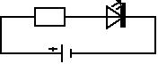
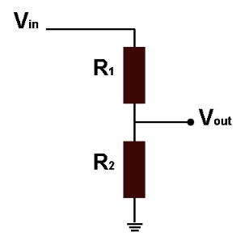
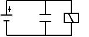
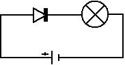
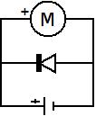
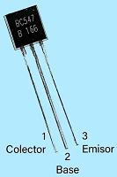
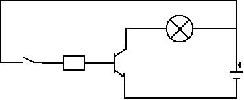
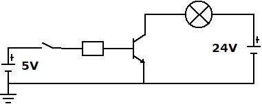
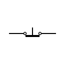

# UT4 Diseño, montaje y medida de circuitos electrónicos en un proyecto tecnológico

En esta unidad aprenderemos a **diseñar, montar y comprobar circuitos electrónicos** utilizando los componentes estudiados en la UT3. Si antes vimos qué es cada componente y cómo funciona, ahora nos centraremos en **cómo se conectan entre sí** para formar circuitos reales dentro de un proyecto tecnológico.

Diseñar un circuito significa elegir los componentes adecuados, interpretar su simbología y decidir cómo deben unirse para que todo funcione correctamente. Antes de montar nada, utilizaremos herramientas de simulación como **Tinkercad**, que permiten comprobar el comportamiento del circuito y detectar errores sin riesgo para los componentes.

El montaje real se realizará en una **protoboard**, donde aprenderemos a colocar cada componente, organizar el cableado y evitar errores típicos como cortocircuitos, conexiones sueltas o inversión de polaridad. Una vez montado, verificaremos su funcionamiento utilizando un **multímetro**, midiendo tensiones, resistencias y continuidad.

El objetivo principal de esta unidad es que el alumno sea capaz de **convertir un esquema o una idea en un circuito funcional**, aplicando correctamente los pasos de diseño, simulación, montaje y medida.

## 1 Introducción al diseño de circuitos electrónicos

Diseñar un circuito electrónico significa elegir los componentes necesarios y decidir cómo deben conectarse para que realicen una función concreta. El proceso comienza interpretando un **esquema eléctrico**, donde cada símbolo representa un componente y cada línea indica una conexión. A través del esquema podemos prever por dónde circulará la corriente, qué tensiones habrá en cada zona del circuito y qué papel cumple cada elemento.

En cualquier diseño intervienen varios aspectos básicos: qué componentes se van a utilizar, qué valores deben tener, cómo se unirán entre sí y cómo se distribuirá la alimentación. Es importante comprobar que las conexiones son coherentes, que las tensiones son seguras para cada dispositivo y que no se sobrepasan las corrientes máximas permitidas. Un buen diseño reduce la aparición de errores comunes como polaridades invertidas, caídas de tensión inesperadas o configuraciones que podrían dañar un componente.

Es fundamental distinguir entre un **esquema eléctrico** y un **diagrama de conexión**. El esquema eléctrico muestra el circuito de forma lógica, usando símbolos normalizados y sin tener en cuenta la posición física de los componentes. Por el contrario, el diagrama de conexión representa cómo se montará realmente el circuito en una protoboard o placa, indicando la ubicación física de cada elemento y la ruta exacta de los cables. Ambos son complementarios: el esquema explica cómo funciona el circuito y el diagrama indica cómo montarlo.

Otro elemento esencial en el diseño es comprender los **sistemas de referencia**. En la mayoría de circuitos se emplean puntos comunes de tensión como **GND** y **VCC**, que sirven de referencia para todas las mediciones y conexiones. Asegurar que todos los componentes comparten la misma referencia, que no existen masas flotantes y que la distribución de alimentación es correcta es clave para evitar fallos y garantizar que el circuito funcione de forma estable y dentro de los límites de seguridad.

## 2 Conexión de los componentes discretos

En este apartado aprenderemos a conectar correctamente los componentes electrónicos que se estudiaron en la UT3. Conocer sus características es el primer paso, pero para construir un circuito funcional necesitamos comprender cómo se integran dentro de un esquema y cómo deben colocarse físicamente en una protoboard o en una placa. Cada componente tiene requisitos específicos: algunos necesitan respetar la polaridad, otros requieren una resistencia adicional para funcionar con seguridad y otros deben conectarse siguiendo una orientación concreta. Este capítulo explica la forma correcta de realizar estas conexiones, los errores más comunes y las precauciones básicas para evitar fallos o daños en el circuito.

> 🔎 **Importante:**  
> En la UT3 se explicó el funcionamiento básico de varios componentes y, en algunos casos, una primera forma de conectarlos.  
> En esta UT4 se presentan **las conexiones completas y ordenadas** tal como deben realizarse en circuitos reales.  
> Por eso, algunos elementos volverán a aparecer aquí, pero con un enfoque más práctico y aplicado.

Los elementos que vamos a explicar son los siguientes:

1. [Conexión de resistencias](#21-conexión-de-resistencias)
2. [Conexión de condensadores](#22-conexión-de-condensadores)
3. [Conexión de diodos](#23-conexión-de-diodos)
4. [Conexión de transistores](#24-conexión-de-transistores)
5. [Conexión de LEDs](#25-conexión-de-leds)
6. [Conexión de bobinas e inductores](#26-conexión-de-bobinas-e-inductores)
7. [Conexión de interruptores y pulsadores](#27-conexión-de-interruptores-y-pulsadores)
8. [Conexión de fuentes de alimentación y fusibles de protección](#28-conexión-de-fuentes-de-alimentación-y-fusibles-de-protección)
9. [Conexión de divisores de tensión (uso práctico con resistencias)](#29-conexión-de-divisores-de-tensión-uso-práctico-con-resistencias)
10. [Conexión de sensores (LDR, NTC, PIR, ultrasonido)](#210-conexión-de-sensores-ldr-ntc-pir-ultrasonido)
11. [Conexión de actuadores (motor DC, servo, relé, zumbador)](#211-conexión-de-actuadores-motor-dc-servo-relé-zumbador)

### 2.1 Conexión de resistencias

Las resistencias no tienen polaridad, por lo que pueden colocarse en cualquier orientación. Su función principal es **limitar la corriente** o **reducir la tensión** en un circuito. Son uno de los componentes más sencillos de conectar, pero también uno de los más importantes.

A la hroa de conectarlas debemos distinguir entre resistencias fjas y resistencias variables.

#### Resistencias fijas

Las resistencias fijas tienen un valor constante.  
Se conectan normalmente en **serie** con otros componentes cuando se necesita:

- Limitar la corriente que pasa por un LED

- Reducir la tensión en un punto del circuito

- Ajustar la corriente en un transistor

- Crear divisores resistivos simples junto a sensores como LDR o NTC

**Ejemplo típico:**  
LED + resistencia en serie para evitar que el LED se queme.

```text
+5V → [Resistencia] → [LED] → GND
```



Puntos clave:

- No tienen polaridad.

- Su valor debe elegirse según la función que van a cumplir.

- En serie disminuyen la corriente; en paralelo disminuye la resistencia total.

#### Resistencias variables (potenciómetros)

Los potenciómetros tienen **tres terminales** y pueden usarse de forma diferente según se necesite.


##### 1. Como resistencia fija

Se utilizan solo **dos terminales**.  
El potenciómetro actúa como una resistencia cuyo valor se ajusta manualmente.

```text
VCC → (terminal A)
GND → (terminal B)
```

##### 2. Como resistencia variable

Se usan el terminal central (cursor o “wiper”) y uno de los laterales.  
Al girar el mando, varía la resistencia entre estos dos puntos.

```text
VCC → (terminal A)
GND → (terminal central o W)
```

##### 3. Como divisor de tensión (uso más común)

Se utilizan **los tres terminales**.  
El potenciómetro entrega una **tensión de salida variable**, comprendida entre el valor máximo y el mínimo.

```text
VCC → (terminal A)
Salida → (terminal central o W)
GND → (terminal B)
```

###### ¿Qué es un divisor de tensión?

Un **divisor de tensión** es un circuito con **dos resistencias en serie** entre \($V_{\text{in}}$) y masa (GND).  
La **salida** \($V_{\text{out}}$) en el **punto intermedio** es una **fracción** de \($V_{\text{in}}$):

$V_{\text{out}} = V_{\text{in}} \cdot \frac{R_2}{R_1 + R_2}$

*(válido si la carga consume muy poca corriente)*



Un **potenciómetro** hace lo mismo pero **ajustable**. Conecta:

- **A = \(+\) (\($V_{\text{in}}$))**
- **B = GND**
- **\($V_{\text{out}}$) en W (cursor)**

Al girar, la salida cambia **suavemente** entre **0 V** y **\($V_{\text{in}}$)**.  
Ejemplo con potenciómetro lineal de 10 kΩ y \($V_{\text{in}}=5\ \text{V}$): 

inicio ≈ 0 V, mitad ≈ 2,5 V, final ≈ 5 V.

**Detalles importantes:**

1. **Sentido de giro:** si va “al revés” de lo esperado, **intercambia A y B**.  
2. **Efecto de la carga:** funciona bien si lo que conectas a la salida **consume muy poca corriente** (alta impedancia).  
   Si necesitas entregar corriente, usa un **amplificador/buffer**.

<u>Diferencia entre **resistencia variable** y **divisor de tensión**</u>

La resistencia variable se emplea para **regular corriente** (ejemplo: limitar la intensidad que pasa por un LED), sin embargo, en el divisor de tensión, no solo se varía resistencia, sino que **obtiene una salida de tensión ajustable** y se usa para **generar una señal de control** (por ejemplo, ajustar el volumen de un amplificador o dar una referencia analógica a un microcontrolador).

**La diferencia clave**:

- Conectar como **resistencia variable** = solo cambias el valor de resistencia en un circuito.

- Conectar como **divisor de tensión** = generas una **tensión de salida proporcional** a la entrada y a la posición del cursor.

Puntos clave:

- El terminal central siempre proporciona la señal variable.

- Es muy útil para controlar brillo, volumen, nivel de señal, etc.

- En Arduino se usa para generar una lectura analógica.

#### Errores comunes en el uso de resistencias

- Usar un valor incorrecto y provocar que el componente (por ejemplo el LED) se queme.

- Conectar un sensor directamente sin resistencia y obtener lecturas incorrectas.

- No utilizar divisor resistivo con sensores analógicos que lo requieren (LDR, NTC).

### 2.2 Conexión de condensadores

Los condensadores son componentes que **almacenan energía eléctrica** durante un breve intervalo de tiempo. En corriente continua (DC), su comportamiento depende mucho de cómo se conectan y del tipo de señal que reciben. Al igual que las resistencias, los condensadores se utilizan en multitud de circuitos por su capacidad para estabilizar, filtrar o retrasar señales.

En la mayoría de montajes básicos, los condensadores se conectan **en paralelo** con la carga o con la línea de alimentación. Esta configuración permite que actúen como un pequeño “depósito” de energía que se carga y descarga rápidamente, ayudando a suavizar caídas de tensión y a eliminar ruidos eléctricos.

#### Tipos de condensadores y polaridad

##### Condensadores cerámicos

- No tienen polaridad.

- Se pueden colocar en cualquier orientación.

- Se usan para filtrado de alta frecuencia y desacoplo.

##### Condensadores electrolíticos

- **Sí tienen polaridad**.

- Tienen un terminal **positivo (+)** y un **negativo (–)**.

- El negativo suele estar marcado con una banda.

- Se utilizan cuando se necesitan valores altos de capacidad.

Nunca deben conectarse al revés, ya que pueden dañarse o, en el peor caso, estallar.

#### Conexión típica: condensador en paralelo

Esta es la forma más frecuente de conexión en circuitos educativos y con Arduino.

```text
VCC ───────┐───────────┐
           │           │
     [Condensador]   [relé]
           │           │
GND ───────┘───────────┘
```



Funciones principales:

- **Filtrar ruido eléctrico** de motores, relés o fuentes.

- **Estabilizar la tensión** delante de sensores sensibles.

- **Suavizar pulsaciones** en fuentes de alimentación.

#### Conexión en serie (no habitual en DC)

Cuando un condensador se conecta en serie, al llegar la corriente continua:

- El condensador se **carga completamente**.

- A partir de ese momento, **no deja pasar más corriente**.

Por eso, esta conexión **no se usa en DC** en montajes básicos.  
Sí puede utilizarse en circuitos **AC** (señales alternas) o como parte de un **filtro**, pero no en los proyectos de esta unidad.

#### Aplicaciones habituales

- Condensador de desacoplo cerca de un sensor para evitar interferencias.

- Condensador en una fuente de alimentación para suavizar la tensión de salida.

- Condensador y resistencia para crear un pequeño **retardo** (filtro RC).

#### Errores comunes

- Conectar un condensador electrolítico con la polaridad invertida.

- Usar un valor demasiado bajo y que el filtrado sea ineficaz.

- Colocarlo lejos de la carga (en filtrado es ideal ponerlo cerca).

- Intentar usar condensadores en serie en circuitos de DC pensando que “pasan señal”.

### 2.3 Conexión de diodos

Los diodos son componentes que **permiten el paso de la corriente en un solo sentido**. Su conexión depende totalmente de su **polaridad**, por lo que es fundamental identificar el ánodo y el cátodo antes de colocarlos en un circuito. Este componente se utiliza principalmente para proteger montajes, evitar inversiones de polaridad y eliminar picos de tensión generados por cargas inductivas como motores o relés.


#### Polaridad del diodo

- **Ánodo (A):** entrada de corriente

- **Cátodo (K):** salida de corriente

El cátodo suele estar marcado con **una banda** en el cuerpo del diodo.  
La corriente circula **del ánodo al cátodo**, pero nunca al revés.

**Regla básica:**

> Si el diodo está en **polarización directa**, conduce.  
> Si está en **polarización inversa**, bloquea la corriente.

#### Conexión en polaridad directa

Se usa cuando queremos **permitir el paso de corriente** en un sentido concreto.

```text
⇒ [Ánodo → Diodo → Cátodo] ⇒ -
```



Ejemplo típico:

- Permitir la alimentación correcta, bloqueando una polaridad inversa accidental.

#### Conexión en polaridad inversa (flyback)

Esta es la conexión más importante en la UT4 y en proyectos de Arduino.

Cuando una bobina (motor, relé, solenoide) se desconecta, genera un **pico de tensión inverso** que puede dañar el transistor, el microcontrolador o incluso la fuente.  
Para evitarlo, se coloca un diodo **en paralelo y en sentido inverso**.

```text
     Motor o relé
      ┌───────┐
      │       │
     (+)     (-)
      │       │
      └──|< ──┘  ← Diodo en inversa (flyback)
```



El diodo:

- Normalmente no conduce.

- Solo actúa cuando aparece el pico de tensión inverso.

- Protege el circuito desviando esa corriente de vuelta a la bobina.

Diodos más usados:

- **1N4007**

- **1N4148**

#### Usos típicos

- Protección de transistores al controlar motores o relés

- Protección de circuitos ante inversión de polaridad

- Rectificación básica (no muy habitual en SMR, pero posible)

#### Errores comunes

- Conectar el diodo al revés en el flyback (no protegerá nada).

- Confundir polaridad al no identificar la banda del cátodo.

- Usarlo como sustituto de la resistencia de un LED (no son equivalentes).

- Intentar hacer “pasar corriente” en un sentido donde el diodo está en inversa.

### 2.4 Conexión de transistores

Los transistores permiten **controlar corrientes más altas** usando una señal de baja potencia, como la de un microcontrolador o un sensor. En montaje básico, el transistor se utiliza como un **interruptor electrónico** que se activa al aplicar corriente en su terminal de control. Esto permite encender motores, relés o luces que Arduino no podría manejar directamente.

El transistor más usado en proyectos educativos es el **NPN** (por ejemplo, 2N2222, S8050 o BC547), aunque también existen transistores PNP y MOSFET. En esta unidad nos centraremos en el transistor **NPN como interruptor**, que es la conexión fundamental para controlar actuadores sencillos.

#### Patillaje y función de cada terminal

Un transistor NPN tiene tres terminales:

- **Base (B):** entrada de control.

- **Colector (C):** entrada de corriente desde la carga.

- **Emisor (E):** salida hacia GND.

La corriente fluye desde el **colector hacia el emisor** cuando la base recibe una pequeña corriente de control.



#### Conexión típica: transistor como interruptor

Esta es la conexión más importante en la UT4, ya que permite que Arduino controle cargas externas.

```text
+V de la carga → [Carga] → Colector (C)
Emisor (E) → GND
Base (B) → [Resistencia] → Pin de control
```

Circuito 1. Una sola fuente de energía.



Circuito 2. Dos fuentes de energía



Explicación:

- La **carga** (motor, relé, zumbador, LED potente…) va siempre entre el positivo y el colector.

- El **emisor** va a **GND**.

- La **base** recibe la señal desde Arduino, pero **siempre** a través de una **resistencia de base** (entre 1 kΩ y 10 kΩ) para limitar la corriente.

Cuando el pin de Arduino se pone en HIGH, entra corriente en la base y el transistor permite que la corriente fluya por la carga y se active.

##### Resistencia de base

La resistencia de base es obligatoria.  
Si se conecta Arduino directamente a la base:

- Se podría quemar el transistor

- O dañar el pin del Arduino

Valores típicos: **1 kΩ – 4.7 kΩ**

#### Cálculo teórico de la resistencia de base

Para que un transistor NPN funcione correctamente como **interruptor**, necesitamos limitar la corriente que llega a la **base**. Esta corriente debe ser suficiente para activar el transistor, pero no tan alta como para dañar el transistor o el pin de Arduino. La resistencia de base se calcula en tres pasos.

###### Paso 1. Determinar la corriente de la carga ($I_C$)

Es la corriente que necesita el dispositivo conectado al **colector** del transistor: motor, relé, zumbador, LED potente, etc. Se debe consultar este parámetro en la instrucciones del dispositivo. 

Ejemplos:

- Motor TT: 100–200 mA

- Relé 5V: 70–90 mA

- Zumbador: 20–60 mA

- LED normal: 10–20 mA (aunque normalmente no necesita transistor)

Esta corriente determina la corriente que deberá manejar el transistor.

###### Paso 2. Calcular la corriente de base necesaria ($I_B$)

Para que el transistor entre en **saturación** y funcione como interruptor, se toma como regla práctica:

### $I_B≈ \frac{I_C}{10}$

Es decir, la corriente de base debe ser aproximadamente **una décima parte** de la corriente que consumirá la carga.

Ejemplo:  
Si la carga necesita 100 mA:

### $I_B​=\frac{100}{10}=10 mA$

###### Paso 3. Calcular la resistencia de base

El pin de Arduino proporciona **5V**, pero la unión base–emisor del transistor tiene una **caída interna de 0,7V**, llamada **$V_{BE}$**, porque funciona como un pequeño diodo interno.

Por eso, la resistencia debe absorber:

### $5V−0,7V=4,3V$

La resistencia se obtiene con:

### $R_B = \frac {(V_{PIN} - V_{BE})}{I_B}$

Ejemplo con I_B = 10 mA:

### $R_B = \frac {4,3V}{0,01A} = 430Ω$

Valor comercial más cercano: **470 Ω**.

#### Cálculo práctico usando la ganancia del transistor (hFE)

Antes de nada, hay que recordar cómo funciona el transistor cuando lo usamos como **interruptor electrónico**.

A la **base** le llega una **pequeña corriente**.  
Si esta corriente es suficiente, el transistor se **satura** y permite que circule una corriente mucho mayor entre **colector** y **emisor**.

Lo importante es que existe una **relación** entre la corriente que llega a la base (**IB**) y la corriente que el transistor permite en el colector (**IC**)

De forma que:

> **Cuanta más corriente llegue a la base, mayor corriente podrá circular por el colector (hasta el límite del transistor y de la carga).**

A esta relación se le llama **ganancia**, **β** o **hFE** del transistor.

> La ganancia (hFE o β) de un transistor indica **la relación entre la corriente que llega a la base y la corriente que el transistor permite circular por el colector**.

Matemáticamente:

$I_C​=hFE⋅I_B​$

##### Ejemplo de cálculo usando la ganancia del transistor (hFE)

Supongamos que tenemos un transistor NPN que debe controlar una carga que consume:

$I_C​=100mA$

El transistor que utilizamos (por ejemplo, un **2N2222** o un **BC337**) tiene una **ganancia típica** de:

$hFE≈150$

La caída entre base y emisor es aproximadamente:

$V_{BE}​≈0,7V$

Y la tensión que aplicamos a la base proviene de una fuente de:

$V_{IN}​=5V$

##### **1. Calcular la corriente necesaria en la base**

Usamos la relación:

#### $I_B​=\frac{I_C}{hFE}​​$

Sustituimos:

#### $I_B​=\frac{100mA}{150}​≈0,66mA$

##### **2. Calcular la resistencia de base**

La resistencia debe absorber la diferencia entre VIN​ y VBE​:

#### $V_R​=5V−0,7V=4,3V$

Aplicamos la ley de Ohm:

#### $R_B​=\frac{​V_R}{I_B}​​$

#### $R_B=\frac{4,3V}{0,00066A}​≈6515Ω$

Valor comercial más cercano:

### 👉 **6,8 kΩ**

##### ✔ **Conclusión del ejemplo**

- El cálculo teórico daba ≈ **430 Ω** (muy conservador).

- El cálculo con ganancia real da valores mucho mayores (≈ **6,8 kΩ**).

- Por eso, en la práctica se usan valores estándar entre **1 kΩ y 4,7 kΩ**, que funcionan bien y no necesitan cálculos precisos.

###### Valores prácticos recomendados

En la mayoría de montajes de la UT4 con Arduino se utilizan valores estándar:

- **4,7 kΩ** → cargas pequeñas (zumbadores, LEDs, pequeños módulos)

- **2,2 kΩ** → cargas medias

- **1 kΩ** → motores pequeños, relés y cargas mayores

Estos valores funcionan bien sin necesidad de cálculos precisos.

###### Nota sobre $V_{BE}$ (caída interna)

La unión base–emisor del transistor tiene una caída de tensión interna de aproximadamente **0,7V**, igual que un diodo de silicio. Esta caída está dentro del transistor y debe restarse al calcular la resistencia.

#### Transistor como regulador (región activa)

Además de utilizarse como interruptor, un transistor NPN también puede funcionar como **regulador**, permitiendo que circule más o menos corriente según la señal que reciba en la base. En este modo, el transistor no está completamente en corte ni totalmente saturado, sino en un punto intermedio llamado **región activa**.

Cuando la corriente que entra en la base aumenta, el transistor permite una corriente mayor entre el colector y el emisor. Si la corriente de base disminuye, la corriente de salida también lo hace. Esto permite controlar de forma gradual la intensidad que recibe una carga, lo que puede producir una caída de tensión variable en el transistor y un comportamiento parecido al de un regulador analógico.

Aunque este modo no se utiliza habitualmente al trabajar con Arduino —porque normalmente lo controlamos en modo interruptor— es importante conocer que un transistor puede regular señales y controlar la intensidad de forma proporcional. Este principio es la base del funcionamiento de muchos amplificadores y circuitos analógicos.

#### Protección con diodo en cargas inductivas (ya explicado en diodos)

Si la carga es un motor o un relé, debe colocarse un **diodo en inversa** en paralelo con la carga para evitar los picos de tensión generados al desconectar la bobina.

```text
Ejemplo:

           +V
            │
          [Carga]
            │
Colector ───┘
Emisor ───── GND

Diodo: en inversa entre los dos extremos de la carga
```

Esto protege tanto al transistor como al microcontrolador.

#### Conexión práctica con Arduino

```text
Pin digital → Resistencia de base → Base
Colector → Carga → +V externo
Emisor → GND común con Arduino
```

Puntos clave:

- El GND del Arduino y el GND del circuito **deben estar unidos**.

- La carga usa **alimentación externa**, no el pin de Arduino.

- La señal de control solo maneja la base del transistor.

#### Usos típicos

- Encender un **relé**

- Controlar un **motor DC**

- Activar un **zumbador potente**

- Conectar cargas con más consumo que un pin digital puede suministrar

#### Errores comunes

- Conectar la base sin resistencia

- Conectar la carga entre el transistor y GND (posición incorrecta)

- Olvidar el diodo flyback con motores y relés

- No unir las masas (GND) entre Arduino y la alimentación externa

- Confundir el patillaje (varía según el modelo)

### 2.5 Conexión de LEDs

Los **LEDs** (diodos emisores de luz) son dispositivos que producen luz cuando circula corriente a través de ellos. Aunque son diodos, su conexión práctica es distinta a la de un diodo normal, porque **necesitan obligatoriamente una resistencia en serie** para limitar la corriente y evitar que se quemen. Por este motivo, los LEDs son uno de los primeros componentes que se montan en protoboard y uno de los más utilizados para comprobar rápidamente si un circuito funciona.

#### Polaridad del LED

El LED tiene **dos patillas**, y cada una cumple una función:

- **Ánodo (+):** patilla larga

- **Cátodo (–):** patilla corta o lado plano del encapsulado

El LED **solo enciende** cuando está en **polarización directa**:

```text
VCC →  Ánodo (patilla larga)
GND →  Cátodo (patilla corta)
```

Si se conecta al revés, no se ilumina (aunque no se rompe).

#### Resistencia limitadora (obligatoria)

Un LED típico necesita **entre 10 mA y 20 mA**, pero un pin de Arduino solo puede proporcionar unos 20–40 mA como máximo.  
Sin una resistencia, el LED podría quemarse o dañar el microcontrolador.

Por eso siempre se coloca **una resistencia en serie**, cuyo valor común suele estar entre 220 Ω y 330 Ω.

Ejemplo:

```text
+5V → [Resistencia] → [LED] → GND
```


La resistencia puede estar **antes o después** del LED; el orden no importa mientras esté en serie.

El valor de la resistencia se calcula con la **Ley de Ohm**:

#### $R = \frac{V_{fuente} - V_f}{I}$

Donde:

- ($V_{fuente}$): tensión de la fuente de alimentación.
- ($V_f$): caída de tensión del LED.
- ($I$): corriente deseada (normalmente entre 10 mA y 20 mA).

**Ejemplo:** Si alimentamos un LED rojo $(V_f = 2 V)$ con una fuente de 5 V y queremos una corriente de 15 mA:

#### $R = \frac{5 V - 2 V}{0.015 A} = 200 Ω$

El valor estándar más próximo sería **220 Ω**.

Emiten luz al ser polarizados directamente.

- Colores: rojo, verde, azul, blanco, RGB.
- Aplicaciones: indicadores luminosos, pantallas.

#### Conexión en protoboard

Ejemplo de conexión típica:

```text
Fila de +5V  → resistencia → patilla larga del LED
Patilla corta del LED → fila de GND
```

Puntos clave:

- Comprobar que la resistencia está realmente **en serie** y no en paralelo.

- Asegurarse de que el LED no forma un **corto** entre dos líneas de alimentación.

- El LED debe quedar conectado entre **dos líneas diferentes**, no en la misma línea interna de la protoboard.

#### LEDs con Arduino

El LED se conecta igual, pero la alimentación suele venir de un **pin digital**.

Ejemplo:

```text
Pin digital → resistencia → LED → GND
```

Permite:

- Encender y apagar el LED

- Controlar el brillo mediante **PWM**

#### Errores comunes

- Conectar el LED sin resistencia (se quema).

- Invertir polaridad (no enciende).

- Usar valores de resistencia demasiado altos (brillo muy bajo).

- Colocar el LED en la misma línea interna de la protoboard sin completar el circuito.

### 2.6 Conexión de bobinas e inductores

Las **bobinas** o **inductores** son componentes pasivos formados por un hilo conductor enrollado. Aunque **no los utilizaremos en los montajes prácticos**, aparecen en muchos dispositivos que sí usamos, como **relés, zumbadores electromagnéticos y motores**.

#### **Polaridad**

- Las bobinas **no tienen polaridad**, por lo que pueden conectarse en cualquier orientación.

#### **Comportamiento en corriente continua**

En corriente continua (DC):

- Al **conectarlas**, se oponen a los cambios bruscos de corriente.

- Una vez estabilizada la corriente, actúan como un conductor con **muy baja resistencia**.

- Al **desconectarlas**, generan un **pico de tensión inverso** debido a la energía almacenada en su campo magnético.

Este pico puede dañar transistores o microcontroladores.

#### **Conexión básica**

La bobina suele formar parte de una **carga inductiva**, como un relé o un motor. Su conexión típica es simplemente en serie dentro del propio dispositivo:

`+V → [Bobina] → GND`

#### **Protección con diodo (muy importante)**

Cuando una bobina forma parte de la carga (como en relés o motores) y se controla mediante un transistor, debe añadirse un **diodo en paralelo y en sentido inverso** para evitar daños:

```text
        +V
         │
      [Bobina]
         │
Colector ┘
Emisor ── GND

Diodo: en inversa entre los dos extremos de la bobina
```

#### **Resumen**

- No tienen polaridad.

- Se oponen a cambios bruscos de corriente.

- Producen picos de tensión al desconectarse.

- Requieren **diodo de protección** si se controlan con un transistor.

#### Errores comunes

- No usar un diodo de protección al controlar relés o motores.

- Confundir la resistencia de la bobina con su función real (el efecto inductivo es lo importante).

- Suponer que tienen polaridad (solo ocurre en inductores especiales).

- Colocar bobinas en serie en circuitos de DC sin conocer su comportamiento.

### 2.7 Conexión de interruptores y pulsadores

Los **interruptores** y **pulsadores** son componentes muy utilizados en circuitos electrónicos porque permiten **abrir o cerrar un circuito manualmente**. Se encuentran en multitud de dispositivos: paneles de control, robots, paneles de pruebas, juguetes electrónicos y cualquier sistema que requiera interacción del usuario.

Además, muchos pulsadores producen pequeñas oscilaciones eléctricas llamadas **rebotes**, que pueden generar señales erróneas. En esta sección veremos cómo conectarlos correctamente y cómo evitar esos problemas.

#### **2.7.1 Tipos básicos**

##### **Interruptor SPST (simple apertura/cierre)**

- Tiene dos terminales.

- Cuando se acciona, establece o interrumpe el paso de la corriente.

- Es equivalente a un **interruptor de la luz** pero en pequeño.

Símbolo típico:


##### **Pulsador NA (normalmente abierto)**


- Está **abierto** (no conduce) mientras no se pulsa.

- Al pulsarlo, **cierra** el circuito.

- Es el más habitual para protoboard.

##### **Pulsador NC (normalmente cerrado)**

 

- Conduce siempre hasta que se pulsa.

- Mucho menos común en SMR, pero existe.

#### **2.7.2 Conexión básica en un circuito**

La manera más simple de conectar un pulsador o interruptor es **en serie con la alimentación o con la carga**:

`+V → [Interruptor] → [Carga] → GND`

Esto permite encender o apagar un componente (por ejemplo, un LED).

Ejemplo:

`+5V → [Interruptor] → [LED + resistencia] → GND`

#### **2.7.3 Conexión del pulsador en protoboard**

Los pulsadores que se usan en protoboard suelen tener **4 patillas**, pero realmente solo usan **2 internas** (van conectadas en parejas).

Esquema típico:

 `[ 1 ]── conectado internamente ──[ 2 ]` 
 `[ 3 ]── conectado internamente ──[ 4 ]`

💡 **Importante:**  
Las patillas 1–2 están unidas entre sí, y las 3–4 también.  
El pulsador **solo une los dos grupos** cuando se pulsa.

Conexión típica:

```text
+5V ────┐
        │
   [ Pulsador ]
        │
   Entrada o carga
        │
       GND
```

---

#### **2.7.4 Rebotes en pulsadores (bouncing)**

Cuando se pulsa un botón, **no se cierra limpiamente**; el contacto físico vibra durante unos milisegundos, generando una señal así:

```
  __
_|  |____
```

En electrónica analógica puede provocar:

- Encendidos intermitentes

- Activación doble

- Señales indeseadas

En microcontroladores esto genera lecturas erróneas si no se corrige.

#### **2.7.5 Eliminación de rebotes con un condensador (antirrebotes pasivo)**

El método más sencillo para reducir los rebotes es colocar un pequeño **condensador** junto al pulsador.

##### **Caso típico: pulsador con resistencia a GND (pull-down)**

```text
          +5V
           │
        [Pulsador]
           │───────→ Señal
           │
          [R]  10 kΩ
           │
          GND
```

Para eliminar rebotes, añadimos un **condensador de 100 nF** (0,1 µF):

```text
          +5V
           │
        [Pulsador]
           │───────→ Señal
           │
          [R]  10 kΩ
           │
          GND
           │
       [C = 100 nF]
           │
          GND
```

El condensador **suaviza los cambios rápidos**, absorbe las pequeñas oscilaciones y deja pasar solo la transición principal.

##### Valores típicos:

- **Condensador:** 100 nF (cerámico)

- **Resistencia pull-down o pull-up:** 10 kΩ

#### **2.7.6 Interruptor ON/OFF (uso básico)**

En proyectos sencillos, un interruptor se usa:

- Para **encender/apagar** una determinada parte del circuito

- Para activar/desactivar una carga

- Para seleccionar entre dos estados

Conexión típica para encender una carga:

`+V → [Interruptor] → [Carga] → GND`

Conexión típica como selector:

```text
      +V
       │
     [INT]
       │
 Señal ON/OFF
       │
      GND
```

#### **2.7.7 Errores comunes**

- Colocar el pulsador cruzando líneas internas de protoboard incorrectamente.

- No usar resistencia pull-up o pull-down (la señal queda “flotante”).

- No añadir condensador de antirrebote cuando es necesario.

- Conectar las parejas de patillas del pulsador como si fueran independientes.

- Confundir interruptores conmutadores con interruptores simples (SPST).

### **2.8 Conexión de fuentes de alimentación y fusibles de protección**

En cualquier circuito electrónico es fundamental conectar correctamente la fuente de alimentación y proteger el sistema ante cortocircuitos o errores de montaje. En esta sección aprenderemos cómo alimentar un circuito en protoboard de forma segura y cómo utilizar fusibles o protectores PTC para evitar daños en los componentes.

#### **2.8.1 Conexión de la alimentación en protoboard**

La protoboard dispone de dos buses laterales (marcados como + y −) que sirven para distribuir la alimentación:

• +V → alimentación positiva  
• GND → masa común

Conexión típica:

+V → Bus positivo de la protoboard  
GND → Bus negativo de la protoboard

Recomendaciones:

- Mantener siempre una línea clara para +V y otra para GND.

- No mezclar tensiones distintas en el mismo bus.

- Comprobar si los buses están partidos (muchas protoboards no conectan los buses en toda su longitud).

#### **2.8.2 GND común: imprescindible**

Cuando intervienen varias fuentes de alimentación (por ejemplo, Arduino + batería externa), es obligatorio unir todas las masas:

GND Arduino – GND fuente externa – GND del circuito

Si no hay GND común:

- El transistor no conmutará correctamente.

- Arduino no podrá leer sensores.

- El circuito será inestable o no funcionará.

#### **2.8.3 Alimentación externa en proyectos con Arduino**

En los proyectos de esta unidad se puede alimentar Arduino de tres formas:

**1. USB (5V)**  
Adecuado para pruebas y pequeños montajes.

**2. Entrada VIN o Jack DC (7–12V)**  
Arduino regula la tensión internamente.

**3. Pin 5V desde una fuente externa**  
Solo recomendable si se controla la tensión y se garantiza GND común.

#### **2.8.4 Módulos de alimentación para protoboard**

Se utilizan módulos que permiten seleccionar 3,3V o 5V y alimentar directamente los buses de la protoboard.  
Estos módulos se alimentan por:

- USB

- Jack DC

- Entrada tipo pin header

Distribuyen tensión a los laterales de la placa sin necesidad de cablear manualmente.

#### **2.8.5 Fusibles y protectores PTC**

Para evitar daños al producirse cortocircuitos, conexiones erróneas o cables cruzados, se utilizan fusibles.

##### **Fusible rápido**

Se coloca **en serie con la alimentación**:

`+V → Fusible → Circuito → GND`

Si hay un cortocircuito, el fusible se funde y protege todos los componentes.

Valores típicos:

- 250 mA

- 500 mA

- 1 A

(según el tipo de alimentación usada)

##### **Fusibles rearmables (PTC)**

Se comportan como un fusible automático:

- En condiciones normales → conducen

- En cortocircuito → aumentan su resistencia y cortan la corriente

- Cuando se enfrían → vuelven a su estado normal

Conexión:

`+V → PTC → Circuito`

Son ideales en protoboard porque permiten muchos errores sin dañar componentes.

#### **2.8.6 Protección adicional: diodos y polaridad**

Para evitar daños por invertir la polaridad accidentalmente, se puede usar:

##### **Diodo en serie**

`+V → Diodo → Circuito`

Si se invierte la polaridad, el diodo bloquea la corriente y el circuito no recibe tensión (pero no se daña).

##### **Diodo en paralelo + fusible**

```text
+V → Fusible → Circuito → GND  
│  
Diodo en inversa  
│  
GND
```

Si se invierte la polaridad, el diodo fuerza un cortocircuito controlado → el fusible se funde → el circuito queda protegido.

#### **2.8.7 Errores comunes al conectar la alimentación**

- No unir las masas de varias fuentes.

- Conectar directamente 9V a un bus que debe ir a 5V.

- No usar fusible ni protección básica.

- Confundir los buses positivos y negativos de la protoboard.

- Colocar mal el módulo de alimentación (invertido).

### **2.9 Conexión de divisores de tensión (uso práctico con resistencias)**

Un divisor de tensión es un circuito muy utilizado en electrónica básica para obtener una tensión menor a partir de una tensión de entrada. Está formado únicamente por dos resistencias y permite generar un nivel de tensión intermedio adecuado para señales de control, entradas analógicas o ajustes de nivel.

En este apartado se explica cómo funciona y cómo se conecta, sin entrar todavía en el uso con sensores.

#### **2.9.1 Esquema básico**

El divisor se forma colocando dos resistencias en serie entre +V y GND.  
La tensión de salida se obtiene en el punto intermedio entre ambas.

Conexión:

`+V → R1 → (Nodo de salida) → R2 → GND`

La tensión de salida cumple la ecuación:

### $V_{out}= V_{in} \times \frac{R_2}{R_1 + R_2}$

R1 es la resistencia superior (entre +V y el nodo)  
R2 es la resistencia inferior (entre el nodo y GND)

#### **2.9.2 Conexión del divisor en una protoboard**

Para montarlo en una protoboard:

1. Coloca R1 entre +V y una fila libre.

2. Coloca R2 entre esa misma fila y GND.

3. Usa esa fila como salida del divisor.

Representación simplificada:

```textile
+5V  
│  
R1  
│ ← Salida  
R2  
│  
GND
```

#### **2.9.3 Selección de valores de R1 y R2**

Para los montajes de esta unidad, se recomiendan valores entre:

1 kΩ y 100 kΩ

Valores muy bajos consumen demasiada corriente y valores muy altos pueden producir señales ruidosas.

Ejemplos útiles:

Obtener 2,5 V desde 5 V:  
R1 = 10 kΩ  
R2 = 10 kΩ

Obtener 3,3 V desde 5 V:  
R1 = 3,3 kΩ  
R2 = 6,8 kΩ

#### **2.9.4 Aplicaciones en circuitos (sin uso de sensores aún)**

El divisor se utiliza para:

• Reducir tensiones antes de llevar la señal a un microcontrolador  
• Ajustar niveles para un transistor  
• Obtener una referencia intermedia  
• Crear una señal analógica simple que varía con R1 o R2

Más adelante este mismo esquema se aplicará a sensores como LDR, NTC o fototransistores.

#### **2.9.5 Limitaciones del divisor de tensión**

Un divisor funciona bien cuando la carga conectada a la salida consume muy poca corriente. Si se conecta una carga que absorbe demasiada corriente:

• La tensión ya no será la esperada  
• El divisor dejará de funcionar correctamente

Por eso suele usarse para señales y mediciones, no para alimentar dispositivos.

#### **2.9.6 Errores comunes**

• Colocar R1 y R2 intercambiadas (la salida cambia completamente)  
• Usar valores muy bajos que descargan la fuente  
• Conectar un LED o motor directamente al divisor  
• Tomar la salida desde la resistencia equivocada  
• Colocar las resistencias en la misma línea interna de la protoboard sin dejar un nodo intermedio

### 2.10 Conexión de sensores (LDR, NTC, PIR, ultrasonido)

Los sensores permiten medir variables del entorno y convertirlas en señales eléctricas que pueden ser interpretadas por un circuito o un microcontrolador. Cada tipo de sensor tiene una forma concreta de conectarse, ya sea porque necesita un divisor de tensión, una alimentación específica o porque genera señales digitales o analógicas.

En este apartado se explica cómo conectar correctamente los sensores más habituales de la UT4: **LDR, NTC, PIR y módulo de ultrasonidos HC-SR04**.

#### 🟫 Sensores de tipo resistivo: LDR y NTC

Los sensores resistivos modifican su resistencia interna según la variable ambiental que miden:

- La **LDR** disminuye su resistencia cuando recibe luz.

- La **NTC** disminuye su resistencia cuando aumenta la temperatura.

Como ambos son resistencias variables, **no entregan una tensión directamente**.  
Necesitan un **divisor de tensión**, que permite obtener un valor analógico compatible con Arduino u otros sistemas.

##### Conexión típica de una LDR o una NTC con divisor de tensión

```text
+5V ──[Sensor]──┬── (Salida analógica)
                │
                └──[Resistencia fija]── GND
```

El punto central (nodo entre sensor y resistencia fija) proporciona una tensión proporcional al cambio de resistencia.

Valores recomendados:

- Resistencia fija: **10 kΩ**, adecuada para la mayoría de LDR y NTC.

- La salida se conecta a una **entrada analógica** del microcontrolador.

##### Funcionamiento

- Si la resistencia del sensor **baja**, la salida sube o baja en función de cómo esté colocado.

- Si la resistencia del sensor **sube**, ocurre lo contrario.

Si el comportamiento es inverso al deseado, basta con **intercambiar las posiciones** del sensor y la resistencia fija en el divisor.

##### Aplicaciones típicas

- LDR: medir luz ambiente para activar LEDs o controlar displays.

- NTC: medir temperatura para ventilación, alarmas o control de motores.

##### Errores comunes en sensores resistivos

- Conectar la LDR o la NTC **directamente a una entrada analógica** sin divisor (no funcionará).

- Usar valores de resistencia muy bajos o muy altos, provocando señales poco útiles.

- Alejar demasiado las pistas o cables, lo que introduce ruido en la señal.

- Conectar el divisor a **3.3V** cuando se está leyendo con una entrada **5V**, generando incompatibilidades.

#### 🟦 Sensor PIR (detección de movimiento)

El sensor PIR (Passive Infrared Sensor) detecta variaciones en la radiación infrarroja producidas por el movimiento de personas o animales.  
A diferencia de la LDR o NTC, el PIR **no produce una señal analógica**, sino un **pulso digital**.

##### Patillaje típico de un sensor PIR

- **VCC** → alimentación (5 V)

- **GND** → masa

- **OUT** → salida digital (HIGH cuando detecta movimiento)

##### Conexión típica del PIR

`+5V → VCC GND → GND Salida → Pin digital del microcontrolador`

La señal de salida suele ser:

- **HIGH (3.3V–5V)** cuando detecta movimiento

- **LOW (0V)** en reposo

Los PIR pueden incluir potenciómetros internos para:

- Ajustar la **sensibilidad**

- Ajustar el **tiempo de mantenimiento del estado HIGH**

##### Puntos importantes

- Requiere un tiempo de **calentamiento inicial** de 15–30 segundos.

- Muy sensible a cambios bruscos de temperatura ambiental.

- La salida suele incluir un pequeño retraso para evitar falsas detecciones.

##### Errores comunes en sensores PIR

- No respetar el tiempo de inicialización del sensor.

- Alimentarlo con menos tensión de la recomendada.

- No compartir **GND común** entre el PIR y el microcontrolador.

- Colocarlo mirando a ventanas o fuentes de calor, provocando falsas alarmas.

#### 🟪 Sensor de ultrasonidos HC-SR04

El HC-SR04 es un sensor muy utilizado para medir distancia mediante ondas ultrasónicas.  
A diferencia de los anteriores, este sensor **no es resistivo** y requiere un protocolo simple para funcionar.

##### Patillaje

- **VCC** → 5 V

- **GND** → masa

- **TRIG** → pin de salida del microcontrolador

- **ECHO** → pin de entrada del microcontrolador

##### Conexión típica

```text
+5V → VCC
GND → GND
Pin digital (salida) → TRIG
Pin digital (entrada) → ECHO
```

##### Funcionamiento resumido

1. El microcontrolador envía un pulso corto (10 µs) por **TRIG**.

2. El sensor emite un tren de ondas ultrasónicas.

3. Cuando las ondas rebotan y regresan, el sensor pone **ECHO** a HIGH durante un tiempo proporcional a la distancia.

Distancia aproximada:

```text
Distancia (cm) = Tiempo_echo (µs) / 58
```

##### Tensiones de señal

- TRIG acepta 5V sin problema.

- ECHO entrega también 5V, por lo que **debe usarse una entrada digital tolerant a 5V** (Arduino UNO, Mega…).  
  *En placas de 3.3V como ESP32 o Raspberry Pico es necesario un divisor o conversor de nivel.*

##### Errores comunes en sensores de ultrasonidos

- No unir GND del sensor con el GND del microcontrolador.

- Conectar ECHO a un pin que no acepte 5V (en placas de 3.3V).

- Medir a superficies blandas o inclinadas (el sonido no rebota bien).

- Usar cables muy largos sin blindaje, lo que introduce ruido.

- Olvidar que necesita un pequeño estabilizado entre mediciones para ser preciso.

### 2.11 Conexión de actuadores (motor DC, servo, relé, zumbador)

Los actuadores convierten una señal eléctrica en un movimiento físico, un sonido o un cambio mecánico. Son elementos fundamentales en cualquier sistema robótico y, en la mayoría de los casos, **requieren más corriente de la que puede entregar directamente un microcontrolador**, por lo que necesitan transistores, módulos de potencia o etapas de control.

En este apartado veremos la forma correcta de conectar los actuadores más comunes: **motores DC, servomotores, relés y zumbadores**.

#### 🟨Motor DC

Un motor DC es una carga inductiva que consume una corriente relativamente alta. **Nunca debe conectarse directamente a un pin de un microcontrolador**. Para controlarlo se utiliza un **transistor NPN** o un **módulo puente H** si se necesita invertir el giro.

##### Conexión típica de motor DC usando transistor NPN

```texto
+V (alimentación del motor) ── [Motor DC] ── Colector
Emisor ── GND
Base ── [Resistencia 1k–2.2k] ── Pin de control
Diodo flyback ── en paralelo con el motor (en inversa)
```

Explicación de elementos:

- **Transistor NPN**: actúa como interruptor electrónico.

- **Resistencia en la base**: limita la corriente que el pin entrega.

- **Diodo flyback**: obligatorio; protege de picos de tensión al desconectar la bobina.

- **GND común**: el motor y el microcontrolador deben compartir masa.

##### Elección de la alimentación

- Motores de **3–6 V**: pueden alimentarse desde una batería o fuente externa.

- Motores de **9–12 V**: siempre fuente externa.

Nunca alimentar un motor desde los 5V del Arduino.

##### Errores comunes en motores DC

- Conectar el motor directamente al microcontrolador.

- Olvidar el **diodo flyback**, dañando transistor o Arduino.

- No compartir masa entre fuentes externas y el microcontrolador.

- Usar cables muy finos o largos que limitan la corriente.

#### 🟩 Servomotor

Los servos estándar (microservo SG90, MG996R, etc.) integran un pequeño motor DC, un circuito de control y una caja de engranajes.  
A diferencia de los motores DC, **no necesitan transistor** para su control, pero sí requieren una **alimentación estable** porque consumen bastante corriente.

##### Patillaje típico del servo

- **Rojo** → +5V o +6V (según modelo)

- **Marrón/Negro** → GND

- **Naranja/Amarillo** → Señal PWM del microcontrolador

##### Conexión típica del servo

```textile
+5V (fuente externa recomendada) → Rojo
GND → Negro/Marrón
Pin PWM (Arduino, etc.) → Señal
```

##### Recomendaciones importantes

- La fuente de alimentación del servo debe ser **externa** si consume más de lo que puede dar el regulador de la placa.

- **GND debe ser común** entre servo y microcontrolador.

- Los servos producen **ruido eléctrico**, recomendable añadir un condensador electrolítico cerca de la alimentación del servo.

##### Errores comunes en servomotores

- Alimentar un servo de alto consumo desde el pin 5V del Arduino.

- No unir los GND de servo y Arduino.

- Usar una señal digital sin PWM (los servos requieren PWM real).

- Colocar varios servos en paralelo sin suficiente fuente de corriente.

#### Relé

El relé es un interruptor electromecánico que permite controlar cargas de mayor voltaje o corriente.  
Los relés **no deben conectarse directamente al microcontrolador**, porque su bobina consume mucha corriente y genera picos inductivos.

Por eso se usan:

- Módulos de relé (ya preparados)

- Relés sueltos + transistor NPN + diodo flyback

##### Conexión típica de un relé usando un módulo (lo más común)

```text
VCC → 5V del microcontrolador
GND → GND
IN → Pin digital
```

El módulo ya incluye:

- Aislamiento (opcional, según modelo)

- Transistor

- Diodo

- Resistencias

##### Conexión de un relé sin módulo

```textile
+5V → una patilla de la bobina
Otra patilla → Colector del transistor
Emisor → GND
Base → Resistencia → Pin digital
Diodo → en inversa sobre la bobina
```

Los contactos del relé permiten controlar la carga:

- **COM** → entrada común

- **NO** → circuito abierto por defecto

- **NC** → circuito cerrado por defecto

##### Errores comunes en relés

- Conectar la bobina directamente al microcontrolador.

- Olvidar el diodo flyback si no es un módulo.

- No separar la parte de potencia de la de control.

- Usar un relé para cargas superiores a su capacidad.

#### 🟪 Zumbador (Buzzer)

Existen dos tipos:

1. **Zumbador activo**: suena al recibir 5V (no necesita PWM).

2. **Zumbador pasivo**: necesita señal PWM para generar tonos.

##### Conexión típica del zumbador activo

```textile
+5V → +
GND → -
```

Se puede activar desde un pin digital a través de un transistor si el buzzer consume demasiado.

##### Conexión del zumbador pasivo

```textile
Pin PWM → +
GND → -
```

Permite generar tonos, alarmas y melodías.

#### Errores comunes en zumbadores

- Usar un pasivo como si fuera activo (no sonará).

- Conectar directamente un buzzer de alto consumo al microcontrolador.

- No identificar la polaridad cuando existe.

---

# CONTINUA EN LA PARTE 2

UT4 Diseño montaje y medida de circuitos electrónicos en un proyecto tecnológico - Parte 2.md

---

© Apuntes de **Informática aplicada a sistemas electrónicos (Robótica)** – UT4
