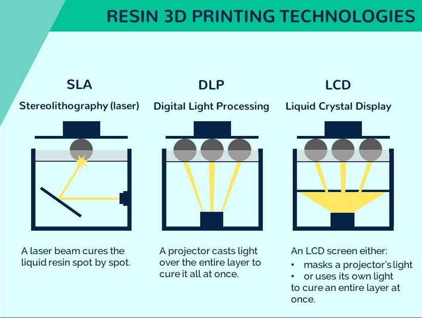

# UT6 Diseño y fabricación de elementos mecánicos mediante impresión 3D


## 1️⃣ Fabricación aditiva

#### 📌 Definición

La **impresión 3D** es un proceso de **fabricación aditiva**.

Se denomina aditiva porque el objeto se construye **añadiendo material capa a capa** hasta completar la pieza final.

A diferencia de otros procesos industriales tradicionales, no se parte de un bloque macizo para eliminar material, sino que el material se deposita únicamente donde es necesario.

---

#### 🔄 Diferencia con la fabricación sustractiva

En la fabricación tradicional se emplean procesos **sustractivos**, es decir:

- Se parte de un bloque sólido.
- Se elimina material mediante corte, fresado o taladrado.
- El objeto final se obtiene quitando lo que sobra.

Ejemplos:
- Fresadora
- Torno
- Taladro industrial

En cambio, en la fabricación aditiva:

- No se elimina material.
- El objeto se construye desde cero.
- Se deposita material únicamente en las zonas necesarias.

| Fabricación sustractiva         | Fabricación aditiva             |
| ------------------------------- | ------------------------------- |
| Se elimina material             | Se añade material               |
| Genera más residuos             | Menor desperdicio               |
| Mayor coste en piezas complejas | Ideal para geometrías complejas |

---

#### 🧱 Construcción capa a capa

En impresión 3D, el modelo digital se divide en **capas horizontales muy finas**.

Cada capa:

- Se deposita sobre la anterior.
- Tiene un grosor determinado (por ejemplo 0,2 mm).
- Se solidifica antes de colocar la siguiente.

El proceso consiste en repetir este ciclo cientos o miles de veces hasta completar la pieza.

Cuanto menor es la altura de capa:

- Mayor calidad superficial.
- Mayor tiempo de impresión.

---

#### ⚠️ Debilidad entre capas (Anisotropía)

Las piezas impresas en 3D presentan una característica importante:

👉 **No tienen la misma resistencia en todas las direcciones.**

Esto se denomina **anisotropía**.

- Son más resistentes dentro de una misma capa.
- Son más débiles en la unión entre capas.

La adhesión entre capas depende de:
- Temperatura de impresión
- Material utilizado
- Parámetros configurados en el slicer

Por este motivo, la orientación de la pieza en la impresora influye directamente en su resistencia mecánica.

---

#### 🎯 Idea clave

La impresión 3D es un proceso de fabricación aditiva que construye objetos capa a capa, lo que permite crear geometrías complejas con menos desperdicio de material, aunque introduce debilidad estructural entre capas debido a la anisotropía.


## 2️⃣ Funcionamiento de una impresora 3D FDM (filamento)

#### 📌 ¿Qué significa FDM?

FDM significa **Fused Deposition Modeling** (Modelado por Deposición Fundida).

Es la tecnología de impresión 3D más utilizada en entornos educativos e industriales básicos.

Su funcionamiento se basa en:

> Fundir un filamento plástico y depositarlo capa a capa para construir una pieza tridimensional.

---

#### 🧱 Componentes principales de una impresora FDM


###### 1️⃣ Bobina de filamento

- Contiene el material plástico enrollado.
- El filamento suele tener un diámetro de 1,75 mm (el más habitual).
- Puede ser PLA, ABS, PETG u otros materiales.

---

###### 2️⃣ Extrusor

- Es el mecanismo que empuja el filamento.
- Controla la cantidad de material que se introduce hacia el hotend.
- Funciona mediante un motor paso a paso.

Su función es regular el flujo de material.

---

###### 3️⃣ Hotend

- Es el conjunto donde se funde el filamento.
- Contiene una resistencia calefactora.
- Incluye un sensor de temperatura (termistor).

Temperaturas habituales:
- PLA → 190–210 ºC
- ABS → 220–250 ºC

---

###### 4️⃣ Boquilla (nozzle)


- Es la salida final del material fundido.
- Diámetro habitual: 0,4 mm.
- Determina el grosor del hilo depositado.

Cuanto menor es el diámetro:
- Mayor detalle.
- Mayor tiempo de impresión.

---

###### 5️⃣ Cama caliente (heatbed)


- Superficie donde se imprime la pieza.
- Puede calentarse para mejorar la adhesión.
- Reduce el efecto de deformación (warping).

Temperatura típica:
- PLA → 50–60 ºC
- ABS → 90–110 ºC

---

###### 6️⃣ Motores paso a paso

Controlan el movimiento en los ejes:

- Eje X → movimiento horizontal
- Eje Y → movimiento horizontal perpendicular
- Eje Z → movimiento vertical (altura de capa)

También controlan el avance del filamento.

---

###### 7️⃣ Placa controladora

- Es el "cerebro" de la impresora.
- Interpreta el G-code.
- Controla motores, temperaturas y movimientos.

---

#### 🔄 Proceso de impresión paso a paso

1. El archivo G-code se envía a la impresora.
2. La impresora calienta el hotend y la cama.
3. El extrusor empuja el filamento hacia el hotend.
4. El plástico se funde.
5. La boquilla deposita una primera capa sobre la cama.
6. Se solidifica.
7. El eje Z sube una altura determinada (por ejemplo 0,2 mm).
8. Se deposita la siguiente capa.
9. El proceso se repite hasta finalizar la pieza.

---

#### 📏 Altura de capa

La altura de capa determina:

- Calidad superficial.
- Tiempo de impresión.
- Precisión vertical.

Valores habituales:

- 0,3 mm → impresión rápida
- 0,2 mm → estándar
- 0,1 mm → alta calidad

---

#### ⚙️ Movimiento coordinado

Durante la impresión:

- Los ejes X e Y dibujan la forma de cada capa.
- El eje Z sube progresivamente.
- El extrusor regula el flujo de material.

Todo esto está perfectamente sincronizado mediante el G-code.

---

#### ⚠️ Limitaciones del sistema FDM

- Puede generar líneas visibles entre capas.
- Las piezas presentan anisotropía (menor resistencia entre capas).
- Puede haber problemas de adhesión o deformación si la temperatura no es adecuada.

---

#### 🎯 Idea clave

Una impresora FDM funde filamento plástico y lo deposita con precisión milimétrica capa a capa, utilizando motores controlados por G-code para construir un objeto tridimensional a partir de un modelo digital.


## 3️⃣ Tipos de impresora 3D

Existen diferentes tecnologías de impresión 3D.  
En el ámbito educativo y de iniciación, las más relevantes son:

- FDM (filamento)
- SLA / MSLA (resina)

---

#### 🧵 1️⃣ Impresoras FDM (Filamento)

FDM significa **Fused Deposition Modeling**.

Funcionan fundiendo un filamento plástico que se deposita capa a capa.

###### 🔧 Características

- Utilizan bobinas de filamento (PLA, ABS, PETG…).
- Son más económicas.
- Mantenimiento sencillo.
- Materiales relativamente seguros (especialmente PLA).
- Ideales para centros educativos.

###### 📌 Ventajas

- Bajo coste.
- Material fácil de almacenar.
- Proceso limpio.
- Fácil sustitución de piezas.

###### ⚠️ Inconvenientes

- Menor nivel de detalle.
- Líneas visibles entre capas.
- Resistencia desigual entre capas (anisotropía).

---

#### 🧪 2️⃣ Impresoras de Resina (SLA / MSLA)


SLA significa **Stereolithography**.

En lugar de fundir plástico, utilizan una **resina líquida fotosensible** que se solidifica mediante luz ultravioleta (UV).



###### 🔬 Funcionamiento básico

1. La resina líquida se encuentra en una cubeta.
2. Un láser o pantalla UV ilumina zonas específicas.
3. La resina se solidifica donde recibe luz.
4. La pieza se construye capa a capa.

---

###### 🔧 Características

- Mayor nivel de detalle.
- Superficie más lisa.
- Ideal para piezas pequeñas o decorativas.
- Requiere lavado y curado posterior.

---

###### ⚠️ Inconvenientes

- Resina tóxica (requiere guantes y ventilación).
- Mayor coste de material.
- Proceso más complejo.
- Necesita postprocesado (lavado con alcohol + curado UV).

---

#### 📊 Comparación directa

| Característica    | FDM (Filamento)        | Resina (SLA)       |
| ----------------- | ---------------------- | ------------------ |
| Material          | Filamento sólido       | Resina líquida     |
| Coste             | Bajo                   | Medio / Alto       |
| Nivel de detalle  | Medio                  | Alto               |
| Seguridad en aula | Alta (PLA)             | Baja               |
| Postprocesado     | No necesario           | Necesario          |
| Uso habitual      | Prototipos funcionales | Figuras detalladas |

---

#### 🎓 ¿Cuál es más adecuada en un instituto?

En entornos educativos como el módulo de robótica:

👉 La tecnología más adecuada es **FDM**, porque:

- Es más segura.
- Es más económica.
- Permite fabricar piezas funcionales.
- Es suficiente para proyectos mecánicos.

---

#### 🎯 Idea clave

Las impresoras FDM funden filamento plástico y son ideales para educación y prototipado funcional.

Las impresoras SLA utilizan resina líquida y ofrecen mayor detalle, pero requieren mayor cuidado, coste y postprocesado.


## 4️⃣ Tipos de filamento (material de impresión)

En impresoras FDM se utilizan diferentes tipos de **filamento plástico**.

Cada material tiene propiedades mecánicas y térmicas distintas, por lo que debe seleccionarse según la aplicación.

---

#### 🧵 1️⃣ PLA (Ácido Poliláctico)

Es el filamento más utilizado en entornos educativos.

###### 🔧 Características

- Fácil de imprimir.
- Baja deformación (poco warping).
- Biodegradable (derivado del maíz).
- No necesita temperaturas muy altas.
- No requiere cama muy caliente.

###### 🌡 Temperatura típica

- Boquilla: 190–210 ºC  
- Cama: 50–60 ºC

###### 📌 Uso habitual

- Prototipos rápidos.
- Soportes.
- Carcasas.
- Piezas decorativas.

###### ⚠️ Limitaciones

- Menor resistencia mecánica.
- Baja resistencia al calor (se deforma a ~60 ºC).

---

#### 🧵 2️⃣ ABS (Acrilonitrilo Butadieno Estireno)

Material más técnico y resistente.

###### 🔧 Características

- Mayor resistencia mecánica.
- Mayor resistencia térmica.
- Más flexible que PLA.
- Puede emitir vapores (requiere ventilación).

###### 🌡 Temperatura típica

- Boquilla: 220–250 ºC  
- Cama: 90–110 ºC

###### 📌 Uso habitual

- Piezas mecánicas.
- Carcasas técnicas.
- Componentes sometidos a esfuerzo o calor.

###### ⚠️ Limitaciones

- Mayor deformación (warping).
- Necesita cama caliente.
- Más difícil de imprimir.

---

#### 🧵 3️⃣ PETG (Tereftalato de Polietileno modificado)

Material intermedio entre PLA y ABS.

###### 🔧 Características

- Más resistente que PLA.
- Menos deformación que ABS.
- Buena resistencia química.
- Buena resistencia al impacto.

###### 🌡 Temperatura típica

- Boquilla: 220–240 ºC  
- Cama: 70–90 ºC

###### 📌 Uso habitual

- Piezas funcionales.
- Soportes estructurales.
- Componentes que necesitan cierta resistencia.

---

#### 📊 Comparación rápida

| Material | Facilidad de impresión | Resistencia | Resistencia al calor | Uso en aula   |
| -------- | ---------------------- | ----------- | -------------------- | ------------- |
| PLA      | Muy alta               | Media       | Baja                 | Ideal         |
| ABS      | Media                  | Alta        | Alta                 | Poco habitual |
| PETG     | Alta                   | Alta        | Media                | Buena opción  |

---

#### 🎯 Criterio de selección del material

El material debe elegirse según:

- Esfuerzo mecánico de la pieza.
- Temperatura a la que estará sometida.
- Nivel de dificultad que se puede asumir.
- Seguridad del entorno.

En proyectos de robótica educativa:

👉 El material más adecuado suele ser **PLA**.

---

#### 🎯 Idea clave

No todos los filamentos son iguales.  
Cada material tiene propiedades diferentes, por lo que la selección correcta es fundamental para garantizar el funcionamiento y la durabilidad de la pieza.


## 5️⃣ Creación del modelo 3D

Antes de imprimir una pieza, es necesario **diseñarla en un entorno de modelado 3D**.

El diseño se realiza mediante software CAD (Computer Aided Design).


---

#### 🖥 ¿Qué es un software CAD?

CAD significa **Diseño Asistido por Ordenador**.

Permite crear modelos tridimensionales a partir de:

- Figuras geométricas básicas.
- Bocetos 2D.
- Extrusión y operaciones de volumen.
- Unión y sustracción de sólidos.

El resultado es un modelo digital tridimensional listo para exportar.

---

#### 🎓 Software habitual en entornos educativos

###### 🧱 Tinkercad

- Plataforma online.
- Basado en modelado por sólidos.
- Muy intuitivo.
- Ideal para iniciación.

Permite:

- Crear piezas mediante figuras básicas (cubos, cilindros, prismas).
- Cambiar dimensiones con precisión.
- Unir o restar sólidos.
- Exportar en formato STL.

---

#### 🧠 Conceptos básicos de modelado

###### 1️⃣ Modelado sólido

Se parte de volúmenes básicos:

- Cubo
- Cilindro
- Esfera
- Prisma

Estos volúmenes pueden:

- Escalarse
- Rotarse
- Posicionarse
- Combinarse

---

###### 2️⃣ Operaciones booleanas

Permiten modificar piezas mediante:

- Unión (combinar sólidos)
- Sustracción (restar un volumen)
- Intersección

Ejemplo:
Crear un soporte con agujero → restar un cilindro a un bloque.

---

###### 3️⃣ Extrusión

Proceso mediante el cual:

- Se dibuja una forma 2D.
- Se le da altura para convertirla en sólido 3D.

Es uno de los métodos más usados en diseño mecánico.

---

#### 📐 Diseño pensado para impresión 3D

No todo modelo es imprimible.

Hay que tener en cuenta:

###### 🔹 Grosor mínimo

- No diseñar paredes inferiores a 1 mm.
- Las piezas demasiado finas pueden romperse.

###### 🔹 Voladizos

- Ángulos mayores de 45° pueden necesitar soportes.
- Las piezas no pueden "imprimirse en el aire".

###### 🔹 Tolerancias

- Si dos piezas deben encajar, dejar 0,2–0,4 mm de margen.
- La impresora no tiene precisión infinita.

---

#### 💾 Formatos de archivo

Una vez terminado el diseño, se exporta a un formato estándar.

###### Formatos más comunes:

- **.STL** → Formato más utilizado en impresión 3D.
- **.OBJ** → Similar a STL, permite incluir más información.
- **.3MF** → Formato moderno con información adicional.

👉 La impresora no entiende archivos del programa CAD directamente.  
Necesita un archivo intermedio como STL.

---

#### 🎯 Flujo de trabajo

MODELO EN CAD → EXPORTAR STL → SLICER → G-code → IMPRESORA

---

#### 🎯 Idea clave

La impresión 3D comienza con un modelo digital creado en un software CAD.  
El diseño debe realizarse teniendo en cuenta las limitaciones físicas del proceso de impresión para garantizar que la pieza sea funcional e imprimible.


## 6️⃣ Formatos de archivo en impresión 3D

Cuando se diseña una pieza en un programa CAD, el archivo generado no puede enviarse directamente a la impresora.

Es necesario convertirlo a un formato compatible con el proceso de impresión.

---

#### 🧱 1️⃣ Archivos de diseño (editables)

Son los archivos propios del programa CAD.

Ejemplos:

- Archivo de Tinkercad (editable en la plataforma).
- Archivos de Fusion 360 (.f3d).
- Archivos de FreeCAD (.FCStd).

🔹 Características:

- Permiten modificar el diseño.
- Contienen información paramétrica.
- No son entendidos por la impresora.

👉 Solo sirven para edición.

---

#### 📦 2️⃣ Archivo STL (estándar de impresión)

STL significa **Stereolithography**.

Es el formato más utilizado en impresión 3D.

###### 🔧 Características

- Representa la superficie del modelo mediante triángulos.
- No contiene información de color ni material.
- No contiene información paramétrica.
- Es compatible con prácticamente todos los slicers.

Cuando se exporta un modelo desde CAD, normalmente se hace en formato:

> `.STL`

---

#### 🧩 3️⃣ Otros formatos comunes

###### 🔹 OBJ

- Similar al STL.
- Puede almacenar color y texturas.
- Más utilizado en diseño gráfico y animación.

###### 🔹 3MF (3D Manufacturing Format)

- Formato más moderno.
- Puede incluir información de material, color y configuración.
- Más completo que STL.

Sin embargo, STL sigue siendo el más utilizado en educación.

---

#### ⚙️ 4️⃣ G-code (archivo final para la impresora)

La impresora NO imprime directamente un STL.

Primero debe pasar por un programa llamado **slicer**.

El slicer convierte el STL en un archivo:

> `.gcode`

El G-code contiene instrucciones como:

- Movimiento en ejes X, Y y Z.
- Temperatura del hotend.
- Temperatura de la cama.
- Velocidad de impresión.
- Cantidad de material a extruir.

Es el lenguaje que entiende la impresora.

---

#### 🔄 Flujo completo de archivos

Diseño CAD  
→ Exportar a `.STL`  
→ Abrir en slicer  
→ Generar `.GCODE`  
→ Enviar a la impresora  

---

#### 🎯 Idea clave

- Los archivos CAD son editables.
- El archivo STL es el formato estándar de intercambio.
- El archivo G-code es el único que entiende la impresora.

Cada formato cumple una función distinta dentro del proceso de impresión 3D.


## 7️⃣ Conversión al formato de la impresora (Slicer y G-code)

La impresora 3D no puede interpretar directamente un archivo STL.

Para poder imprimir una pieza, es necesario convertir el modelo 3D en un conjunto de instrucciones que la impresora pueda ejecutar.

Este proceso se realiza mediante un software llamado **slicer** (laminador).

---

#### 🖥 ¿Qué es un slicer?

Un slicer es un programa que:

- Divide el modelo 3D en capas horizontales.
- Calcula el recorrido que debe seguir la boquilla.
- Genera el archivo final en formato G-code.

Ejemplos de slicers:

- Ultimaker Cura
- Creality Print
- OrcaSlicer

---

#### 🧱 ¿Qué hace exactamente el slicer?

1️⃣ Importa el archivo STL.  
2️⃣ Permite configurar parámetros de impresión.  
3️⃣ Simula el proceso capa a capa.  
4️⃣ Genera el archivo `.gcode`.

El slicer traduce el modelo en instrucciones matemáticas de movimiento y temperatura.

---

#### 📜 ¿Qué es el G-code?

El G-code es un lenguaje de control numérico.

Contiene órdenes como:

- Mover el eje X a una posición determinada.
- Subir el eje Z una altura concreta.
- Activar la resistencia del hotend.
- Ajustar la temperatura.
- Controlar la velocidad de desplazamiento.
- Extruir una cantidad exacta de material.

Ejemplo simplificado:

```
G1 X50 Y25 Z0.2 F1500
```

Esta instrucción indica un movimiento a la posición X=50, Y=25, Z=0.2 con una velocidad determinada.

\---

#### ⚙️ Parámetros básicos que se configuran en el slicer

###### 🔹 Altura de capa

Determina el grosor de cada capa.

\- 0,3 mm → más rápido, menos detalle
\- 0,2 mm → estándar
\- 0,1 mm → más calidad, más tiempo

\---

###### 🔹 Relleno (Infill)

Define la cantidad de material interno.

\- 10% → pieza ligera
\- 20% → estándar
\- 100% → maciza

Más relleno = más resistencia y más tiempo de impresión.

\---

###### 🔹 Temperatura

Depende del material:

\- PLA → 190–210 ºC
\- ABS → 220–250 ºC
\- PETG → 220–240 ºC

Temperatura incorrecta puede provocar:

\- Mala adhesión entre capas
\- Subextrusión
\- Deformaciones

\---

###### 🔹 Velocidad de impresión

\- Mayor velocidad → menos calidad
\- Menor velocidad → mejor acabado

Debe ajustarse según la impresora y el material.

\---

###### 🔹 Soportes (Supports)

Se utilizan cuando la pieza tiene voladizos pronunciados.

El slicer puede generar estructuras temporales que luego se retiran.

\---

#### 🔄 Flujo completo del proceso

MODELO CAD  
→ Exportar STL  
→ Abrir en slicer  
→ Configurar parámetros  
→ Generar G-code  
→ Enviar a impresora  

\---

#### 🎯 Idea clave

El slicer es el paso intermedio imprescindible entre el diseño y la impresión.

Convierte un modelo geométrico en instrucciones precisas de movimiento, temperatura y extrusión que permiten a la impresora construir la pieza capa a capa.